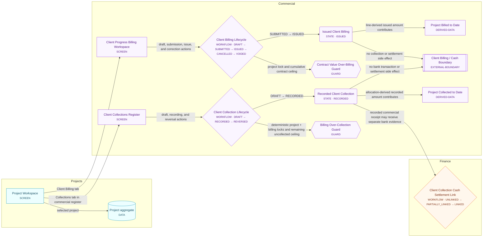
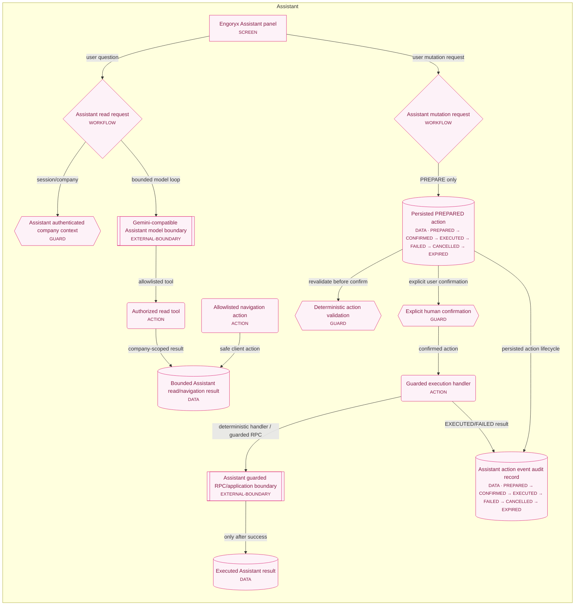

# Engoryx Application Workflow Map

> Generated from the single canonical graph source at `scripts/workflow-map/graph.ts`. Do not edit this file by hand.

## How to use this map

Use the overview for orientation, then choose the domain diagram closest to the change. Read the linked source files, guards, permissions, invariants, and tests before editing. The map is advisory context; current source, current CI, database contracts, and authenticated runtime evidence remain authoritative.

- Generate: `npm.cmd run workflow-map:generate`
- Check for drift: `npm.cmd run workflow-map:check`
- Check source-contract consistency: `npm.cmd run workflow-map:consistency`
- Generate bounded agent context: `npm.cmd run workflow-map:context -- --query "<task keywords>"`
- Machine-readable graph: `docs/architecture/workflow-map.json`
- Canonical source: `scripts/workflow-map/graph.ts`

## Graph metadata

| Field | Value |
| --- | --- |
| Schema version | `1` |
| Graph version | `wm-1+p2-procurement-commercial-client-billing+p3a-project-financial-control+p3a3-p3d1` |
| Product | Engoryx Engineering Operations Platform |
| Source classification | `mixed` |
| Reviewed against | `cb2bcd2b9674b6743f3b77f847f4151d1a53f9ba` |
| Reviewed at | `2026-09-04` |
| Node count | 232 |
| Edge count | 296 |
| Invariant count | 25 |
| Phase/module tags | `Phase 0`, `Phase 1A`, `Phase 1B`, `Phase 1C`, `Core Hardening Wave 1`, `Core Hardening Wave 2A`, `Core Hardening Wave 2B2`, `Cross-Domain Settlement`, `P2 Procurement + Commercial`, `P3A-2 Project Financial Control`, `P3A-3 Explainable Project Attention`, `P3D-1 Engineering Coordination Integration`, `QA-1`, `WM-1` |

## Canonical route rule

Route references below mirror `src/utils/routes.ts`, `src/utils/appRouteContracts.ts`, and `src/utils/appRouting.ts`; they are context links, not a second router. Project subviews remain one `projects` route with view/query selection. The standalone `/demo/app/documents` and `/demo/app/assistant` entries are explicitly demo-only.

| Node | Route ID | Canonical path | Query keys | Scope |
| --- | --- | --- | --- | --- |
| **Demo landing route**<br/><small>`route-demo-landing`</small> | demo-only | `/demo` | — | `demo-only` |
| **Demo Assistant route**<br/><small>`route-demo-assistant`</small> | demo-only | `/demo/app/assistant` | — | `demo-only` |
| **Demo standalone Engineering Documents route**<br/><small>`route-demo-documents`</small> | demo-only | `/demo/app/documents` | — | `demo-only` |
| **Dashboard route**<br/><small>`route-dashboard`</small> | `dashboard` | `/dashboard` | — | `company` |
| **Cash & Banking route**<br/><small>`route-cash`</small> | `cash` | `/cash` | `transactionId`, `fromTargetType`, `fromTargetId` | `company` |
| **Projects directory route**<br/><small>`route-projects`</small> | `projects` | `/projects` | — | `company` |
| **Project Workspace route**<br/><small>`route-project-workspace`</small> | `projects` | `/projects/:projectId` | `view` | `project` |
| **Project Documents route**<br/><small>`route-project-documents`</small> | `projects` | `/projects/:projectId/documents` | `docId`, `revId` | `project` |
| **Project RFI register route**<br/><small>`route-project-rfis`</small> | `projects` | `/projects/:projectId/rfis` | `rfiId` | `project` |
| **RFI detail route**<br/><small>`route-rfi-detail`</small> | `projects` | `/projects/:projectId/rfis?rfiId=:rfiId` | `rfiId` | `project` |
| **Project Submittals route**<br/><small>`route-project-submittals`</small> | `projects` | `/projects/:projectId/submittals` | `submittalId`, `roundId` | `project` |
| **Submittal round detail route**<br/><small>`route-submittal-detail`</small> | `projects` | `/projects/:projectId/submittals?submittalId=:submittalId&roundId=:roundId` | `submittalId`, `roundId` | `project` |
| **Project Site Logs route**<br/><small>`route-project-site-logs`</small> | `projects` | `/projects/:projectId/site-logs` | `siteLogId` | `project` |
| **Site Log detail route**<br/><small>`route-site-log-detail`</small> | `projects` | `/projects/:projectId/site-logs?siteLogId=:siteLogId` | `siteLogId` | `project` |
| **Invoice extraction route**<br/><small>`route-extract`</small> | `extract` | `/extract` | — | `company` |
| **Email Intake route**<br/><small>`route-inbox`</small> | `inbox` | `/email-intake` | — | `company` |
| **Invoices route**<br/><small>`route-invoices`</small> | `invoices` | `/invoices` | — | `company` |
| **Invoice detail route**<br/><small>`route-invoice-detail`</small> | `invoices` | `/invoices/:invoiceId` | `from` | `company` |
| **Invoice review route**<br/><small>`route-review-invoice`</small> | `review` | `/review?invoiceId=:invoiceId` | `invoiceId`, `from` | `company` |
| **Vendors route**<br/><small>`route-vendors`</small> | `vendors` | `/vendors` | — | `company` |
| **Payroll route**<br/><small>`route-payroll`</small> | `payroll` | `/payroll` | `runId`, `periodId`, `attendanceDate`, `from` | `company` |
| **Payroll run detail route**<br/><small>`route-payroll-run`</small> | `payroll` | `/payroll?runId=:runId` | `runId`, `periodId`, `attendanceDate`, `from` | `company` |
| **Expenses route**<br/><small>`route-expenses`</small> | `expenses` | `/expenses` | — | `company` |
| **Reports route**<br/><small>`route-reports`</small> | `reports` | `/reports` | — | `company` |
| **Settings route**<br/><small>`route-settings`</small> | `settings` | `/settings` | — | `company` |

## Generated diagrams

### Whole-platform overview

Bounded view of application entry, project cost, invoice/cash separation, payroll labor/net-pay separation, reports, and the guarded Assistant seam.

```mermaid
flowchart LR
  subgraph g_platformTenancy["Platform / Tenancy"]
    n_platform_entry{"Application entry<br/><small>WORKFLOW</small>"}
    n_production_mode{"Authenticated production mode<br/><small>WORKFLOW</small>"}
    n_demo_mode{"Isolated demo mode<br/><small>WORKFLOW</small>"}
    n_company_context[("Deployment company context<br/><small>DATA</small>")]
    n_company_rbac{{"Company RBAC and RLS guard<br/><small>GUARD</small>"}}
    n_company_profile_settings["Deployment company profile<br/><small>SCREEN</small>"]
    n_company_access_management["Company access management<br/><small>SCREEN</small>"]
    n_company_invitation_delivery[["Email access preauthorization<br/><small>EXTERNAL-BOUNDARY · PENDING → ACCEPTED → REVOKED → EXPIRED</small>"]]
    n_company_member_permission_editor{{"Member permission overrides<br/><small>GUARD</small>"}}
    n_production_persistence_boundary[["Production persistence boundary<br/><small>EXTERNAL-BOUNDARY</small>"]]
    n_demo_isolation{{"Demo isolation guard<br/><small>GUARD</small>"}}
  end
  subgraph g_finance["Finance"]
    n_route_cash(["Cash &amp; Banking route<br/><small>ROUTE · /cash</small>"])
    n_route_invoices(["Invoices route<br/><small>ROUTE · /invoices</small>"])
    n_expense_correction_lifecycle{"Expense correction lifecycle<br/><small>WORKFLOW · DELETE_UNUSED → VOID → ARCHIVE → RESTORE</small>"}
    n_expense_correction_rpc_boundary[["Authoritative expense correction RPC boundary<br/><small>EXTERNAL-BOUNDARY</small>"]]
    n_invoice_correction_lifecycle{"Invoice correction lifecycle<br/><small>WORKFLOW · DELETE_UNUSED → VOID → ARCHIVE → RESTORE</small>"}
    n_invoice_correction_rpc_boundary[["Authoritative invoice correction RPC boundary<br/><small>EXTERNAL-BOUNDARY</small>"]]
    n_invoice_state_void("Invoice · VOID<br/><small>STATE</small>")
    n_invoice_state_verified("Invoice · VERIFIED<br/><small>STATE</small>")
    n_invoice_payable_obligation["Verified invoice payable obligation<br/><small>DERIVED-DATA</small>"]
    n_cash_settlement_match[("Financial settlement match<br/><small>DATA · SUGGESTED → CONFIRMED → REJECTED → REVERSED</small>")]
    n_cash_settlement_evidence["Confirmed settlement evidence<br/><small>DERIVED-DATA</small>"]
  end
  subgraph g_projects["Projects"]
    n_route_projects(["Projects directory route<br/><small>ROUTE · /projects</small>"])
    n_project_workspace["Project Workspace<br/><small>SCREEN</small>"]
    n_project_cost_aggregation["Authoritative project-cost aggregation<br/><small>DERIVED-DATA</small>"]
    n_invoice_project_allocation[("Invoice project allocation<br/><small>DATA</small>")]
    n_invoice_project_cost_contribution["Verified invoice project-cost contribution<br/><small>DERIVED-DATA</small>"]
    n_direct_project_expense[("Direct project expense<br/><small>DATA · DRAFT → APPROVED → PAID → VOID</small>")]
    n_payroll_project_labor_cost["Authoritative project labor cost<br/><small>DERIVED-DATA</small>"]
    n_project_labor_aggregate_rpc[["Safe project labor aggregate RPC<br/><small>EXTERNAL-BOUNDARY</small>"]]
  end
  subgraph g_workforce["Workforce"]
    n_route_payroll(["Payroll route<br/><small>ROUTE · /payroll</small>"])
    n_payroll_run[("Payroll run<br/><small>DATA · DRAFT → CALCULATED → APPROVED → PAID → VOID</small>")]
    n_payroll_net_pay_basis["Employee net-pay settlement basis<br/><small>DERIVED-DATA</small>"]
  end
  subgraph g_reporting["Reporting"]
    n_route_reports(["Reports route<br/><small>ROUTE · /reports</small>"])
    n_reports_derived_surface{"Derived reporting surface<br/><small>WORKFLOW</small>"}
  end
  subgraph g_assistant["Assistant"]
    n_assistant_mutation_request{"Assistant mutation request<br/><small>WORKFLOW</small>"}
    n_assistant_prepared_action[("Persisted PREPARED action<br/><small>DATA · PREPARED → CONFIRMED → EXECUTED → FAILED → CANCELLED → EXPIRED</small>")]
    n_assistant_human_confirmation{{"Explicit human confirmation<br/><small>GUARD</small>"}}
    n_assistant_guarded_execution("Guarded execution handler<br/><small>ACTION</small>")
  end
  n_platform_entry -->|production path| n_production_mode
  n_platform_entry -->|/demo path| n_demo_mode
  n_company_context -->|permission snapshot| n_company_rbac
  n_company_rbac -->|RLS/RPC authority| n_production_persistence_boundary
  n_demo_mode -->|local/session boundary| n_demo_isolation
  n_demo_isolation -->|no production writes| n_production_persistence_boundary
  n_company_access_management -->|guarded email authorization| n_company_invitation_delivery
  n_company_access_management -->|effective overrides| n_company_member_permission_editor
  n_invoice_project_allocation -->|verified supplier cost| n_project_cost_aggregation
  n_invoice_project_allocation -->|verified invoice cost| n_invoice_project_cost_contribution
  n_invoice_project_cost_contribution -->|project cost contribution| n_project_cost_aggregation
  n_direct_project_expense -->|approved/paid direct cost| n_project_cost_aggregation
  n_invoice_correction_lifecycle -->|locked preflight and mutation| n_invoice_correction_rpc_boundary
  n_invoice_correction_lifecycle -->|void with reason| n_invoice_state_void
  n_invoice_state_verified -->|explicit correction| n_invoice_state_void
  n_invoice_state_void -->|excluded from active project cost| n_invoice_project_cost_contribution
  n_invoice_state_verified -->|cash payable basis| n_invoice_payable_obligation
  n_direct_project_expense -->|correction outcomes| n_expense_correction_lifecycle
  n_expense_correction_lifecycle -->|locked preflight and mutation| n_expense_correction_rpc_boundary
  n_expense_correction_rpc_boundary -->|VOID excluded, ARCHIVE retained| n_project_cost_aggregation
  n_cash_settlement_match -->|payment evidence| n_cash_settlement_evidence
  n_cash_settlement_evidence -->|settlement evidence only| n_invoice_payable_obligation
  n_cash_settlement_evidence -->|disbursement evidence only| n_payroll_net_pay_basis
  n_project_labor_aggregate_rpc -->|privacy-preserving labor source| n_project_cost_aggregation
  n_assistant_mutation_request -->|PREPARE only| n_assistant_prepared_action
  n_assistant_prepared_action -->|explicit user confirmation| n_assistant_human_confirmation
  n_assistant_human_confirmation -->|confirmed action| n_assistant_guarded_execution
  classDef platformTenancy fill:#eef2ff,stroke:#4f46e5,color:#1e1b4b;
  classDef dashboard fill:#f1f5f9,stroke:#475569,color:#0f172a;
  classDef projects fill:#ecfeff,stroke:#0891b2,color:#164e63;
  classDef engineering fill:#f0fdf4,stroke:#16a34a,color:#14532d;
  classDef finance fill:#fff7ed,stroke:#ea580c,color:#7c2d12;
  classDef workforce fill:#fdf4ff,stroke:#c026d3,color:#701a75;
  classDef reporting fill:#fefce8,stroke:#ca8a04,color:#713f12;
  classDef assistant fill:#fdf2f8,stroke:#db2777,color:#831843;
  class n_platform_entry platformTenancy
  class n_production_mode platformTenancy
  class n_demo_mode platformTenancy
  class n_company_context platformTenancy
  class n_company_rbac platformTenancy
  class n_company_profile_settings platformTenancy
  class n_company_access_management platformTenancy
  class n_company_invitation_delivery platformTenancy
  class n_company_member_permission_editor platformTenancy
  class n_production_persistence_boundary platformTenancy
  class n_demo_isolation platformTenancy
  class n_route_cash finance
  class n_route_projects projects
  class n_route_invoices finance
  class n_route_payroll workforce
  class n_route_reports reporting
  class n_project_workspace projects
  class n_project_cost_aggregation projects
  class n_invoice_project_allocation projects
  class n_invoice_project_cost_contribution projects
  class n_direct_project_expense projects
  class n_expense_correction_lifecycle finance
  class n_expense_correction_rpc_boundary finance
  class n_invoice_correction_lifecycle finance
  class n_invoice_correction_rpc_boundary finance
  class n_invoice_state_void finance
  class n_invoice_state_verified finance
  class n_invoice_payable_obligation finance
  class n_cash_settlement_match finance
  class n_cash_settlement_evidence finance
  class n_payroll_run workforce
  class n_payroll_project_labor_cost projects
  class n_project_labor_aggregate_rpc projects
  class n_payroll_net_pay_basis workforce
  class n_reports_derived_surface reporting
  class n_assistant_mutation_request assistant
  class n_assistant_prepared_action assistant
  class n_assistant_human_confirmation assistant
  class n_assistant_guarded_execution assistant
```



### Projects and Engineering flow

Project aggregate, Engineering Documents, RFIs, Submittals, and Daily Site Logs with lifecycle/history boundaries.

```mermaid
flowchart LR
  subgraph g_projects["Projects"]
    n_route_projects(["Projects directory route<br/><small>ROUTE · /projects</small>"])
    n_route_project_workspace(["Project Workspace route<br/><small>ROUTE · /projects/:projectId</small>"])
    n_project_directory["Project portfolio table<br/><small>SCREEN</small>"]
    n_project_selection("Select project<br/><small>ACTION</small>")
    n_project_workspace["Project Workspace<br/><small>SCREEN</small>"]
    n_project_aggregate[("Project aggregate<br/><small>DATA</small>")]
    n_project_correction_lifecycle{"Project correction and removal lifecycle<br/><small>WORKFLOW</small>"}
    n_project_lifecycle_rpc_boundary[["Authoritative project lifecycle RPC boundary<br/><small>EXTERNAL-BOUNDARY</small>"]]
    n_project_activity_guard{{"Archived project activity guard<br/><small>GUARD</small>"}}
    n_project_overview["Project Financial Control Dashboard (Project Overview)<br/><small>SCREEN</small>"]
    n_project_cost_aggregation["Authoritative project-cost aggregation<br/><small>DERIVED-DATA</small>"]
    n_project_labor_aggregate_rpc[["Safe project labor aggregate RPC<br/><small>EXTERNAL-BOUNDARY</small>"]]
    n_project_attention_signals["Project Attention Signals<br/><small>DERIVED-DATA</small>"]
    n_production_p2_integration_parity{"Production P2 Integration Parity<br/><small>WORKFLOW</small>"}
  end
  subgraph g_engineering["Engineering"]
    n_route_project_documents(["Project Documents route<br/><small>ROUTE · /projects/:projectId/documents</small>"])
    n_route_project_rfis(["Project RFI register route<br/><small>ROUTE · /projects/:projectId/rfis</small>"])
    n_route_rfi_detail(["RFI detail route<br/><small>ROUTE · /projects/:projectId/rfis?rfiId=:rfiId</small>"])
    n_route_project_submittals(["Project Submittals route<br/><small>ROUTE · /projects/:projectId/submittals</small>"])
    n_route_submittal_detail(["Submittal round detail route<br/><small>ROUTE · /projects/:projectId/submittals?submittalId=:submittalId&amp;roundId=:roundId</small>"])
    n_route_project_site_logs(["Project Site Logs route<br/><small>ROUTE · /projects/:projectId/site-logs</small>"])
    n_route_site_log_detail(["Site Log detail route<br/><small>ROUTE · /projects/:projectId/site-logs?siteLogId=:siteLogId</small>"])
    n_engineering_documents_screen["Engineering Documents register<br/><small>SCREEN</small>"]
    n_engineering_document[("Engineering document<br/><small>DATA · DRAFT → UNDER_REVIEW → APPROVED → REJECTED → SUPERSEDED → ARCHIVED</small>")]
    n_engineering_document_revision[("Immutable document revision<br/><small>DATA · PENDING_REVIEW → APPROVED → REJECTED → SUPERSEDED</small>")]
    n_blueprint_viewer["Blueprint viewer and redlines<br/><small>SCREEN</small>"]
    n_drawing_annotations[("Revision-scoped drawing annotations<br/><small>DATA · OPEN → RESOLVED → CLOSED → DELETED</small>")]
    n_rfi_register_screen["RFI register<br/><small>SCREEN</small>"]
    n_rfi_record[("RFI record<br/><small>DATA · DRAFT → OPEN → ANSWERED → CLOSED → VOID</small>")]
    n_rfi_state_draft("RFI · DRAFT<br/><small>STATE</small>")
    n_rfi_state_open("RFI · OPEN<br/><small>STATE</small>")
    n_rfi_state_answered("RFI · ANSWERED<br/><small>STATE</small>")
    n_rfi_state_closed("RFI · CLOSED<br/><small>STATE</small>")
    n_rfi_state_void("RFI · VOID<br/><small>STATE</small>")
    n_rfi_response_history[("Append-only RFI responses<br/><small>DATA</small>")]
    n_rfi_document_links[("RFI document-revision links<br/><small>DATA</small>")]
    n_submittal_register_screen["Technical Submittals register<br/><small>SCREEN</small>"]
    n_submittal_record[("Technical submittal<br/><small>DATA · DRAFT → SUBMITTED → UNDER_REVIEW → APPROVED → APPROVED_AS_NOTED → REVISE_AND_RESUBMIT → REJECTED → CLOSED → VOID</small>")]
    n_submittal_state_draft("Submittal · DRAFT<br/><small>STATE</small>")
    n_submittal_state_submitted("Submittal · SUBMITTED<br/><small>STATE</small>")
    n_submittal_state_under_review("Submittal · UNDER_REVIEW<br/><small>STATE</small>")
    n_submittal_state_approved("Submittal · APPROVED<br/><small>STATE</small>")
    n_submittal_state_approved_as_noted("Submittal · APPROVED_AS_NOTED<br/><small>STATE</small>")
    n_submittal_state_revise("Submittal · REVISE_AND_RESUBMIT<br/><small>STATE</small>")
    n_submittal_state_rejected("Submittal · REJECTED<br/><small>STATE</small>")
    n_submittal_state_closed("Submittal · CLOSED<br/><small>STATE</small>")
    n_submittal_state_void("Submittal · VOID<br/><small>STATE</small>")
    n_submittal_rounds[("Immutable submittal rounds<br/><small>DATA · DRAFT → SUBMITTED → UNDER_REVIEW → APPROVED → APPROVED_AS_NOTED → REVISE_AND_RESUBMIT → REJECTED → CLOSED → VOID</small>")]
    n_submittal_review_history[("Append-only submittal reviews<br/><small>DATA · APPROVED → APPROVED_AS_NOTED → REVISE_AND_RESUBMIT → REJECTED</small>")]
    n_submittal_document_links[("Submittal document-revision links<br/><small>DATA</small>")]
    n_site_log_register_screen["Daily Site Log register<br/><small>SCREEN</small>"]
    n_site_log_aggregate[("Daily Site Log aggregate<br/><small>DATA · DRAFT → SUBMITTED → FINALIZED → VOID</small>")]
    n_site_log_state_draft("Site Log · DRAFT<br/><small>STATE</small>")
    n_site_log_state_submitted("Site Log · SUBMITTED<br/><small>STATE</small>")
    n_site_log_state_finalized("Site Log · FINALIZED<br/><small>STATE</small>")
    n_site_log_state_void("Site Log · VOID<br/><small>STATE</small>")
    n_site_log_correction_addendum[("Append-only Site Log correction/addendum<br/><small>DATA</small>")]
    n_site_log_weather_observation[("Weather and site-condition observation<br/><small>DATA</small>")]
    n_site_log_crew_observation[("Crew/headcount observation<br/><small>DATA</small>")]
    n_site_log_equipment_observation[("Equipment usage observation<br/><small>DATA</small>")]
    n_site_log_safety_observation[("Safety observation<br/><small>DATA</small>")]
    n_site_log_event_history[("Append-only Site Log event history<br/><small>DATA · CREATED → UPDATED → SUBMITTED → FINALIZED → VOIDED</small>")]
    n_site_log_payroll_boundary{{"Field observation / payroll boundary<br/><small>GUARD</small>"}}
    n_project_engineering_coordination_summary["Project Engineering Coordination Summary<br/><small>DERIVED-DATA</small>"]
  end
  subgraph g_commercial["Commercial"]
    n_client_billing_workspace["Client Progress Billing Workspace<br/><small>SCREEN</small>"]
    n_client_billing_lifecycle{"Client Billing Lifecycle<br/><small>WORKFLOW · DRAFT → SUBMITTED → ISSUED → CANCELLED → VOIDED</small>"}
    n_client_billing_issued("Issued Client Billing<br/><small>STATE · ISSUED</small>")
    n_project_billed_to_date["Project Billed to Date<br/><small>DERIVED-DATA</small>"]
    n_client_billing_overbilling_guard{{"Contract Value Over-Billing Guard<br/><small>GUARD</small>"}}
    n_client_billing_cash_boundary[["Client Billing / Cash Boundary<br/><small>EXTERNAL-BOUNDARY</small>"]]
    n_client_collection_workspace["Client Collections Register<br/><small>SCREEN</small>"]
    n_client_collection_lifecycle{"Client Collection Lifecycle<br/><small>WORKFLOW · DRAFT → RECORDED → REVERSED</small>"}
    n_client_collection_recorded("Recorded Client Collection<br/><small>STATE · RECORDED</small>")
    n_project_collected_to_date["Project Collected to Date<br/><small>DERIVED-DATA</small>"]
    n_client_collection_overcollection_guard{{"Billing Over-Collection Guard<br/><small>GUARD</small>"}}
  end
  subgraph g_finance["Finance"]
    n_client_collection_cash_settlement_link{"Client Collection Cash Settlement Link<br/><small>WORKFLOW · UNLINKED → PARTIALLY_LINKED → LINKED</small>"}
  end
  n_project_directory -->|selects project| n_project_selection
  n_project_selection -->|canonical project path| n_route_project_workspace
  n_route_project_workspace -->|opens| n_project_workspace
  n_project_workspace -->|selected project| n_project_aggregate
  n_project_workspace -->|Financial Control Dashboard / Overview tab| n_project_overview
  n_project_directory -->|reviews correction options| n_project_correction_lifecycle
  n_project_correction_lifecycle -->|preflight, lock, audit, lifecycle RPC| n_project_lifecycle_rpc_boundary
  n_project_correction_lifecycle -->|archive boundary| n_project_activity_guard
  n_project_workspace -->|Documents tab| n_route_project_documents
  n_project_workspace -->|RFIs tab| n_route_project_rfis
  n_project_workspace -->|Submittals tab| n_route_project_submittals
  n_project_workspace -->|Site Logs tab| n_route_project_site_logs
  n_project_cost_aggregation -->|authoritative cost-control scorecard and charts| n_project_overview
  n_route_project_documents -->|opens| n_engineering_documents_screen
  n_engineering_documents_screen -->|register| n_engineering_document
  n_engineering_document -->|current revision| n_engineering_document_revision
  n_engineering_documents_screen -->|open revision| n_blueprint_viewer
  n_blueprint_viewer -->|private PDF| n_engineering_document_revision
  n_blueprint_viewer -->|revision redlines| n_drawing_annotations
  n_route_project_rfis -->|register| n_rfi_register_screen
  n_rfi_register_screen -->|project RFIs| n_rfi_record
  n_rfi_state_draft -->|open| n_rfi_state_open
  n_rfi_state_open -->|final response| n_rfi_state_answered
  n_rfi_state_answered -->|close| n_rfi_state_closed
  n_rfi_state_draft -->|void| n_rfi_state_void
  n_rfi_state_open -->|void| n_rfi_state_void
  n_rfi_state_answered -->|void| n_rfi_state_void
  n_rfi_record -->|append-only responses| n_rfi_response_history
  n_rfi_record -->|revision references| n_rfi_document_links
  n_rfi_document_links -->|exact immutable revision| n_engineering_document_revision
  n_route_project_submittals -->|register| n_submittal_register_screen
  n_submittal_register_screen -->|project submittals| n_submittal_record
  n_submittal_state_draft -->|submit| n_submittal_state_submitted
  n_submittal_state_submitted -->|start review| n_submittal_state_under_review
  n_submittal_state_under_review -->|approve| n_submittal_state_approved
  n_submittal_state_under_review -->|approve as noted| n_submittal_state_approved_as_noted
  n_submittal_state_under_review -->|revise and resubmit| n_submittal_state_revise
  n_submittal_state_under_review -->|reject| n_submittal_state_rejected
  n_submittal_state_submitted -->|direct decision| n_submittal_state_approved
  n_submittal_state_submitted -->|direct decision| n_submittal_state_approved_as_noted
  n_submittal_state_submitted -->|direct decision| n_submittal_state_revise
  n_submittal_state_submitted -->|direct decision| n_submittal_state_rejected
  n_submittal_state_approved -->|close| n_submittal_state_closed
  n_submittal_state_approved_as_noted -->|close| n_submittal_state_closed
  n_submittal_state_rejected -->|close| n_submittal_state_closed
  n_submittal_state_revise -->|new round| n_submittal_state_submitted
  n_submittal_state_draft -->|void| n_submittal_state_void
  n_submittal_state_submitted -->|void| n_submittal_state_void
  n_submittal_state_under_review -->|void| n_submittal_state_void
  n_submittal_state_approved -->|void| n_submittal_state_void
  n_submittal_state_approved_as_noted -->|void| n_submittal_state_void
  n_submittal_state_revise -->|void| n_submittal_state_void
  n_submittal_state_rejected -->|void| n_submittal_state_void
  n_submittal_record -->|current and prior rounds| n_submittal_rounds
  n_submittal_rounds -->|round decisions| n_submittal_review_history
  n_submittal_rounds -->|round revision references| n_submittal_document_links
  n_submittal_document_links -->|exact immutable revision| n_engineering_document_revision
  n_route_project_site_logs -->|register| n_site_log_register_screen
  n_site_log_register_screen -->|project field records| n_site_log_aggregate
  n_site_log_state_draft -->|submit| n_site_log_state_submitted
  n_site_log_state_submitted -->|finalize| n_site_log_state_finalized
  n_site_log_state_draft -->|void with reason| n_site_log_state_void
  n_site_log_state_submitted -->|void with reason| n_site_log_state_void
  n_site_log_aggregate -->|weather/site conditions| n_site_log_weather_observation
  n_site_log_aggregate -->|crew/headcount| n_site_log_crew_observation
  n_site_log_aggregate -->|equipment| n_site_log_equipment_observation
  n_site_log_aggregate -->|safety| n_site_log_safety_observation
  n_site_log_aggregate -->|formal event history| n_site_log_event_history
  n_site_log_aggregate -->|post-finalization correction| n_site_log_correction_addendum
  n_site_log_crew_observation -->|observation only| n_site_log_payroll_boundary
  n_project_labor_aggregate_rpc -->|privacy-preserving labor source| n_project_cost_aggregation
  n_project_workspace -->|Client Billing tab| n_client_billing_workspace
  n_client_billing_workspace -->|draft, submission, issue, and correction actions| n_client_billing_lifecycle
  n_client_billing_lifecycle -->|SUBMITTED → ISSUED| n_client_billing_issued
  n_client_billing_issued -->|line-derived issued amount contributes| n_project_billed_to_date
  n_client_billing_lifecycle -->|project lock and cumulative contract ceiling| n_client_billing_overbilling_guard
  n_client_billing_issued -->|no collection or settlement side effect| n_client_billing_cash_boundary
  n_project_workspace -->|Collections tab in commercial register| n_client_collection_workspace
  n_client_collection_workspace -->|draft, recording, and reversal actions| n_client_collection_lifecycle
  n_client_collection_lifecycle -->|DRAFT → RECORDED| n_client_collection_recorded
  n_client_collection_recorded -->|allocation-derived recorded amount contributes| n_project_collected_to_date
  n_client_collection_lifecycle -->|deterministic project + billing locks and remaining uncollected ceiling| n_client_collection_overcollection_guard
  n_client_collection_recorded -->|no bank transaction or settlement side effect| n_client_billing_cash_boundary
  n_client_collection_recorded -->|recorded commercial receipt may receive separate bank evidence| n_client_collection_cash_settlement_link
  n_project_cost_aggregation -->|actual, committed, pending, currency, and completeness facts| n_project_attention_signals
  n_project_attention_signals -->|flagged project drilldown| n_project_workspace
  n_project_attention_signals -->|evidence, source, date, and action detail| n_project_overview
  n_project_workspace -->|selected-project engineering coordination| n_project_engineering_coordination_summary
  n_project_engineering_coordination_summary -->|Documents and immutable revisions| n_engineering_documents_screen
  n_project_engineering_coordination_summary -->|project RFIs| n_rfi_register_screen
  n_project_engineering_coordination_summary -->|project Submittals| n_submittal_register_screen
  n_project_engineering_coordination_summary -->|project Daily Site Logs| n_site_log_register_screen
  n_project_engineering_coordination_summary -->|explicitly due RFI and Submittal signals| n_project_attention_signals
  n_production_p2_integration_parity -->|subcontract, claim, and variation context| n_project_workspace
  classDef platformTenancy fill:#eef2ff,stroke:#4f46e5,color:#1e1b4b;
  classDef dashboard fill:#f1f5f9,stroke:#475569,color:#0f172a;
  classDef projects fill:#ecfeff,stroke:#0891b2,color:#164e63;
  classDef engineering fill:#f0fdf4,stroke:#16a34a,color:#14532d;
  classDef finance fill:#fff7ed,stroke:#ea580c,color:#7c2d12;
  classDef workforce fill:#fdf4ff,stroke:#c026d3,color:#701a75;
  classDef reporting fill:#fefce8,stroke:#ca8a04,color:#713f12;
  classDef assistant fill:#fdf2f8,stroke:#db2777,color:#831843;
  classDef commercial fill:#faf5ff,stroke:#9333ea,color:#581c87;
  class n_route_projects projects
  class n_route_project_workspace projects
  class n_route_project_documents engineering
  class n_route_project_rfis engineering
  class n_route_rfi_detail engineering
  class n_route_project_submittals engineering
  class n_route_submittal_detail engineering
  class n_route_project_site_logs engineering
  class n_route_site_log_detail engineering
  class n_project_directory projects
  class n_project_selection projects
  class n_project_workspace projects
  class n_project_aggregate projects
  class n_project_correction_lifecycle projects
  class n_project_lifecycle_rpc_boundary projects
  class n_project_activity_guard projects
  class n_project_overview projects
  class n_project_cost_aggregation projects
  class n_engineering_documents_screen engineering
  class n_engineering_document engineering
  class n_engineering_document_revision engineering
  class n_blueprint_viewer engineering
  class n_drawing_annotations engineering
  class n_rfi_register_screen engineering
  class n_rfi_record engineering
  class n_rfi_state_draft engineering
  class n_rfi_state_open engineering
  class n_rfi_state_answered engineering
  class n_rfi_state_closed engineering
  class n_rfi_state_void engineering
  class n_rfi_response_history engineering
  class n_rfi_document_links engineering
  class n_submittal_register_screen engineering
  class n_submittal_record engineering
  class n_submittal_state_draft engineering
  class n_submittal_state_submitted engineering
  class n_submittal_state_under_review engineering
  class n_submittal_state_approved engineering
  class n_submittal_state_approved_as_noted engineering
  class n_submittal_state_revise engineering
  class n_submittal_state_rejected engineering
  class n_submittal_state_closed engineering
  class n_submittal_state_void engineering
  class n_submittal_rounds engineering
  class n_submittal_review_history engineering
  class n_submittal_document_links engineering
  class n_site_log_register_screen engineering
  class n_site_log_aggregate engineering
  class n_site_log_state_draft engineering
  class n_site_log_state_submitted engineering
  class n_site_log_state_finalized engineering
  class n_site_log_state_void engineering
  class n_site_log_correction_addendum engineering
  class n_site_log_weather_observation engineering
  class n_site_log_crew_observation engineering
  class n_site_log_equipment_observation engineering
  class n_site_log_safety_observation engineering
  class n_site_log_event_history engineering
  class n_site_log_payroll_boundary engineering
  class n_project_labor_aggregate_rpc projects
  class n_client_billing_workspace commercial
  class n_client_billing_lifecycle commercial
  class n_client_billing_issued commercial
  class n_project_billed_to_date commercial
  class n_client_billing_overbilling_guard commercial
  class n_client_billing_cash_boundary commercial
  class n_client_collection_workspace commercial
  class n_client_collection_lifecycle commercial
  class n_client_collection_recorded commercial
  class n_project_collected_to_date commercial
  class n_client_collection_overcollection_guard commercial
  class n_client_collection_cash_settlement_link finance
  class n_project_attention_signals projects
  class n_project_engineering_coordination_summary engineering
  class n_production_p2_integration_parity projects
```

### Project Attention and Production Parity

P3A-3 explainable project attention, selected-project engineering coordination, and production P2 subcontract/claim/variation routing.

```mermaid
flowchart LR
  subgraph g_projects["Projects"]
    n_route_projects(["Projects directory route<br/><small>ROUTE · /projects</small>"])
    n_route_project_workspace(["Project Workspace route<br/><small>ROUTE · /projects/:projectId</small>"])
    n_project_directory["Project portfolio table<br/><small>SCREEN</small>"]
    n_project_financial_summary["Project Financial Summary<br/><small>DERIVED-DATA</small>"]
    n_project_selection("Select project<br/><small>ACTION</small>")
    n_project_workspace["Project Workspace<br/><small>SCREEN</small>"]
    n_project_overview["Project Financial Control Dashboard (Project Overview)<br/><small>SCREEN</small>"]
    n_project_cost_aggregation["Authoritative project-cost aggregation<br/><small>DERIVED-DATA</small>"]
    n_project_attention_signals["Project Attention Signals<br/><small>DERIVED-DATA</small>"]
    n_production_p2_integration_parity{"Production P2 Integration Parity<br/><small>WORKFLOW</small>"}
  end
  subgraph g_dashboard["Dashboard"]
    n_portfolio_management_dashboard["Portfolio Management Dashboard<br/><small>SCREEN</small>"]
  end
  subgraph g_engineering["Engineering"]
    n_engineering_documents_screen["Engineering Documents register<br/><small>SCREEN</small>"]
    n_rfi_register_screen["RFI register<br/><small>SCREEN</small>"]
    n_submittal_register_screen["Technical Submittals register<br/><small>SCREEN</small>"]
    n_site_log_register_screen["Daily Site Log register<br/><small>SCREEN</small>"]
    n_project_engineering_coordination_summary["Project Engineering Coordination Summary<br/><small>DERIVED-DATA</small>"]
  end
  subgraph g_procurement["Procurement"]
    n_procurement_workspace["Procurement Workspace<br/><small>SCREEN</small>"]
  end
  subgraph g_commercial["Commercial"]
    n_subcontract_packages{"Subcontract Packages<br/><small>WORKFLOW</small>"}
    n_subcontract_progress_claims{"Subcontract Progress Claims<br/><small>WORKFLOW</small>"}
    n_subcontract_variations{"Subcontract Variations and Change Orders<br/><small>WORKFLOW · DRAFT → SUBMITTED → APPROVED → REJECTED</small>"}
  end
  n_route_projects -->|opens| n_portfolio_management_dashboard
  n_portfolio_management_dashboard -->|project register and filters| n_project_directory
  n_portfolio_management_dashboard -->|currency-aware portfolio metrics| n_project_financial_summary
  n_portfolio_management_dashboard -->|project drilldown| n_project_workspace
  n_project_directory -->|selects project| n_project_selection
  n_project_selection -->|canonical project path| n_route_project_workspace
  n_route_project_workspace -->|opens| n_project_workspace
  n_project_workspace -->|Financial Control Dashboard / Overview tab| n_project_overview
  n_project_cost_aggregation -->|authoritative cost-control scorecard and charts| n_project_overview
  n_project_cost_aggregation -->|Actual, committed, and budget metrics| n_project_financial_summary
  n_project_cost_aggregation -->|project procurement contributes commitment context| n_procurement_workspace
  n_portfolio_management_dashboard -->|project attention counts, filters, and severity-first ordering| n_project_attention_signals
  n_project_financial_summary -->|authoritative financial and commercial evidence| n_project_attention_signals
  n_project_cost_aggregation -->|actual, committed, pending, currency, and completeness facts| n_project_attention_signals
  n_project_attention_signals -->|flagged project drilldown| n_project_workspace
  n_project_attention_signals -->|evidence, source, date, and action detail| n_project_overview
  n_project_workspace -->|selected-project engineering coordination| n_project_engineering_coordination_summary
  n_project_engineering_coordination_summary -->|Documents and immutable revisions| n_engineering_documents_screen
  n_project_engineering_coordination_summary -->|project RFIs| n_rfi_register_screen
  n_project_engineering_coordination_summary -->|project Submittals| n_submittal_register_screen
  n_project_engineering_coordination_summary -->|project Daily Site Logs| n_site_log_register_screen
  n_project_engineering_coordination_summary -->|explicitly due RFI and Submittal signals| n_project_attention_signals
  n_production_p2_integration_parity -->|subcontract, claim, and variation context| n_project_workspace
  n_production_p2_integration_parity -->|production Procurement register records and actions| n_procurement_workspace
  classDef platformTenancy fill:#eef2ff,stroke:#4f46e5,color:#1e1b4b;
  classDef dashboard fill:#f1f5f9,stroke:#475569,color:#0f172a;
  classDef projects fill:#ecfeff,stroke:#0891b2,color:#164e63;
  classDef engineering fill:#f0fdf4,stroke:#16a34a,color:#14532d;
  classDef finance fill:#fff7ed,stroke:#ea580c,color:#7c2d12;
  classDef workforce fill:#fdf4ff,stroke:#c026d3,color:#701a75;
  classDef reporting fill:#fefce8,stroke:#ca8a04,color:#713f12;
  classDef assistant fill:#fdf2f8,stroke:#db2777,color:#831843;
  classDef procurement fill:#f0fdfa,stroke:#0f766e,color:#134e4a;
  classDef commercial fill:#faf5ff,stroke:#9333ea,color:#581c87;
  class n_route_projects projects
  class n_route_project_workspace projects
  class n_project_directory projects
  class n_portfolio_management_dashboard dashboard
  class n_project_financial_summary projects
  class n_project_selection projects
  class n_project_workspace projects
  class n_project_overview projects
  class n_project_cost_aggregation projects
  class n_engineering_documents_screen engineering
  class n_rfi_register_screen engineering
  class n_submittal_register_screen engineering
  class n_site_log_register_screen engineering
  class n_procurement_workspace procurement
  class n_subcontract_packages commercial
  class n_subcontract_progress_claims commercial
  class n_subcontract_variations commercial
  class n_project_attention_signals projects
  class n_project_engineering_coordination_summary engineering
  class n_production_p2_integration_parity projects
```



### Client Progress Billing flow

Project-level revenue-side billing register from draft line editing through issued-only billed-to-date, with contract ceiling and cash/settlement separation.



### Invoice and Cash Settlement flow

Source/extraction/review/verified project allocation alongside separate payable and confirmed cash settlement evidence.

```mermaid
flowchart LR
  subgraph g_finance["Finance"]
    n_route_extract(["Invoice extraction route<br/><small>ROUTE · /extract</small>"])
    n_route_inbox(["Email Intake route<br/><small>ROUTE · /email-intake</small>"])
    n_route_invoices(["Invoices route<br/><small>ROUTE · /invoices</small>"])
    n_route_invoice_detail(["Invoice detail route<br/><small>ROUTE · /invoices/:invoiceId</small>"])
    n_route_review_invoice(["Invoice review route<br/><small>ROUTE · /review?invoiceId=:invoiceId</small>"])
    n_expense_correction_lifecycle{"Expense correction lifecycle<br/><small>WORKFLOW · DELETE_UNUSED → VOID → ARCHIVE → RESTORE</small>"}
    n_expense_correction_rpc_boundary[["Authoritative expense correction RPC boundary<br/><small>EXTERNAL-BOUNDARY</small>"]]
    n_invoice_source[("Invoice source document or email<br/><small>DATA</small>")]
    n_invoice_extraction_workflow{"Invoice extraction workflow<br/><small>WORKFLOW · NEW → EXTRACTING → EXTRACTED → FAILED</small>"}
    n_invoice_extraction_ai_boundary[["Gemini-compatible extraction boundary<br/><small>EXTERNAL-BOUNDARY</small>"]]
    n_invoice_record[("Supplier invoice record<br/><small>DATA · NEEDS_REVIEW → VERIFIED → ACTIVE → VOID</small>")]
    n_invoice_correction_lifecycle{"Invoice correction lifecycle<br/><small>WORKFLOW · DELETE_UNUSED → VOID → ARCHIVE → RESTORE</small>"}
    n_invoice_correction_rpc_boundary[["Authoritative invoice correction RPC boundary<br/><small>EXTERNAL-BOUNDARY</small>"]]
    n_invoice_state_void("Invoice · VOID<br/><small>STATE</small>")
    n_invoice_state_needs_review("Invoice · NEEDS_REVIEW<br/><small>STATE</small>")
    n_invoice_state_verified("Invoice · VERIFIED<br/><small>STATE</small>")
    n_invoice_human_verification{{"Human verification guard<br/><small>GUARD</small>"}}
    n_invoice_review_history[("Invoice review history<br/><small>DATA</small>")]
    n_invoice_payable_obligation["Verified invoice payable obligation<br/><small>DERIVED-DATA</small>"]
    n_cash_accounts[("Bank, e-wallet, and cash accounts<br/><small>DATA</small>")]
    n_cash_statement_import{"Statement import and normalization<br/><small>WORKFLOW · PREVIEW → IMPORTED → FAILED</small>"}
    n_cash_transactions[("Financial transactions<br/><small>DATA · PENDING → POSTED → REVERSED</small>")]
    n_cash_reconciliation_workspace["Cash reconciliation workspace<br/><small>SCREEN</small>"]
    n_cash_settlement_candidates["Settlement candidates<br/><small>DERIVED-DATA</small>"]
    n_cash_settlement_match[("Financial settlement match<br/><small>DATA · SUGGESTED → CONFIRMED → REJECTED → REVERSED</small>")]
    n_cash_settlement_confirmation_action("Confirm settlement allocation<br/><small>ACTION</small>")
    n_cash_settlement_evidence["Confirmed settlement evidence<br/><small>DERIVED-DATA</small>"]
    n_cash_settlement_state_suggested("Settlement · SUGGESTED<br/><small>STATE</small>")
    n_cash_settlement_state_confirmed("Settlement · CONFIRMED<br/><small>STATE</small>")
    n_cash_settlement_state_rejected("Settlement · REJECTED<br/><small>STATE</small>")
    n_cash_settlement_state_reversed("Settlement · REVERSED<br/><small>STATE</small>")
    n_cash_settlement_reversal_history[("Settlement reversal history<br/><small>DATA</small>")]
    n_cash_settlement_guard{{"Settlement eligibility and concurrency guard<br/><small>GUARD</small>"}}
    n_cash_settlement_rpc_boundary[["Settlement RPC boundary<br/><small>EXTERNAL-BOUNDARY</small>"]]
  end
  subgraph g_projects["Projects"]
    n_project_cost_aggregation["Authoritative project-cost aggregation<br/><small>DERIVED-DATA</small>"]
    n_invoice_project_allocation[("Invoice project allocation<br/><small>DATA</small>")]
    n_invoice_project_cost_contribution["Verified invoice project-cost contribution<br/><small>DERIVED-DATA</small>"]
    n_direct_project_expense[("Direct project expense<br/><small>DATA · DRAFT → APPROVED → PAID → VOID</small>")]
  end
  n_invoice_project_allocation -->|verified supplier cost| n_project_cost_aggregation
  n_invoice_project_allocation -->|verified invoice cost| n_invoice_project_cost_contribution
  n_invoice_project_cost_contribution -->|project cost contribution| n_project_cost_aggregation
  n_direct_project_expense -->|approved/paid direct cost| n_project_cost_aggregation
  n_route_extract -->|new extraction| n_invoice_extraction_workflow
  n_route_inbox -->|email source| n_invoice_source
  n_route_invoices -->|directory| n_invoice_record
  n_invoice_source -->|bytes and metadata| n_invoice_extraction_workflow
  n_invoice_extraction_workflow -->|assistive extraction| n_invoice_extraction_ai_boundary
  n_invoice_extraction_ai_boundary -->|draft/reviewable record| n_invoice_record
  n_invoice_record -->|awaits human verification| n_invoice_state_needs_review
  n_invoice_state_needs_review -->|explicit review| n_invoice_human_verification
  n_invoice_human_verification -->|verify| n_invoice_state_verified
  n_invoice_record -->|review provenance| n_invoice_review_history
  n_invoice_record -->|correction outcomes| n_invoice_correction_lifecycle
  n_invoice_correction_lifecycle -->|locked preflight and mutation| n_invoice_correction_rpc_boundary
  n_invoice_correction_lifecycle -->|void with reason| n_invoice_state_void
  n_invoice_state_verified -->|explicit correction| n_invoice_state_void
  n_invoice_state_void -->|excluded from active project cost| n_invoice_project_cost_contribution
  n_invoice_correction_rpc_boundary -->|confirmed settlement blocks void/delete| n_cash_settlement_guard
  n_invoice_state_verified -->|cash payable basis| n_invoice_payable_obligation
  n_direct_project_expense -->|correction outcomes| n_expense_correction_lifecycle
  n_expense_correction_lifecycle -->|locked preflight and mutation| n_expense_correction_rpc_boundary
  n_expense_correction_rpc_boundary -->|VOID excluded, ARCHIVE retained| n_project_cost_aggregation
  n_expense_correction_rpc_boundary -->|confirmed settlement blocks void/delete| n_cash_settlement_guard
  n_cash_accounts -->|account activity| n_cash_transactions
  n_cash_statement_import -->|validated import| n_cash_transactions
  n_cash_transactions -->|reconciliation context| n_cash_reconciliation_workspace
  n_cash_reconciliation_workspace -->|eligible obligations| n_cash_settlement_candidates
  n_invoice_payable_obligation -->|invoice obligation| n_cash_settlement_candidates
  n_direct_project_expense -->|supported expense obligation| n_cash_settlement_candidates
  n_cash_settlement_candidates -->|review allocation| n_cash_settlement_confirmation_action
  n_cash_settlement_confirmation_action -->|eligibility and concurrency| n_cash_settlement_guard
  n_cash_settlement_guard -->|confirm/batch/reverse RPC| n_cash_settlement_rpc_boundary
  n_cash_settlement_rpc_boundary -->|canonical bridge| n_cash_settlement_match
  n_cash_settlement_state_suggested -->|explicit confirmation| n_cash_settlement_state_confirmed
  n_cash_settlement_state_suggested -->|reject| n_cash_settlement_state_rejected
  n_cash_settlement_state_confirmed -->|reverse with reason| n_cash_settlement_state_reversed
  n_cash_settlement_match -->|payment evidence| n_cash_settlement_evidence
  n_cash_settlement_match -->|additive reversal| n_cash_settlement_reversal_history
  n_cash_settlement_evidence -->|settlement evidence only| n_invoice_payable_obligation
  classDef platformTenancy fill:#eef2ff,stroke:#4f46e5,color:#1e1b4b;
  classDef dashboard fill:#f1f5f9,stroke:#475569,color:#0f172a;
  classDef projects fill:#ecfeff,stroke:#0891b2,color:#164e63;
  classDef engineering fill:#f0fdf4,stroke:#16a34a,color:#14532d;
  classDef finance fill:#fff7ed,stroke:#ea580c,color:#7c2d12;
  classDef workforce fill:#fdf4ff,stroke:#c026d3,color:#701a75;
  classDef reporting fill:#fefce8,stroke:#ca8a04,color:#713f12;
  classDef assistant fill:#fdf2f8,stroke:#db2777,color:#831843;
  class n_route_extract finance
  class n_route_inbox finance
  class n_route_invoices finance
  class n_route_invoice_detail finance
  class n_route_review_invoice finance
  class n_project_cost_aggregation projects
  class n_invoice_project_allocation projects
  class n_invoice_project_cost_contribution projects
  class n_direct_project_expense projects
  class n_expense_correction_lifecycle finance
  class n_expense_correction_rpc_boundary finance
  class n_invoice_source finance
  class n_invoice_extraction_workflow finance
  class n_invoice_extraction_ai_boundary finance
  class n_invoice_record finance
  class n_invoice_correction_lifecycle finance
  class n_invoice_correction_rpc_boundary finance
  class n_invoice_state_void finance
  class n_invoice_state_needs_review finance
  class n_invoice_state_verified finance
  class n_invoice_human_verification finance
  class n_invoice_review_history finance
  class n_invoice_payable_obligation finance
  class n_cash_accounts finance
  class n_cash_statement_import finance
  class n_cash_transactions finance
  class n_cash_reconciliation_workspace finance
  class n_cash_settlement_candidates finance
  class n_cash_settlement_match finance
  class n_cash_settlement_confirmation_action finance
  class n_cash_settlement_evidence finance
  class n_cash_settlement_state_suggested finance
  class n_cash_settlement_state_confirmed finance
  class n_cash_settlement_state_rejected finance
  class n_cash_settlement_state_reversed finance
  class n_cash_settlement_reversal_history finance
  class n_cash_settlement_guard finance
  class n_cash_settlement_rpc_boundary finance
```



### Workforce and Payroll flow

Workers and payroll source records through period/run calculation, approval, project labor cost, and net-pay settlement basis.

```mermaid
flowchart LR
  subgraph g_workforce["Workforce"]
    n_route_payroll(["Payroll route<br/><small>ROUTE · /payroll</small>"])
    n_route_payroll_run(["Payroll run detail route<br/><small>ROUTE · /payroll?runId=:runId</small>"])
    n_workforce_directory["Workforce directory<br/><small>SCREEN</small>"]
    n_worker_records[("Worker identity and assignments<br/><small>DATA</small>")]
    n_workforce_correction_lifecycle{"Workforce and payroll correction lifecycle<br/><small>WORKFLOW</small>"}
    n_workforce_lifecycle_rpc_boundary[["Authoritative workforce lifecycle RPC boundary<br/><small>EXTERNAL-BOUNDARY</small>"]]
    n_workforce_labor_context_guard{{"Default versus actual labor context guard<br/><small>GUARD</small>"}}
    n_compensation_profiles[("Worker compensation profiles<br/><small>DATA</small>")]
    n_payroll_attendance[("Authoritative payroll attendance<br/><small>DATA · DRAFT → CONFIRMED → VOID</small>")]
    n_payroll_overtime[("Overtime requests<br/><small>DATA · DRAFT → PENDING → APPROVED → REJECTED → CANCELLED</small>")]
    n_payroll_leave[("Leave requests<br/><small>DATA · DRAFT → PENDING → APPROVED → REJECTED → CANCELLED</small>")]
    n_payroll_work_source_records[("Work/source records and imports<br/><small>DATA · DRAFT → SUBMITTED → APPROVED → VOID</small>")]
    n_payroll_schedule[("Payroll schedule<br/><small>DATA</small>")]
    n_payroll_period[("Payroll period<br/><small>DATA · DRAFT → OPEN → CALCULATED → APPROVED → PAID → VOID</small>")]
    n_payroll_run[("Payroll run<br/><small>DATA · DRAFT → CALCULATED → APPROVED → PAID → VOID</small>")]
    n_payroll_state_draft("Payroll run · DRAFT<br/><small>STATE</small>")
    n_payroll_state_calculated("Payroll run · CALCULATED<br/><small>STATE</small>")
    n_payroll_state_approved("Payroll run · APPROVED<br/><small>STATE</small>")
    n_payroll_state_paid("Payroll run · PAID<br/><small>STATE</small>")
    n_payroll_state_void("Payroll run · VOID<br/><small>STATE</small>")
    n_payroll_entry_snapshot[("Payroll entry calculation snapshot<br/><small>DATA</small>")]
    n_payroll_project_labor_allocation[("Project labor allocation<br/><small>DATA</small>")]
    n_payroll_net_pay_basis["Employee net-pay settlement basis<br/><small>DERIVED-DATA</small>"]
    n_payroll_source_freshness_guard{{"Payroll source freshness and readiness guard<br/><small>GUARD</small>"}}
    n_payroll_history_immutability{{"Payroll history immutability guard<br/><small>GUARD</small>"}}
    n_payroll_run_action("Calculate, approve, or pay payroll run<br/><small>ACTION</small>")
    n_payroll_persistence_boundary[["Payroll persistence and guarded RPC boundary<br/><small>EXTERNAL-BOUNDARY</small>"]]
  end
  subgraph g_projects["Projects"]
    n_payroll_project_allocation[("Payroll project allocation<br/><small>DATA</small>")]
    n_payroll_project_labor_cost["Authoritative project labor cost<br/><small>DERIVED-DATA</small>"]
    n_project_labor_aggregate_rpc[["Safe project labor aggregate RPC<br/><small>EXTERNAL-BOUNDARY</small>"]]
  end
  subgraph g_finance["Finance"]
    n_cash_settlement_candidates["Settlement candidates<br/><small>DERIVED-DATA</small>"]
  end
  n_payroll_net_pay_basis -->|employee net pay| n_cash_settlement_candidates
  n_route_payroll -->|opens| n_workforce_directory
  n_route_payroll_run -->|selected run| n_payroll_run
  n_workforce_directory -->|workers and assignments| n_worker_records
  n_workforce_directory -->|safe correction actions| n_workforce_correction_lifecycle
  n_worker_records -->|effective pay basis| n_compensation_profiles
  n_worker_records -->|worker/date source| n_payroll_attendance
  n_worker_records -->|worker/period source| n_payroll_overtime
  n_worker_records -->|worker leave source| n_payroll_leave
  n_worker_records -->|work source| n_payroll_work_source_records
  n_worker_records -->|default versus actual context| n_workforce_labor_context_guard
  n_workforce_correction_lifecycle -->|preflight, lock, audit| n_workforce_lifecycle_rpc_boundary
  n_workforce_lifecycle_rpc_boundary -->|preserves consumed history| n_payroll_history_immutability
  n_workforce_labor_context_guard -->|no fake office project or duplicate labor| n_payroll_project_labor_allocation
  n_payroll_schedule -->|effective boundaries| n_payroll_period
  n_payroll_period -->|one run per period| n_payroll_run
  n_payroll_attendance -->|confirmed presence| n_payroll_run
  n_payroll_overtime -->|approved overtime| n_payroll_run
  n_payroll_leave -->|approved leave| n_payroll_run
  n_payroll_work_source_records -->|approved/imported work| n_payroll_run
  n_compensation_profiles -->|effective rates/components| n_payroll_run
  n_payroll_state_draft -->|calculate| n_payroll_state_calculated
  n_payroll_state_calculated -->|approve| n_payroll_state_approved
  n_payroll_state_approved -->|pay| n_payroll_state_paid
  n_payroll_state_draft -->|void| n_payroll_state_void
  n_payroll_state_calculated -->|void| n_payroll_state_void
  n_payroll_state_approved -->|void| n_payroll_state_void
  n_payroll_run -->|per-worker snapshot| n_payroll_entry_snapshot
  n_payroll_entry_snapshot -->|project allocation| n_payroll_project_labor_allocation
  n_payroll_project_labor_allocation -->|confirmed labor cost| n_payroll_project_labor_cost
  n_payroll_project_labor_allocation -->|server-side project sum| n_project_labor_aggregate_rpc
  n_payroll_entry_snapshot -->|sum netPay| n_payroll_net_pay_basis
  n_payroll_run -->|before approval/recalculation| n_payroll_source_freshness_guard
  n_payroll_run -->|approved/paid/void lock| n_payroll_history_immutability
  n_payroll_run_action -->|fresh source check| n_payroll_source_freshness_guard
  n_payroll_run_action -->|guarded payroll persistence| n_payroll_persistence_boundary
  n_payroll_net_pay_basis -->|eligible disbursement| n_cash_settlement_candidates
  classDef platformTenancy fill:#eef2ff,stroke:#4f46e5,color:#1e1b4b;
  classDef dashboard fill:#f1f5f9,stroke:#475569,color:#0f172a;
  classDef projects fill:#ecfeff,stroke:#0891b2,color:#164e63;
  classDef engineering fill:#f0fdf4,stroke:#16a34a,color:#14532d;
  classDef finance fill:#fff7ed,stroke:#ea580c,color:#7c2d12;
  classDef workforce fill:#fdf4ff,stroke:#c026d3,color:#701a75;
  classDef reporting fill:#fefce8,stroke:#ca8a04,color:#713f12;
  classDef assistant fill:#fdf2f8,stroke:#db2777,color:#831843;
  class n_route_payroll workforce
  class n_route_payroll_run workforce
  class n_payroll_project_allocation projects
  class n_cash_settlement_candidates finance
  class n_workforce_directory workforce
  class n_worker_records workforce
  class n_workforce_correction_lifecycle workforce
  class n_workforce_lifecycle_rpc_boundary workforce
  class n_workforce_labor_context_guard workforce
  class n_compensation_profiles workforce
  class n_payroll_attendance workforce
  class n_payroll_overtime workforce
  class n_payroll_leave workforce
  class n_payroll_work_source_records workforce
  class n_payroll_schedule workforce
  class n_payroll_period workforce
  class n_payroll_run workforce
  class n_payroll_state_draft workforce
  class n_payroll_state_calculated workforce
  class n_payroll_state_approved workforce
  class n_payroll_state_paid workforce
  class n_payroll_state_void workforce
  class n_payroll_entry_snapshot workforce
  class n_payroll_project_labor_allocation workforce
  class n_payroll_project_labor_cost projects
  class n_project_labor_aggregate_rpc projects
  class n_payroll_net_pay_basis workforce
  class n_payroll_source_freshness_guard workforce
  class n_payroll_history_immutability workforce
  class n_payroll_run_action workforce
  class n_payroll_persistence_boundary workforce
```



### Assistant guarded mutation flow

Separate read/navigation behavior from PREPARE → deterministic validation → human confirmation → guarded execution → result.



## High-value invariants

These invariants are intentionally explicit because generic import graphs cannot reliably infer their business meaning.

| Invariant | Meaning | Source files | Tests |
| --- | --- | --- | --- |
| **Company and RBAC isolation is authoritative**<br/><small>`company-rbac-is-authoritative`</small> | Business records are scoped by company membership and permission; client visibility is not a substitute for PostgreSQL RLS/RPC authorization. | `src/context/CompanyAccessContext.tsx`<br/>`src/lib/companyAccess.ts`<br/>`src/utils/accessControl.ts`<br/>`supabase/migrations/20260824090000_company_tenancy_rbac_foundation.sql`<br/>`supabase/migrations/20260824093000_company_tenancy_rls_and_admin_rpcs.sql`<br/>`supabase/migrations/20260829003147_core_hardening_wave1_access_management.sql`<br/>`src/server/access/invitationDelivery.ts` | `tests/companyAccess.test.ts`<br/>`tests/companyTenancyFinalContract.test.ts`<br/>`tests/companyTenancyMigration.test.ts` |
| **Demo mode is isolated from production writes**<br/><small>`demo-cannot-write-production`</small> | The public /demo runtime uses deterministic local/session state and cannot become a production company or Supabase write path. | `src/main.tsx`<br/>`src/app/applicationMode.ts`<br/>`src/demo/DemoRoot.tsx`<br/>`src/demo/DemoWorkspaceProvider.tsx`<br/>`src/demo/demoRouting.ts` | `tests/demoWorkspace.test.ts`<br/>`tests/demoCleanup.test.ts` |
| **Verified invoice project cost is independent from cash settlement**<br/><small>`invoice-project-cost-independent-from-settlement`</small> | Verified invoice allocations are a project-cost source. Cash settlement is payment evidence and must not create or duplicate project cost. | `src/utils/projectCosting.ts`<br/>`src/lib/financialSettlement.ts`<br/>`src/lib/financialSettlementPersistence.ts`<br/>`supabase/migrations/20260827210000_financial_settlement_integration.sql`<br/>`docs/ENGORYX_FINANCIAL_SETTLEMENT_INTEGRATION.md` | `tests/financialSettlement.test.ts`<br/>`tests/projectCostingHardening.test.ts` |
| **Invoice and expense corrections preserve financial history**<br/><small>`financial-corrections-preserve-history`</small> | Unused invoice/expense deletion is database-guarded; operational records use explicit archive or void actions; finalized history, allocations, extraction/review evidence, and confirmed settlement dependencies are never silently erased or rewritten. | `src/lib/financialLifecycle.ts`<br/>`src/lib/persistence.ts`<br/>`src/lib/expenses.ts`<br/>`src/utils/projectCosting.ts`<br/>`supabase/migrations/20260829060220_core_hardening_wave2b2_invoice_expense_corrections.sql`<br/>`docs/ENGORYX_CORE_HARDENING_PLAN.md` | `tests/financialLifecycle.test.ts`<br/>`tests/coreHardeningWave2B2.test.ts`<br/>`supabase/tests/database/08_core_hardening_wave2b2_invoice_expense_corrections.test.sql` |
| **Project labor cost is independent from employee net-pay settlement**<br/><small>`payroll-labor-cost-independent-from-net-pay-settlement`</small> | Approved or paid payroll allocations provide project labor cost, while settlement eligibility and basis use employee net pay. | `src/lib/payrollCalculation.ts`<br/>`src/lib/financialSettlement.ts`<br/>`src/utils/projectCosting.ts`<br/>`docs/payroll-workforce-hardening.md`<br/>`docs/ENGORYX_FINANCIAL_SETTLEMENT_INTEGRATION.md` | `tests/financialSettlement.test.ts`<br/>`tests/payrollIntegrity.test.ts`<br/>`tests/payrollCalculation.test.ts` |
| **Project labor aggregate preserves payroll privacy**<br/><small>`project-labor-aggregate-preserves-payroll-privacy`</small> | Finance and Viewer may receive confirmed/pending project labor totals through the guarded payroll.summary.read aggregate without receiving employee identity, payroll entries, rates, attendance, deductions, net pay, or allocation rows. | `src/utils/projectLaborCostAggregate.ts`<br/>`src/utils/dataCompleteness.ts`<br/>`src/lib/projects.ts`<br/>`src/server/assistant/assistantToolExecutors.ts`<br/>`src/server/assistant/toolAuthorization.ts`<br/>`supabase/migrations/20260828153000_project_labor_cost_aggregate.sql`<br/>`docs/ENGORYX_INTEGRITY_HARDENING.md` | `tests/projectLaborCostAggregate.test.ts`<br/>`tests/projectLaborCostAggregateMigration.test.ts` |
| **Site Log crew observation is not payroll attendance**<br/><small>`site-log-observation-is-not-payroll-attendance`</small> | Crew and headcount rows describe field presence observed by the site team; they never directly create or alter authoritative payroll attendance, timesheets, overtime, or runs. | `src/lib/dailySiteLogs.ts`<br/>`src/lib/dailySiteLogsPersistence.ts`<br/>`src/lib/payrollWorkforce.ts`<br/>`docs/ENGORYX_PHASE_1C_DAILY_SITE_LOGS.md` | `tests/dailySiteLogs.test.ts`<br/>`tests/dailySiteLogsPersistence.test.ts`<br/>`tests/dailySiteLogsMigration.test.ts` |
| **Approved and paid payroll history is immutable**<br/><small>`approved-payroll-history-is-immutable`</small> | Approval, payment, locking, and voiding guards preserve payroll source snapshots, entries, allocations, and historical meaning. | `src/lib/payroll.ts`<br/>`src/lib/payrollIntegrity.ts`<br/>`src/lib/payrollSourceRevision.ts`<br/>`supabase/migrations/20260823150000_payroll_workforce_integrity.sql`<br/>`supabase/migrations/20260824120000_payroll_safety_hardening.sql` | `tests/payrollIntegrity.test.ts`<br/>`tests/payrollSafetyGate.test.ts`<br/>`tests/payrollPersistence.test.ts` |
| **Engineering document revision lineage is immutable**<br/><small>`engineering-revision-lineage-is-immutable`</small> | A new document revision preserves prior source, identity, and references; annotation deletion is represented as history rather than physical deletion. | `src/lib/engineeringDocuments.ts`<br/>`src/lib/engineeringDocumentsPersistence.ts`<br/>`src/components/engineering/BlueprintViewer.tsx`<br/>`supabase/migrations/20260826140000_engineering_documents_hardening.sql`<br/>`supabase/migrations/20260826234440_engineering_documents_annotation_immutability.sql`<br/>`supabase/migrations/20260827000204_engineering_documents_storage_path_policy.sql` | `tests/engineeringDocuments.test.ts`<br/>`tests/engineeringDocumentsHardening.test.ts`<br/>`tests/engineeringDocumentsMigration.test.ts` |
| **Formal engineering history is preserved**<br/><small>`formal-engineering-history-is-preserved`</small> | RFI responses, submittal rounds/reviews, and Site Log lifecycle events are append-only or explicitly historical at their domain boundary. | `src/lib/engineeringCoordination.ts`<br/>`src/lib/dailySiteLogs.ts`<br/>`supabase/migrations/20260827140000_engineering_coordination_phase1b.sql`<br/>`supabase/migrations/20260827150000_engineering_daily_site_logs_phase1c.sql` | `tests/dailySiteLogs.test.ts`<br/>`tests/migrationInvariants.test.ts`<br/>`tests/assistantBackend.test.ts` |
| **Settlement reversal is additive history**<br/><small>`settlement-reversal-is-additive-history`</small> | Reversing a confirmed settlement retains its original confirmation provenance and records a reversal reason; it does not delete the original match or change project cost. | `src/lib/financialSettlement.ts`<br/>`src/lib/financialSettlementPersistence.ts`<br/>`supabase/migrations/20260827210000_financial_settlement_integration.sql`<br/>`docs/ENGORYX_FINANCIAL_SETTLEMENT_INTEGRATION.md` | `tests/financialSettlement.test.ts`<br/>`tests/assistantFinancialSettlement.test.ts` |
| **Assistant mutations require human confirmation and guarded execution**<br/><small>`assistant-mutations-require-confirmation`</small> | Assistant mutation tools persist a PREPARED action, require explicit confirmation, revalidate context and permissions, then execute through deterministic application handlers and guarded RPCs. | `src/assistant/confirmationPolicy.ts`<br/>`src/server/assistant/assistantHandler.ts`<br/>`src/server/assistant/toolAuthorization.ts`<br/>`src/server/assistant/toolValidation.ts`<br/>`src/server/assistant/toolRegistry.ts`<br/>`src/server/assistant/assistantToolExecutors.ts` | `tests/assistantActionPolicy.test.ts`<br/>`tests/assistantBackend.test.ts` |
| **Reports are derived views and exports**<br/><small>`reports-are-derived-surfaces`</small> | Reports consume authoritative project, invoice, expense, payroll, and cash data; report screens and exports do not create a parallel financial source of truth. | `src/app/routes/ReportsRoute.tsx`<br/>`src/components/Reports.tsx`<br/>`src/utils/projectReports.ts`<br/>`src/utils/excelExport.ts` | `tests/payrollReporting.test.ts`<br/>`tests/reconciliation.test.ts`<br/>`tests/accountingStatistics.test.ts` |
| **Issued purchase orders are commitments, not actual cost**<br/><small>`procurement-po-commitment-not-actual`</small> | Approved/issued purchase-order commitments contribute to Committed Cost only. They must not create or increase Actual Cost until a separate actual-cost source exists. | `src/lib/purchaseOrders.ts`<br/>`src/utils/projectCosting.ts` | `tests/purchaseOrdersCommittedCost.test.ts`<br/>`tests/purchaseOrdersDomain.test.ts`<br/>`tests/purchaseOrderReceiptsInvariants.test.ts`<br/>`tests/purchaseOrderMatchingInvariants.test.ts`<br/>`tests/rfqFinancialInvariants.test.ts`<br/>`tests/rfqDraftPoConversion.test.ts` |
| **RFQs and quotations remain pre-commitment**<br/><small>`procurement-rfq-precommitment`</small> | RFQs, supplier quotations, and supplier selection are sourcing evidence only; they are neither Committed Cost nor Actual Cost. Commitment begins only through the purchase-order lifecycle. | `src/lib/rfqs.ts`<br/>`src/lib/purchaseOrders.ts`<br/>`src/utils/projectCosting.ts` | `tests/purchaseOrdersCommittedCost.test.ts`<br/>`tests/purchaseOrdersDomain.test.ts`<br/>`tests/purchaseOrderReceiptsInvariants.test.ts`<br/>`tests/purchaseOrderMatchingInvariants.test.ts`<br/>`tests/rfqFinancialInvariants.test.ts`<br/>`tests/rfqDraftPoConversion.test.ts` |
| **Eligible subcontracts contribute remaining commitment**<br/><small>`commercial-subcontract-remaining-commitment`</small> | Eligible approved/active subcontracts contribute remaining commitment to project Committed Cost after certified progress is deducted. | `src/lib/subcontracts.ts`<br/>`src/lib/subcontractClaims.ts`<br/>`src/utils/projectCosting.ts` | `tests/subcontractsDomain.test.ts`<br/>`tests/subcontractClaimsDomain.test.ts`<br/>`tests/subcontractClaimsReviewHardening.test.ts`<br/>`tests/subcontractVariationsDomain.test.ts`<br/>`tests/subcontractVariationsFinancialInvariants.test.ts`<br/>`tests/subcontractVariationsClaimIntegration.test.ts` |
| **Progress claims certify work without creating actual cost**<br/><small>`commercial-progress-claim-certification-not-actual`</small> | Approved progress claims represent certified gross work and reduce remaining subcontract commitment. They must not automatically create Actual Cost, supplier invoices, payments, or settlement records. | `src/lib/subcontractClaims.ts`<br/>`src/utils/projectCosting.ts` | `tests/subcontractsDomain.test.ts`<br/>`tests/subcontractClaimsDomain.test.ts`<br/>`tests/subcontractClaimsReviewHardening.test.ts`<br/>`tests/subcontractVariationsDomain.test.ts`<br/>`tests/subcontractVariationsFinancialInvariants.test.ts`<br/>`tests/subcontractVariationsClaimIntegration.test.ts` |
| **Only approved subcontract variations revise subcontract commitment**<br/><small>`commercial-approved-variation-revises-subcontract-only`</small> | Only APPROVED subcontract variations change revised subcontract value and remaining subcontract commitment. They must not alter projects.contract_value, projects.project_budget, or Actual Cost. | `src/lib/subcontractVariations.ts`<br/>`src/utils/projectCosting.ts` | `tests/subcontractsDomain.test.ts`<br/>`tests/subcontractClaimsDomain.test.ts`<br/>`tests/subcontractClaimsReviewHardening.test.ts`<br/>`tests/subcontractVariationsDomain.test.ts`<br/>`tests/subcontractVariationsFinancialInvariants.test.ts`<br/>`tests/subcontractVariationsClaimIntegration.test.ts` |
| **Do not aggregate unrelated currencies without explicit FX**<br/><small>`p2-no-implicit-cross-currency-aggregation`</small> | Procurement and subcontract commitments must not be summed across unrelated currencies unless an explicit exchange-rate conversion has been applied. | `src/lib/purchaseOrders.ts`<br/>`src/lib/subcontracts.ts`<br/>`src/utils/projectCosting.ts` | `tests/purchaseOrdersCommittedCost.test.ts`<br/>`tests/purchaseOrdersDomain.test.ts`<br/>`tests/purchaseOrderReceiptsInvariants.test.ts`<br/>`tests/purchaseOrderMatchingInvariants.test.ts`<br/>`tests/rfqFinancialInvariants.test.ts`<br/>`tests/rfqDraftPoConversion.test.ts`<br/>`tests/subcontractsDomain.test.ts`<br/>`tests/subcontractClaimsDomain.test.ts`<br/>`tests/subcontractClaimsReviewHardening.test.ts`<br/>`tests/subcontractVariationsDomain.test.ts`<br/>`tests/subcontractVariationsFinancialInvariants.test.ts`<br/>`tests/subcontractVariationsClaimIntegration.test.ts` |
| **Only issued client billing contributes to billed-to-date**<br/><small>`commercial-client-billing-issued-only`</small> | Client progress billing is project revenue-side history. Header totals derive from billing lines, and only ISSUED records contribute to Billed to Date; drafts, submitted, cancelled, and voided records remain excluded. Issuance is bounded by the authoritative project contract value. | `src/lib/clientBilling.ts`<br/>`src/components/projects/ClientBillingPanel.tsx`<br/>`src/components/projects/ProjectOverview.tsx`<br/>`supabase/migrations/20260903224406_client_progress_billing_foundation.sql` | `tests/subcontractsDomain.test.ts`<br/>`tests/subcontractClaimsDomain.test.ts`<br/>`tests/subcontractClaimsReviewHardening.test.ts`<br/>`tests/subcontractVariationsDomain.test.ts`<br/>`tests/subcontractVariationsFinancialInvariants.test.ts`<br/>`tests/subcontractVariationsClaimIntegration.test.ts`<br/>`tests/clientProgressBilling.test.ts`<br/>`tests/clientProgressBillingMigration.test.ts` |
| **Client billing is separate from collection and settlement**<br/><small>`commercial-client-billing-cash-separation`</small> | Creating, submitting, issuing, cancelling, or voiding client billing does not create cash transactions, settlement matches, bank balances, accounting postings, or collected/outstanding receivables truth. | `src/lib/clientBilling.ts`<br/>`src/components/projects/ClientBillingPanel.tsx`<br/>`src/utils/projectCosting.ts`<br/>`supabase/migrations/20260903224406_client_progress_billing_foundation.sql` | `tests/subcontractsDomain.test.ts`<br/>`tests/subcontractClaimsDomain.test.ts`<br/>`tests/subcontractClaimsReviewHardening.test.ts`<br/>`tests/subcontractVariationsDomain.test.ts`<br/>`tests/subcontractVariationsFinancialInvariants.test.ts`<br/>`tests/subcontractVariationsClaimIntegration.test.ts`<br/>`tests/clientProgressBilling.test.ts`<br/>`tests/clientProgressBillingMigration.test.ts` |
| **Only recorded client collections contribute to collected-to-date**<br/><small>`commercial-client-collection-recorded-only`</small> | Client collections represent commercial receivables history allocated against issued client billings. Only RECORDED collections contribute to Collected to Date and reduce Outstanding Billed Amount; drafts and reversed records remain excluded. | `src/lib/clientCollections.ts`<br/>`src/components/projects/ClientBillingPanel.tsx`<br/>`src/components/projects/ProjectOverview.tsx`<br/>`supabase/migrations/20260904090000_client_collections_foundation.sql` | `tests/subcontractsDomain.test.ts`<br/>`tests/subcontractClaimsDomain.test.ts`<br/>`tests/subcontractClaimsReviewHardening.test.ts`<br/>`tests/subcontractVariationsDomain.test.ts`<br/>`tests/subcontractVariationsFinancialInvariants.test.ts`<br/>`tests/subcontractVariationsClaimIntegration.test.ts`<br/>`tests/clientCollectionsDomain.test.ts`<br/>`tests/clientCollectionsMigration.test.ts`<br/>`tests/clientCollectionSettlement.test.ts`<br/>`supabase/tests/database/16_client_collection_settlement.test.sql` |
| **Client collections are commercial receivables separate from cash settlement**<br/><small>`commercial-client-collection-cash-separation`</small> | Creating, updating, recording, or reversing client collections tracks commercial payment allocations against issued billings. They do not create bank transactions, cash account balance mutations, journal entries, or P2B-6 cash settlement records. | `src/lib/clientCollections.ts`<br/>`src/components/projects/ClientBillingPanel.tsx`<br/>`src/utils/projectCosting.ts`<br/>`supabase/migrations/20260904090000_client_collections_foundation.sql` | `tests/subcontractsDomain.test.ts`<br/>`tests/subcontractClaimsDomain.test.ts`<br/>`tests/subcontractClaimsReviewHardening.test.ts`<br/>`tests/subcontractVariationsDomain.test.ts`<br/>`tests/subcontractVariationsFinancialInvariants.test.ts`<br/>`tests/subcontractVariationsClaimIntegration.test.ts`<br/>`tests/clientCollectionsDomain.test.ts`<br/>`tests/clientCollectionsMigration.test.ts`<br/>`tests/clientCollectionSettlement.test.ts`<br/>`supabase/tests/database/16_client_collection_settlement.test.sql` |
| **Client collection settlement is incoming bank evidence only**<br/><small>`commercial-client-collection-cash-linkage`</small> | A RECORDED client collection may be linked to same-company POSTED CREDIT transactions through the canonical financial transaction match model. The settlement basis is the allocation-derived collection total; partial and multi-match links never create another collection or change Collected to Date, Actual Cost, or Committed Cost. | `src/lib/clientCollections.ts`<br/>`src/lib/financialSettlement.ts`<br/>`src/lib/financialSettlementPersistence.ts`<br/>`src/lib/cashBanking.ts`<br/>`src/lib/cashBankingPersistence.ts`<br/>`src/components/CashSettlementAllocationWorkspace.tsx`<br/>`src/components/projects/ClientCollectionSettlementPanel.tsx`<br/>`src/components/projects/ClientBillingPanel.tsx`<br/>`src/components/projects/ProjectWorkspace.tsx`<br/>`src/components/projects/ProjectOverview.tsx`<br/>`src/app/routes/ProjectsRoute.tsx`<br/>`src/App.tsx`<br/>`src/utils/projectFinancialSummary.ts`<br/>`supabase/migrations/20260904090000_client_collections_foundation.sql`<br/>`supabase/migrations/20260904100000_client_collection_cash_settlement_linkage.sql` | `tests/subcontractsDomain.test.ts`<br/>`tests/subcontractClaimsDomain.test.ts`<br/>`tests/subcontractClaimsReviewHardening.test.ts`<br/>`tests/subcontractVariationsDomain.test.ts`<br/>`tests/subcontractVariationsFinancialInvariants.test.ts`<br/>`tests/subcontractVariationsClaimIntegration.test.ts`<br/>`tests/clientCollectionsDomain.test.ts`<br/>`tests/clientCollectionsMigration.test.ts`<br/>`tests/clientCollectionSettlement.test.ts`<br/>`supabase/tests/database/16_client_collection_settlement.test.sql` |
| **Active bank links block collection reversal**<br/><small>`commercial-client-collection-settlement-reversal-guard`</small> | A recorded client collection cannot be reversed while a confirmed CLIENT_COLLECTION match is active. Settlement reversal is reason-gated, preserves history, restores the unlinked bank-evidence amount, and leaves commercial collection totals unchanged. | `src/lib/clientCollections.ts`<br/>`src/lib/financialSettlement.ts`<br/>`src/lib/financialSettlementPersistence.ts`<br/>`src/lib/cashBanking.ts`<br/>`src/lib/cashBankingPersistence.ts`<br/>`src/components/CashSettlementAllocationWorkspace.tsx`<br/>`src/components/projects/ClientCollectionSettlementPanel.tsx`<br/>`src/components/projects/ClientBillingPanel.tsx`<br/>`src/components/projects/ProjectWorkspace.tsx`<br/>`src/components/projects/ProjectOverview.tsx`<br/>`src/app/routes/ProjectsRoute.tsx`<br/>`src/App.tsx`<br/>`src/utils/projectFinancialSummary.ts`<br/>`supabase/migrations/20260904090000_client_collections_foundation.sql`<br/>`supabase/migrations/20260904100000_client_collection_cash_settlement_linkage.sql` | `tests/subcontractsDomain.test.ts`<br/>`tests/subcontractClaimsDomain.test.ts`<br/>`tests/subcontractClaimsReviewHardening.test.ts`<br/>`tests/subcontractVariationsDomain.test.ts`<br/>`tests/subcontractVariationsFinancialInvariants.test.ts`<br/>`tests/subcontractVariationsClaimIntegration.test.ts`<br/>`tests/clientCollectionsDomain.test.ts`<br/>`tests/clientCollectionsMigration.test.ts`<br/>`tests/clientCollectionSettlement.test.ts`<br/>`supabase/tests/database/16_client_collection_settlement.test.sql` |

## Exploratory architecture input

GitDiagram was used only to accelerate repository discovery. The following record preserves what was useful and what required domain-specific correction before becoming Engoryx context.

### GitDiagram — accessed

Exploratory repository architecture input only; never authoritative for business semantics.

Useful findings:

- React entry/providers/shell/router form the browser application boundary.
- Company access, Supabase persistence, workspace synchronization, project/engineering controllers, financial settlement, payroll, and Assistant are major architectural areas.
- The Assistant has a server handler, company AI runtime, tool loop, and prepared-action seam.

Corrections applied in the canonical graph:

- Settlement evidence is not project cost and does not create or duplicate invoice allocations.
- Payroll project labor cost is separate from employee net-pay settlement basis.
- Daily Site Log crew/headcount is observational and has no authoritative edge into payroll attendance.
- Assistant mutations require PREPARE, human confirmation, deterministic validation, and guarded execution; there is no direct Assistant-to-database mutation edge.
- Project subviews use appRouting.ts and query parameters rather than a second runtime router; engineering revision and formal history semantics are curated from source and migrations.

## Workflow and source index

State nodes are rendered in the lifecycle diagrams; the index below keeps the supporting workflow, route, screen, data, guard, action, and boundary context discoverable without listing every component or SQL function.

### Platform / Tenancy

| Node | Type | Scope / route | Status values | Permissions | Source / confirmation | Source files | Tests | QA-1 scenarios |
| --- | --- | --- | --- | --- | --- | --- | --- | --- |
| **Application entry**<br/><small>`platform-entry`</small> | `workflow` | `global`<br/>— | — | — | `code-derived` | `src/main.tsx`<br/>`src/app/applicationMode.ts` | `tests/demoWorkspace.test.ts`<br/>`tests/authScreenEntry.test.ts` | — |
| **Authenticated production mode**<br/><small>`production-mode`</small> | `workflow` | `company`<br/>— | — | — | `mixed` | `src/main.tsx`<br/>`src/App.tsx`<br/>`src/app/AppProviders.tsx`<br/>`src/context/CompanyAccessContext.tsx`<br/>`src/lib/deploymentCompany.ts` | `tests/auth.test.ts`<br/>`tests/companyAccess.test.ts`<br/>`tests/singleCompanyDeployment.test.ts` | — |
| **Deployment configured company**<br/><small>`deployment-company`</small> | `data` | `company`<br/>— | — | — | `mixed` | `src/lib/deploymentCompany.ts`<br/>`src/context/CompanyAccessContext.tsx`<br/>`supabase/migrations/20260828150000_single_company_deployment.sql` | `tests/singleCompanyDeployment.test.ts` | — |
| **Isolated demo mode**<br/><small>`demo-mode`</small> | `workflow` | `demo-only`<br/>— | — | — | `mixed` | `src/main.tsx`<br/>`src/demo/DemoRoot.tsx`<br/>`src/demo/DemoWorkspace.tsx`<br/>`src/demo/demoRouting.ts` | `tests/demoWorkspace.test.ts`<br/>`tests/demoCleanup.test.ts` | `demo--landing--base-route-loaded--desktop-1440` |
| **Workspace shell and router**<br/><small>`platform-shell`</small> | `screen` | `company`<br/>— | — | — | `code-derived` | `src/app/AppShell.tsx`<br/>`src/app/routes/AppRouter.tsx`<br/>`src/navigation/navigationModel.ts` | `tests/headerNavigation.test.ts`<br/>`tests/navigationRoutes.test.ts` | — |
| **Deployment company context**<br/><small>`company-context`</small> | `data` | `company`<br/>— | — | — | `code-derived` | `src/context/CompanyAccessContext.tsx`<br/>`src/lib/companyAccess.ts`<br/>`src/lib/companyContext.ts` | `tests/companyAccess.test.ts`<br/>`tests/singleCompanyDeployment.test.ts`<br/>`tests/workspaceLoadCache.test.ts` | — |
| **User membership and role permissions**<br/><small>`company-membership`</small> | `data` | `company`<br/>— | — | — | `mixed` | `src/lib/companyAccess.ts`<br/>`src/context/CompanyAccessContext.tsx`<br/>`supabase/migrations/20260824090000_company_tenancy_rbac_foundation.sql`<br/>`supabase/migrations/20260829003147_core_hardening_wave1_access_management.sql` | `tests/companyTenancyRpcContract.test.ts`<br/>`tests/companyTenancyFinalContract.test.ts`<br/>`tests/coreHardeningWave1.test.ts` | — |
| **Company RBAC and RLS guard**<br/><small>`company-rbac`</small> | `guard` | `company`<br/>— | — | `dashboard.read`<br/>`projects.read`<br/>`cash.summary.read`<br/>`invoices.read`<br/>`payroll.summary.read`<br/>`reports.financial.read`<br/>`company.members.read`<br/>`company.members.manage`<br/>`company.settings.manage` | `mixed` | `src/utils/accessControl.ts`<br/>`src/lib/companyAccess.ts`<br/>`supabase/migrations/20260824090000_company_tenancy_rbac_foundation.sql`<br/>`supabase/migrations/20260824093000_company_tenancy_rls_and_admin_rpcs.sql`<br/>`supabase/migrations/20260829003147_core_hardening_wave1_access_management.sql` | `tests/companyAccess.test.ts`<br/>`tests/companyTenancyMigration.test.ts`<br/>`tests/serverAuthorization.test.ts`<br/>`tests/coreHardeningWave1.test.ts` | — |
| **Deployment company profile**<br/><small>`company-profile-settings`</small> | `screen` | `company`<br/>— | — | `company.settings.read`<br/>`company.settings.manage` | `mixed` | `src/components/access/CompanyProfileSettings.tsx`<br/>`src/components/Settings.tsx`<br/>`src/lib/companyAccess.ts`<br/>`supabase/migrations/20260829003147_core_hardening_wave1_access_management.sql` | `tests/companyRename.test.ts`<br/>`tests/coreHardeningWave1.test.ts` | — |
| **Company access management**<br/><small>`company-access-management`</small> | `screen` | `company`<br/>— | — | `company.members.read`<br/>`company.members.manage` | `mixed` | `src/components/access/DeploymentAccessManagement.tsx`<br/>`src/context/CompanyAccessContext.tsx`<br/>`src/lib/companyAccess.ts`<br/>`supabase/migrations/20260829132712_email_access_preauthorization.sql` | `tests/singleCompanyDeployment.test.ts`<br/>`tests/coreHardeningWave1.test.ts`<br/>`tests/emailAccessPreauthorization.test.ts`<br/>`supabase/tests/database/11_email_access_preauthorization.test.sql` | — |
| **Email access preauthorization**<br/><small>`company-invitation-delivery`</small> | `external-boundary` | `company`<br/>— | `PENDING` → `ACCEPTED` → `REVOKED` → `EXPIRED` | `company.members.manage` | `mixed` | `server.ts`<br/>`src/server/access/invitationDelivery.ts`<br/>`src/context/CompanyAccessContext.tsx`<br/>`src/lib/companyAccess.ts`<br/>`supabase/migrations/20260829003147_core_hardening_wave1_access_management.sql`<br/>`supabase/migrations/20260829132712_email_access_preauthorization.sql` | `tests/coreHardeningWave1.test.ts`<br/>`tests/emailAccessPreauthorization.test.ts`<br/>`supabase/tests/database/11_email_access_preauthorization.test.sql` | — |
| **Member permission overrides**<br/><small>`company-member-permission-editor`</small> | `guard` | `company`<br/>— | — | `company.members.manage` | `mixed` | `src/components/access/DeploymentAccessManagement.tsx`<br/>`src/utils/accessControl.ts`<br/>`supabase/migrations/20260829003147_core_hardening_wave1_access_management.sql` | `tests/coreHardeningWave1.test.ts`<br/>`tests/companyAccess.test.ts` | — |
| **Production persistence boundary**<br/><small>`production-persistence-boundary`</small> | `external-boundary` | `company`<br/>— | — | — | `mixed` | `src/lib/supabase.ts`<br/>`src/lib/persistence.ts`<br/>`src/lib/workspaceSync.ts`<br/>`supabase/migrations/20260824095000_company_tenancy_storage_and_verification.sql` | `tests/companyTenancyFinalContract.test.ts`<br/>`tests/workspaceSyncRegression.test.ts` | — |
| **Demo isolation guard**<br/><small>`demo-isolation`</small> | `guard` | `demo-only`<br/>— | — | — | `mixed` | `src/demo/DemoWorkspaceProvider.tsx`<br/>`src/demo/demoState.ts`<br/>`src/demo/demoRouting.ts`<br/>`src/demo/DemoWorkspace.tsx` | `tests/demoWorkspace.test.ts`<br/>`tests/demoCleanup.test.ts` | — |
| **Workspace cache and Realtime synchronization**<br/><small>`workspace-sync`</small> | `workflow` | `company`<br/>— | — | — | `mixed` | `src/lib/workspaceSync.ts`<br/>`src/lib/workspaceLoadCache.ts`<br/>`src/lib/workspaceSyncInstrumentation.ts`<br/>`supabase/migrations/20260823180000_workspace_sync_realtime.sql` | `tests/workspaceSync.test.ts`<br/>`tests/workspaceSyncRegression.test.ts`<br/>`tests/workspaceLoadCache.test.ts` | — |
| **Demo landing route**<br/><small>`route-demo-landing`</small> | `route` | `demo-only`<br/>demo-only<br/>`/demo` | — | — | `code-derived` | `src/demo/demoRouting.ts`<br/>`src/demo/DemoLandingPage.tsx` | `tests/demoWorkspace.test.ts` | `demo--landing--base-route-loaded--desktop-1440` |
| **Settings route**<br/><small>`route-settings`</small> | `route` | `company`<br/>`settings`<br/>`/settings` | — | — | `code-derived` | `src/utils/routes.ts`<br/>`src/app/routes/SettingsRoute.tsx`<br/>`src/components/Settings.tsx`<br/>`src/components/access/CompanyProfileSettings.tsx`<br/>`src/components/access/DeploymentAccessManagement.tsx` | `tests/appRouting.test.ts`<br/>`tests/coreHardeningWave1.test.ts` | — |

### Dashboard

| Node | Type | Scope / route | Status values | Permissions | Source / confirmation | Source files | Tests | QA-1 scenarios |
| --- | --- | --- | --- | --- | --- | --- | --- | --- |
| **Dashboard route**<br/><small>`route-dashboard`</small> | `route` | `company`<br/>`dashboard`<br/>`/dashboard` | — | — | `code-derived` | `src/utils/routes.ts`<br/>`src/utils/appRouting.ts`<br/>`src/app/routes/AppRouter.tsx` | `tests/appRouting.test.ts`<br/>`tests/navigationRoutes.test.ts` | `dashboard--dashboard--base-route-loaded--desktop-1440`<br/>`dashboard--dashboard--base-route-loaded--laptop-1366`<br/>`dashboard--dashboard--mobile-navigation-opened--mobile-390` |
| **Operations Dashboard**<br/><small>`dashboard-screen`</small> | `screen` | `company`<br/>— | — | — | `mixed` | `src/app/routes/DashboardRoute.tsx`<br/>`src/components/Dashboard.tsx` | `tests/accountingStatistics.test.ts`<br/>`tests/structuredBrowserEvidence.test.ts` | `dashboard--dashboard--base-route-loaded--desktop-1440` |
| **Dashboard derived metrics**<br/><small>`dashboard-derived-metrics`</small> | `derived-data` | `company`<br/>— | — | — | `mixed` | `src/utils/dashboardStats.ts`<br/>`src/utils/dashboardViewModel.ts`<br/>`src/App.tsx` | `tests/accountingStatistics.test.ts`<br/>`tests/financialSettlement.test.ts` | — |
| **Portfolio Management Dashboard**<br/><small>`portfolio-management-dashboard`</small> | `screen` | `company`<br/>— | — | `projects.read`<br/>`payroll.summary.read`<br/>`reports.financial.read` | `mixed` | `src/app/routes/ProjectsRoute.tsx`<br/>`src/components/projects/ProjectsPage.tsx`<br/>`src/utils/projectManagementViewModel.ts`<br/>`src/utils/projectFinancialSummary.ts`<br/>`src/lib/clientBilling.ts`<br/>`src/lib/clientCollections.ts` | `tests/projectManagementViewModel.test.ts`<br/>`tests/projectManagementUX.test.ts`<br/>`tests/demoWorkspace.test.ts` | `projects--projects--portfolio-dashboard-verified--desktop-1440` |

### Projects

| Node | Type | Scope / route | Status values | Permissions | Source / confirmation | Source files | Tests | QA-1 scenarios |
| --- | --- | --- | --- | --- | --- | --- | --- | --- |
| **Projects directory route**<br/><small>`route-projects`</small> | `route` | `company`<br/>`projects`<br/>`/projects` | — | — | `code-derived` | `src/utils/routes.ts`<br/>`src/utils/appRouting.ts`<br/>`src/app/routes/ProjectsRoute.tsx` | `tests/appRouting.test.ts`<br/>`tests/projects.test.ts` | `projects--projects--portfolio-dashboard-verified--desktop-1440` |
| **Project Workspace route**<br/><small>`route-project-workspace`</small> | `route` | `project`<br/>`projects`<br/>`/projects/:projectId`<br/>query: `view` | — | — | `code-derived` | `src/utils/appRouting.ts`<br/>`src/components/projects/ProjectWorkspace.tsx`<br/>`src/app/routes/ProjectsRoute.tsx` | `tests/appRouting.test.ts`<br/>`tests/projectWorkspaceNavigation.test.ts` | `project-workspace--project-overview--project-selected--desktop-1440`<br/>`project-workspace--project-overview--base-route-loaded--tablet-768` |
| **Project portfolio table**<br/><small>`project-directory`</small> | `screen` | `company`<br/>— | — | — | `code-derived` | `src/app/routes/ProjectsRoute.tsx`<br/>`src/components/projects/ProjectsPage.tsx` | `tests/projects.test.ts`<br/>`tests/projectWorkspaceNavigation.test.ts` | `projects--projects--portfolio-dashboard-verified--desktop-1440` |
| **Project Financial Summary**<br/><small>`project-financial-summary`</small> | `derived-data` | `company-and-project`<br/>— | — | `projects.read`<br/>`payroll.summary.read`<br/>`reports.financial.read` | `mixed` | `src/utils/projectFinancialSummary.ts`<br/>`src/utils/projectManagementViewModel.ts`<br/>`src/lib/clientBilling.ts`<br/>`src/lib/clientCollections.ts` | `tests/projectFinancialSummary.test.ts`<br/>`tests/projectManagementViewModel.test.ts`<br/>`tests/clientProgressBilling.test.ts`<br/>`tests/clientCollectionsDomain.test.ts` | — |
| **Select project**<br/><small>`project-selection`</small> | `action` | `company`<br/>— | — | `projects.read` | `code-derived` | `src/features/projects/useProjectController.ts`<br/>`src/utils/appRouting.ts` | `tests/projectWorkspaceNavigation.test.ts`<br/>`tests/appRouting.test.ts` | — |
| **Project Workspace**<br/><small>`project-workspace`</small> | `screen` | `project`<br/>— | — | — | `mixed` | `src/components/projects/ProjectWorkspace.tsx`<br/>`src/app/routes/ProjectsRoute.tsx` | `tests/projectWorkspaceNavigation.test.ts`<br/>`tests/projects.test.ts` | `project-workspace--project-overview--project-selected--desktop-1440`<br/>`project-workspace--project-documents--base-route-loaded--desktop-1440` |
| **Project aggregate**<br/><small>`project-aggregate`</small> | `data` | `company-and-project`<br/>— | — | `projects.read`<br/>`projects.manage` | `mixed` | `src/lib/projects.ts`<br/>`src/types.ts`<br/>`supabase/migrations/20260823130000_engineering_project_costing_foundation.sql` | `tests/projects.test.ts`<br/>`tests/projectCostingHardening.test.ts` | — |
| **Project correction and removal lifecycle**<br/><small>`project-correction-lifecycle`</small> | `workflow` | `company-and-project`<br/>— | — | `projects.read`<br/>`projects.manage` | `mixed`<br/>confirmation: `human` | `src/components/projects/ProjectsPage.tsx`<br/>`src/components/projects/ProjectWorkspace.tsx`<br/>`src/lib/projects.ts`<br/>`src/features/projects/useProjectController.ts`<br/>`supabase/migrations/20260829050916_core_hardening_wave2b1_project_corrections.sql` | `tests/projectLifecycle.test.ts`<br/>`tests/coreHardeningWave2B1.test.ts`<br/>`supabase/tests/database/06_core_hardening_wave2b1_project_corrections.test.sql` | — |
| **Authoritative project lifecycle RPC boundary**<br/><small>`project-lifecycle-rpc-boundary`</small> | `external-boundary` | `company-and-project`<br/>— | — | `projects.read`<br/>`projects.manage` | `mixed`<br/>confirmation: `human` | `src/lib/projects.ts`<br/>`supabase/migrations/20260829050916_core_hardening_wave2b1_project_corrections.sql` | `tests/coreHardeningWave2B1.test.ts`<br/>`supabase/tests/database/06_core_hardening_wave2b1_project_corrections.test.sql` | — |
| **Archived project activity guard**<br/><small>`project-activity-guard`</small> | `guard` | `company-and-project`<br/>— | — | `projects.manage` | `mixed` | `supabase/migrations/20260829050916_core_hardening_wave2b1_project_corrections.sql` | `tests/coreHardeningWave2B1.test.ts`<br/>`supabase/tests/database/06_core_hardening_wave2b1_project_corrections.test.sql` | — |
| **Project Financial Control Dashboard (Project Overview)**<br/><small>`project-overview`</small> | `screen` | `project`<br/>— | — | — | `mixed` | `src/components/projects/ProjectOverview.tsx`<br/>`src/components/projects/ProjectWorkspace.tsx`<br/>`src/utils/projectManagementViewModel.ts`<br/>`src/utils/projectFinancialSummary.ts`<br/>`src/utils/projectDashboardViewModel.ts` | `tests/projectFinancialControlDashboard.test.ts`<br/>`tests/projectWorkspaceNavigation.test.ts`<br/>`tests/projectOverviewFinancialTruth.test.ts` | `project-financial-control--project-financial-control--financial-control-dashboard-verified--desktop-1440`<br/>`project-financial-control--project-financial-control--financial-control-dashboard-verified--laptop-1366`<br/>`project-financial-control--project-financial-control--financial-control-dashboard-verified--tablet-768`<br/>`project-financial-control--project-financial-control--financial-control-dashboard-verified--mobile-390`<br/>`project-financial-control--project-financial-control--mixed-currency-control-state-verified--desktop-1440` |
| **Authoritative project-cost aggregation**<br/><small>`project-cost-aggregation`</small> | `derived-data` | `project`<br/>— | — | `projects.read`<br/>`payroll.summary.read`<br/>`reports.financial.read` | `mixed` | `src/utils/projectCosting.ts`<br/>`src/utils/projectLaborCostAggregate.ts`<br/>`src/utils/projectDashboardViewModel.ts`<br/>`src/App.tsx`<br/>`docs/engineering-project-costing-plan.md` | `tests/projectCostingHardening.test.ts`<br/>`tests/projectLaborCostAggregate.test.ts`<br/>`tests/accountingStatistics.test.ts`<br/>`tests/financialSettlement.test.ts` | — |
| **Invoice project allocation**<br/><small>`invoice-project-allocation`</small> | `data` | `company-and-project`<br/>— | — | `projects.manage`<br/>`invoices.read` | `mixed` | `src/utils/projectAllocations.ts`<br/>`src/lib/persistence.ts`<br/>`supabase/migrations/20260823170000_invoice_project_allocation_replacement.sql` | `tests/projectAllocations.test.ts`<br/>`tests/projectCostingHardening.test.ts` | — |
| **Verified invoice project-cost contribution**<br/><small>`invoice-project-cost-contribution`</small> | `derived-data` | `company-and-project`<br/>— | — | — | `mixed` | `src/utils/projectCosting.ts`<br/>`src/utils/projectAllocations.ts`<br/>`docs/ENGORYX_FINANCIAL_SETTLEMENT_INTEGRATION.md` | `tests/projectCostingHardening.test.ts`<br/>`tests/financialSettlement.test.ts` | — |
| **Payroll project allocation**<br/><small>`payroll-project-allocation`</small> | `data` | `company-and-project`<br/>— | — | `payroll.approve`<br/>`projects.read` | `mixed` | `src/lib/payroll.ts`<br/>`src/lib/payrollCalculation.ts`<br/>`supabase/migrations/20260823150000_payroll_workforce_integrity.sql` | `tests/payrollIntegrity.test.ts`<br/>`tests/engineeringProjectCosting.test.ts` | — |
| **Direct project expense**<br/><small>`direct-project-expense`</small> | `data` | `company-and-project`<br/>— | `DRAFT` → `APPROVED` → `PAID` → `VOID` | `expenses.read`<br/>`expenses.manage` | `mixed` | `src/lib/expenses.ts`<br/>`src/components/expenses/ProjectExpenses.tsx`<br/>`src/components/expenses/ExpensesPage.tsx`<br/>`src/types.ts` | `tests/accountingStatistics.test.ts`<br/>`tests/financialSettlement.test.ts`<br/>`tests/financialLifecycle.test.ts` | — |
| **Authoritative project labor cost**<br/><small>`payroll-project-labor-cost`</small> | `derived-data` | `company-and-project`<br/>— | — | `payroll.summary.read`<br/>`projects.read` | `mixed` | `src/utils/projectCosting.ts`<br/>`src/utils/projectLaborCostAggregate.ts`<br/>`src/utils/projectDashboardViewModel.ts`<br/>`supabase/migrations/20260828153000_project_labor_cost_aggregate.sql`<br/>`docs/payroll-workforce-hardening.md` | `tests/engineeringProjectCosting.test.ts`<br/>`tests/projectLaborCostAggregate.test.ts`<br/>`tests/financialSettlement.test.ts` | — |
| **Safe project labor aggregate RPC**<br/><small>`project-labor-aggregate-rpc`</small> | `external-boundary` | `company-and-project`<br/>— | — | `projects.read`<br/>`payroll.summary.read` | `mixed` | `src/lib/projects.ts`<br/>`src/utils/projectLaborCostAggregate.ts`<br/>`supabase/migrations/20260828153000_project_labor_cost_aggregate.sql`<br/>`docs/ENGORYX_INTEGRITY_HARDENING.md` | `tests/projectLaborCostAggregate.test.ts`<br/>`tests/projectLaborCostAggregateMigration.test.ts` | — |
| **Project Budget Control**<br/><small>`project-budget-control`</small> | `derived-data` | `project`<br/>— | — | — | `mixed` | `src/utils/projectCosting.ts` | `tests/projectCostCodesAndBudgetControl.test.ts`<br/>`tests/projectCostingHardening.test.ts`<br/>`tests/purchaseOrdersCommittedCost.test.ts`<br/>`tests/subcontractsDomain.test.ts` | — |
| **Project Attention Signals**<br/><small>`project-attention-signals`</small> | `derived-data` | `company-and-project`<br/>— | — | `projects.read` | `mixed` | `src/utils/projectManagementViewModel.ts`<br/>`src/components/projects/ProjectsPage.tsx`<br/>`src/components/projects/ProjectOverview.tsx` | `tests/p3a3P3dIntegration.test.ts`<br/>`tests/projectManagementViewModel.test.ts` | — |
| **Production P2 Integration Parity**<br/><small>`production-p2-integration-parity`</small> | `workflow` | `company-and-project`<br/>— | — | `procurement.read`<br/>`procurement.manage`<br/>`procurement.approve` | `code-derived` | `src/App.tsx`<br/>`src/app/routes/AppRouter.tsx`<br/>`src/app/routes/ProjectsRoute.tsx`<br/>`src/components/projects/ProjectWorkspace.tsx`<br/>`src/components/procurement/ProcurementPage.tsx`<br/>`src/lib/workspaceSync.ts`<br/>`supabase/migrations/20260904120000_p2_p3_integration_realtime_parity.sql` | `tests/p3a3P3dIntegration.test.ts`<br/>`tests/subcontractsPersistence.test.ts`<br/>`tests/subcontractClaimsPersistence.test.ts`<br/>`tests/subcontractVariationsDomain.test.ts`<br/>`tests/workspaceSync.test.ts` | — |

### Procurement

| Node | Type | Scope / route | Status values | Permissions | Source / confirmation | Source files | Tests | QA-1 scenarios |
| --- | --- | --- | --- | --- | --- | --- | --- | --- |
| **Procurement Workspace**<br/><small>`procurement-workspace`</small> | `screen` | `project`<br/>— | — | — | `mixed` | `src/components/procurement/ProcurementPage.tsx`<br/>`src/lib/purchaseOrders.ts`<br/>`src/lib/rfqs.ts`<br/>`src/utils/projectCosting.ts` | `tests/purchaseOrdersCommittedCost.test.ts`<br/>`tests/purchaseOrdersDomain.test.ts`<br/>`tests/purchaseOrderReceiptsInvariants.test.ts`<br/>`tests/purchaseOrderMatchingInvariants.test.ts`<br/>`tests/rfqFinancialInvariants.test.ts`<br/>`tests/rfqDraftPoConversion.test.ts` | — |
| **Purchase Order Approval and Commitment**<br/><small>`purchase-order-lifecycle`</small> | `workflow` | `project`<br/>— | — | — | `mixed` | `src/lib/purchaseOrders.ts`<br/>`src/utils/projectCosting.ts` | `tests/purchaseOrdersCommittedCost.test.ts`<br/>`tests/purchaseOrdersDomain.test.ts`<br/>`tests/purchaseOrderReceiptsInvariants.test.ts`<br/>`tests/purchaseOrderMatchingInvariants.test.ts`<br/>`tests/rfqFinancialInvariants.test.ts`<br/>`tests/rfqDraftPoConversion.test.ts` | — |
| **Purchase Order Goods and Delivery Receipts**<br/><small>`purchase-order-receipts`</small> | `workflow` | `project`<br/>— | — | — | `code-derived` | `src/lib/purchaseOrders.ts`<br/>`src/components/procurement/ProcurementPage.tsx` | `tests/purchaseOrdersCommittedCost.test.ts`<br/>`tests/purchaseOrdersDomain.test.ts`<br/>`tests/purchaseOrderReceiptsInvariants.test.ts`<br/>`tests/purchaseOrderMatchingInvariants.test.ts`<br/>`tests/rfqFinancialInvariants.test.ts`<br/>`tests/rfqDraftPoConversion.test.ts` | — |
| **Supplier Invoice to Purchase Order Matching**<br/><small>`supplier-invoice-po-matching`</small> | `workflow` | `project`<br/>— | — | — | `code-derived` | `src/lib/purchaseOrders.ts`<br/>`src/components/procurement/ProcurementPage.tsx` | `tests/purchaseOrdersCommittedCost.test.ts`<br/>`tests/purchaseOrdersDomain.test.ts`<br/>`tests/purchaseOrderReceiptsInvariants.test.ts`<br/>`tests/purchaseOrderMatchingInvariants.test.ts`<br/>`tests/rfqFinancialInvariants.test.ts`<br/>`tests/rfqDraftPoConversion.test.ts` | — |
| **Request for Quotation**<br/><small>`procurement-rfq`</small> | `workflow` | `project`<br/>— | — | — | `code-derived` | `src/lib/rfqs.ts`<br/>`src/components/procurement/ProcurementPage.tsx` | `tests/purchaseOrdersCommittedCost.test.ts`<br/>`tests/purchaseOrdersDomain.test.ts`<br/>`tests/purchaseOrderReceiptsInvariants.test.ts`<br/>`tests/purchaseOrderMatchingInvariants.test.ts`<br/>`tests/rfqFinancialInvariants.test.ts`<br/>`tests/rfqDraftPoConversion.test.ts` | — |
| **Supplier Quotations and Human Selection**<br/><small>`supplier-quotation-selection`</small> | `action` | `project`<br/>— | — | — | `mixed`<br/>confirmation: `human` | `src/lib/rfqs.ts`<br/>`src/components/procurement/ProcurementPage.tsx` | `tests/purchaseOrdersCommittedCost.test.ts`<br/>`tests/purchaseOrdersDomain.test.ts`<br/>`tests/purchaseOrderReceiptsInvariants.test.ts`<br/>`tests/purchaseOrderMatchingInvariants.test.ts`<br/>`tests/rfqFinancialInvariants.test.ts`<br/>`tests/rfqDraftPoConversion.test.ts` | — |
| **RFQ to Draft Purchase Order**<br/><small>`rfq-draft-po-conversion`</small> | `action` | `project`<br/>— | — | — | `mixed` | `src/lib/rfqs.ts`<br/>`src/lib/purchaseOrders.ts` | `tests/purchaseOrdersCommittedCost.test.ts`<br/>`tests/purchaseOrdersDomain.test.ts`<br/>`tests/purchaseOrderReceiptsInvariants.test.ts`<br/>`tests/purchaseOrderMatchingInvariants.test.ts`<br/>`tests/rfqFinancialInvariants.test.ts`<br/>`tests/rfqDraftPoConversion.test.ts` | — |

### Commercial

| Node | Type | Scope / route | Status values | Permissions | Source / confirmation | Source files | Tests | QA-1 scenarios |
| --- | --- | --- | --- | --- | --- | --- | --- | --- |
| **Subcontract Packages**<br/><small>`subcontract-packages`</small> | `workflow` | `project`<br/>— | — | — | `code-derived` | `src/lib/subcontracts.ts` | `tests/subcontractsDomain.test.ts`<br/>`tests/subcontractClaimsDomain.test.ts`<br/>`tests/subcontractClaimsReviewHardening.test.ts`<br/>`tests/subcontractVariationsDomain.test.ts`<br/>`tests/subcontractVariationsFinancialInvariants.test.ts`<br/>`tests/subcontractVariationsClaimIntegration.test.ts` | — |
| **Subcontract Commitment**<br/><small>`subcontract-commitment`</small> | `derived-data` | `project`<br/>— | — | — | `mixed` | `src/lib/subcontracts.ts`<br/>`src/utils/projectCosting.ts` | `tests/subcontractsDomain.test.ts`<br/>`tests/subcontractClaimsDomain.test.ts`<br/>`tests/subcontractClaimsReviewHardening.test.ts`<br/>`tests/subcontractVariationsDomain.test.ts`<br/>`tests/subcontractVariationsFinancialInvariants.test.ts`<br/>`tests/subcontractVariationsClaimIntegration.test.ts` | — |
| **Subcontract Progress Claims**<br/><small>`subcontract-progress-claims`</small> | `workflow` | `project`<br/>— | — | — | `code-derived` | `src/lib/subcontractClaims.ts`<br/>`src/utils/projectCosting.ts` | `tests/subcontractsDomain.test.ts`<br/>`tests/subcontractClaimsDomain.test.ts`<br/>`tests/subcontractClaimsReviewHardening.test.ts`<br/>`tests/subcontractVariationsDomain.test.ts`<br/>`tests/subcontractVariationsFinancialInvariants.test.ts`<br/>`tests/subcontractVariationsClaimIntegration.test.ts` | — |
| **Subcontract Retention**<br/><small>`subcontract-retention`</small> | `derived-data` | `project`<br/>— | — | — | `code-derived` | `src/lib/subcontractClaims.ts` | `tests/subcontractsDomain.test.ts`<br/>`tests/subcontractClaimsDomain.test.ts`<br/>`tests/subcontractClaimsReviewHardening.test.ts`<br/>`tests/subcontractVariationsDomain.test.ts`<br/>`tests/subcontractVariationsFinancialInvariants.test.ts`<br/>`tests/subcontractVariationsClaimIntegration.test.ts` | — |
| **Subcontract Variations and Change Orders**<br/><small>`subcontract-variations`</small> | `workflow` | `project`<br/>— | `DRAFT` → `SUBMITTED` → `APPROVED` → `REJECTED` | — | `code-derived` | `src/lib/subcontractVariations.ts`<br/>`src/utils/projectCosting.ts` | `tests/subcontractsDomain.test.ts`<br/>`tests/subcontractClaimsDomain.test.ts`<br/>`tests/subcontractClaimsReviewHardening.test.ts`<br/>`tests/subcontractVariationsDomain.test.ts`<br/>`tests/subcontractVariationsFinancialInvariants.test.ts`<br/>`tests/subcontractVariationsClaimIntegration.test.ts` | — |
| **Revised Subcontract Value**<br/><small>`revised-subcontract-value`</small> | `derived-data` | `project`<br/>— | — | — | `mixed` | `src/lib/subcontracts.ts`<br/>`src/lib/subcontractVariations.ts`<br/>`src/utils/projectCosting.ts` | `tests/subcontractsDomain.test.ts`<br/>`tests/subcontractClaimsDomain.test.ts`<br/>`tests/subcontractClaimsReviewHardening.test.ts`<br/>`tests/subcontractVariationsDomain.test.ts`<br/>`tests/subcontractVariationsFinancialInvariants.test.ts`<br/>`tests/subcontractVariationsClaimIntegration.test.ts` | — |
| **Remaining Subcontract Commitment**<br/><small>`remaining-subcontract-commitment`</small> | `derived-data` | `project`<br/>— | — | — | `mixed` | `src/lib/subcontracts.ts`<br/>`src/lib/subcontractClaims.ts`<br/>`src/lib/subcontractVariations.ts`<br/>`src/utils/projectCosting.ts` | `tests/subcontractsDomain.test.ts`<br/>`tests/subcontractClaimsDomain.test.ts`<br/>`tests/subcontractClaimsReviewHardening.test.ts`<br/>`tests/subcontractVariationsDomain.test.ts`<br/>`tests/subcontractVariationsFinancialInvariants.test.ts`<br/>`tests/subcontractVariationsClaimIntegration.test.ts` | — |
| **Client Progress Billing Workspace**<br/><small>`client-billing-workspace`</small> | `screen` | `project`<br/>— | — | `projects.read`<br/>`projects.manage` | `mixed` | `src/lib/clientBilling.ts`<br/>`src/components/projects/ClientBillingPanel.tsx`<br/>`src/components/projects/ProjectWorkspace.tsx`<br/>`src/components/projects/ProjectOverview.tsx`<br/>`src/app/routes/ProjectsRoute.tsx`<br/>`src/utils/projectFinancialSummary.ts`<br/>`supabase/migrations/20260903224406_client_progress_billing_foundation.sql`<br/>`supabase/migrations/20260903232024_client_billing_realtime.sql` | `tests/subcontractsDomain.test.ts`<br/>`tests/subcontractClaimsDomain.test.ts`<br/>`tests/subcontractClaimsReviewHardening.test.ts`<br/>`tests/subcontractVariationsDomain.test.ts`<br/>`tests/subcontractVariationsFinancialInvariants.test.ts`<br/>`tests/subcontractVariationsClaimIntegration.test.ts`<br/>`tests/clientProgressBilling.test.ts`<br/>`tests/clientProgressBillingMigration.test.ts` | — |
| **Client Billing Lifecycle**<br/><small>`client-billing-lifecycle`</small> | `workflow` | `company-and-project`<br/>— | `DRAFT` → `SUBMITTED` → `ISSUED` → `CANCELLED` → `VOIDED` | `projects.manage` | `mixed`<br/>confirmation: `human` | `src/lib/clientBilling.ts`<br/>`src/components/projects/ClientBillingPanel.tsx`<br/>`src/components/projects/ProjectWorkspace.tsx`<br/>`src/components/projects/ProjectOverview.tsx`<br/>`src/app/routes/ProjectsRoute.tsx`<br/>`src/utils/projectFinancialSummary.ts`<br/>`supabase/migrations/20260903224406_client_progress_billing_foundation.sql`<br/>`supabase/migrations/20260903232024_client_billing_realtime.sql` | `tests/subcontractsDomain.test.ts`<br/>`tests/subcontractClaimsDomain.test.ts`<br/>`tests/subcontractClaimsReviewHardening.test.ts`<br/>`tests/subcontractVariationsDomain.test.ts`<br/>`tests/subcontractVariationsFinancialInvariants.test.ts`<br/>`tests/subcontractVariationsClaimIntegration.test.ts`<br/>`tests/clientProgressBilling.test.ts`<br/>`tests/clientProgressBillingMigration.test.ts` | — |
| **Project Billed to Date**<br/><small>`project-billed-to-date`</small> | `derived-data` | `project`<br/>— | — | — | `mixed` | `src/lib/clientBilling.ts`<br/>`src/components/projects/ProjectOverview.tsx`<br/>`src/components/projects/ClientBillingPanel.tsx` | `tests/subcontractsDomain.test.ts`<br/>`tests/subcontractClaimsDomain.test.ts`<br/>`tests/subcontractClaimsReviewHardening.test.ts`<br/>`tests/subcontractVariationsDomain.test.ts`<br/>`tests/subcontractVariationsFinancialInvariants.test.ts`<br/>`tests/subcontractVariationsClaimIntegration.test.ts`<br/>`tests/clientProgressBilling.test.ts`<br/>`tests/clientProgressBillingMigration.test.ts` | — |
| **Contract Value Over-Billing Guard**<br/><small>`client-billing-overbilling-guard`</small> | `guard` | `company-and-project`<br/>— | — | `projects.manage` | `mixed` | `src/lib/clientBilling.ts`<br/>`supabase/migrations/20260903224406_client_progress_billing_foundation.sql` | `tests/subcontractsDomain.test.ts`<br/>`tests/subcontractClaimsDomain.test.ts`<br/>`tests/subcontractClaimsReviewHardening.test.ts`<br/>`tests/subcontractVariationsDomain.test.ts`<br/>`tests/subcontractVariationsFinancialInvariants.test.ts`<br/>`tests/subcontractVariationsClaimIntegration.test.ts`<br/>`tests/clientProgressBilling.test.ts`<br/>`tests/clientProgressBillingMigration.test.ts` | — |
| **Client Billing / Cash Boundary**<br/><small>`client-billing-cash-boundary`</small> | `external-boundary` | `company-and-project`<br/>— | — | — | `mixed` | `src/lib/clientBilling.ts`<br/>`src/components/projects/ClientBillingPanel.tsx`<br/>`supabase/migrations/20260903224406_client_progress_billing_foundation.sql` | `tests/subcontractsDomain.test.ts`<br/>`tests/subcontractClaimsDomain.test.ts`<br/>`tests/subcontractClaimsReviewHardening.test.ts`<br/>`tests/subcontractVariationsDomain.test.ts`<br/>`tests/subcontractVariationsFinancialInvariants.test.ts`<br/>`tests/subcontractVariationsClaimIntegration.test.ts`<br/>`tests/clientProgressBilling.test.ts`<br/>`tests/clientProgressBillingMigration.test.ts` | — |
| **Client Collections Register**<br/><small>`client-collection-workspace`</small> | `screen` | `project`<br/>— | — | `projects.read`<br/>`projects.manage` | `mixed` | `src/lib/clientCollections.ts`<br/>`src/lib/financialSettlement.ts`<br/>`src/lib/financialSettlementPersistence.ts`<br/>`src/lib/cashBanking.ts`<br/>`src/lib/cashBankingPersistence.ts`<br/>`src/components/CashSettlementAllocationWorkspace.tsx`<br/>`src/components/projects/ClientCollectionSettlementPanel.tsx`<br/>`src/components/projects/ClientBillingPanel.tsx`<br/>`src/components/projects/ProjectWorkspace.tsx`<br/>`src/components/projects/ProjectOverview.tsx`<br/>`src/app/routes/ProjectsRoute.tsx`<br/>`src/App.tsx`<br/>`src/utils/projectFinancialSummary.ts`<br/>`supabase/migrations/20260904090000_client_collections_foundation.sql`<br/>`supabase/migrations/20260904100000_client_collection_cash_settlement_linkage.sql` | `tests/subcontractsDomain.test.ts`<br/>`tests/subcontractClaimsDomain.test.ts`<br/>`tests/subcontractClaimsReviewHardening.test.ts`<br/>`tests/subcontractVariationsDomain.test.ts`<br/>`tests/subcontractVariationsFinancialInvariants.test.ts`<br/>`tests/subcontractVariationsClaimIntegration.test.ts`<br/>`tests/clientCollectionsDomain.test.ts`<br/>`tests/clientCollectionsMigration.test.ts`<br/>`tests/clientCollectionSettlement.test.ts`<br/>`supabase/tests/database/16_client_collection_settlement.test.sql` | — |
| **Client Collection Lifecycle**<br/><small>`client-collection-lifecycle`</small> | `workflow` | `company-and-project`<br/>— | `DRAFT` → `RECORDED` → `REVERSED` | `projects.manage` | `mixed`<br/>confirmation: `human` | `src/lib/clientCollections.ts`<br/>`src/lib/financialSettlement.ts`<br/>`src/lib/financialSettlementPersistence.ts`<br/>`src/lib/cashBanking.ts`<br/>`src/lib/cashBankingPersistence.ts`<br/>`src/components/CashSettlementAllocationWorkspace.tsx`<br/>`src/components/projects/ClientCollectionSettlementPanel.tsx`<br/>`src/components/projects/ClientBillingPanel.tsx`<br/>`src/components/projects/ProjectWorkspace.tsx`<br/>`src/components/projects/ProjectOverview.tsx`<br/>`src/app/routes/ProjectsRoute.tsx`<br/>`src/App.tsx`<br/>`src/utils/projectFinancialSummary.ts`<br/>`supabase/migrations/20260904090000_client_collections_foundation.sql`<br/>`supabase/migrations/20260904100000_client_collection_cash_settlement_linkage.sql` | `tests/subcontractsDomain.test.ts`<br/>`tests/subcontractClaimsDomain.test.ts`<br/>`tests/subcontractClaimsReviewHardening.test.ts`<br/>`tests/subcontractVariationsDomain.test.ts`<br/>`tests/subcontractVariationsFinancialInvariants.test.ts`<br/>`tests/subcontractVariationsClaimIntegration.test.ts`<br/>`tests/clientCollectionsDomain.test.ts`<br/>`tests/clientCollectionsMigration.test.ts`<br/>`tests/clientCollectionSettlement.test.ts`<br/>`supabase/tests/database/16_client_collection_settlement.test.sql` | — |
| **Project Collected to Date**<br/><small>`project-collected-to-date`</small> | `derived-data` | `project`<br/>— | — | — | `mixed` | `src/lib/clientCollections.ts`<br/>`src/components/projects/ProjectOverview.tsx`<br/>`src/components/projects/ClientBillingPanel.tsx`<br/>`src/utils/projectFinancialSummary.ts` | `tests/subcontractsDomain.test.ts`<br/>`tests/subcontractClaimsDomain.test.ts`<br/>`tests/subcontractClaimsReviewHardening.test.ts`<br/>`tests/subcontractVariationsDomain.test.ts`<br/>`tests/subcontractVariationsFinancialInvariants.test.ts`<br/>`tests/subcontractVariationsClaimIntegration.test.ts`<br/>`tests/clientCollectionsDomain.test.ts`<br/>`tests/clientCollectionsMigration.test.ts`<br/>`tests/clientCollectionSettlement.test.ts`<br/>`supabase/tests/database/16_client_collection_settlement.test.sql` | — |
| **Billing Over-Collection Guard**<br/><small>`client-collection-overcollection-guard`</small> | `guard` | `company-and-project`<br/>— | — | `projects.manage` | `mixed` | `src/lib/clientCollections.ts`<br/>`supabase/migrations/20260904090000_client_collections_foundation.sql` | `tests/subcontractsDomain.test.ts`<br/>`tests/subcontractClaimsDomain.test.ts`<br/>`tests/subcontractClaimsReviewHardening.test.ts`<br/>`tests/subcontractVariationsDomain.test.ts`<br/>`tests/subcontractVariationsFinancialInvariants.test.ts`<br/>`tests/subcontractVariationsClaimIntegration.test.ts`<br/>`tests/clientCollectionsDomain.test.ts`<br/>`tests/clientCollectionsMigration.test.ts`<br/>`tests/clientCollectionSettlement.test.ts`<br/>`supabase/tests/database/16_client_collection_settlement.test.sql` | — |

### Engineering

| Node | Type | Scope / route | Status values | Permissions | Source / confirmation | Source files | Tests | QA-1 scenarios |
| --- | --- | --- | --- | --- | --- | --- | --- | --- |
| **Demo standalone Engineering Documents route**<br/><small>`route-demo-documents`</small> | `route` | `demo-only`<br/>demo-only<br/>`/demo/app/documents` | — | — | `code-derived` | `src/demo/demoRouting.ts`<br/>`src/demo/DemoEngineeringDocuments.tsx` | `tests/projectWorkspaceNavigation.test.ts`<br/>`tests/structuredBrowserEvidence.test.ts` | `engineering-documents--engineering-documents--base-route-loaded--desktop-1440` |
| **Project Documents route**<br/><small>`route-project-documents`</small> | `route` | `project`<br/>`projects`<br/>`/projects/:projectId/documents`<br/>query: `docId`, `revId` | — | — | `code-derived` | `src/utils/appRouting.ts`<br/>`src/components/projects/ProjectWorkspace.tsx`<br/>`src/components/engineering/ProjectDocuments.tsx` | `tests/appRouting.test.ts`<br/>`tests/projectWorkspaceNavigation.test.ts`<br/>`tests/engineeringDocumentsHardening.test.ts` | `project-workspace--project-documents--base-route-loaded--desktop-1440`<br/>`project-workspace--project-documents--base-route-loaded--mobile-390`<br/>`engineering-documents--blueprint-viewer--demo-drawing-preview-opened--desktop-1440` |
| **Project RFI register route**<br/><small>`route-project-rfis`</small> | `route` | `project`<br/>`projects`<br/>`/projects/:projectId/rfis`<br/>query: `rfiId` | — | — | `code-derived` | `src/utils/appRouting.ts`<br/>`src/components/projects/ProjectWorkspace.tsx`<br/>`src/components/engineering/ProjectRfis.tsx` | `tests/appRouting.test.ts`<br/>`tests/assistantActionPolicy.test.ts` | `rfis--rfis--base-route-loaded--desktop-1440` |
| **RFI detail route**<br/><small>`route-rfi-detail`</small> | `route` | `project`<br/>`projects`<br/>`/projects/:projectId/rfis?rfiId=:rfiId`<br/>query: `rfiId` | — | — | `code-derived` | `src/utils/appRouting.ts`<br/>`src/app/routes/ProjectsRoute.tsx`<br/>`src/components/engineering/ProjectRfis.tsx` | `tests/appRouting.test.ts`<br/>`tests/assistantActionPolicy.test.ts` | `rfis--rfi-detail--rfi-detail-opened--desktop-1440` |
| **Project Submittals route**<br/><small>`route-project-submittals`</small> | `route` | `project`<br/>`projects`<br/>`/projects/:projectId/submittals`<br/>query: `submittalId`, `roundId` | — | — | `code-derived` | `src/utils/appRouting.ts`<br/>`src/components/projects/ProjectWorkspace.tsx`<br/>`src/components/engineering/ProjectSubmittals.tsx` | `tests/appRouting.test.ts`<br/>`tests/assistantActionPolicy.test.ts` | `submittals--submittals--base-route-loaded--desktop-1440` |
| **Submittal round detail route**<br/><small>`route-submittal-detail`</small> | `route` | `project`<br/>`projects`<br/>`/projects/:projectId/submittals?submittalId=:submittalId&roundId=:roundId`<br/>query: `submittalId`, `roundId` | — | — | `code-derived` | `src/utils/appRouting.ts`<br/>`src/app/routes/ProjectsRoute.tsx`<br/>`src/components/engineering/ProjectSubmittals.tsx` | `tests/appRouting.test.ts`<br/>`tests/assistantActionPolicy.test.ts` | `submittals--submittal-detail--submittal-detail-and-round-opened--desktop-1440` |
| **Project Site Logs route**<br/><small>`route-project-site-logs`</small> | `route` | `project`<br/>`projects`<br/>`/projects/:projectId/site-logs`<br/>query: `siteLogId` | — | — | `code-derived` | `src/utils/appRouting.ts`<br/>`src/components/projects/ProjectWorkspace.tsx`<br/>`src/components/engineering/ProjectSiteLogs.tsx` | `tests/appRouting.test.ts`<br/>`tests/assistantActionPolicy.test.ts` | `site-logs--site-logs--base-route-loaded--desktop-1440`<br/>`site-logs--site-logs--base-route-loaded--tablet-768`<br/>`site-logs--site-logs--base-route-loaded--mobile-390` |
| **Site Log detail route**<br/><small>`route-site-log-detail`</small> | `route` | `project`<br/>`projects`<br/>`/projects/:projectId/site-logs?siteLogId=:siteLogId`<br/>query: `siteLogId` | — | — | `code-derived` | `src/utils/appRouting.ts`<br/>`src/app/routes/ProjectsRoute.tsx`<br/>`src/components/engineering/ProjectSiteLogs.tsx` | `tests/appRouting.test.ts`<br/>`tests/assistantActionPolicy.test.ts` | `site-logs--site-log-detail--site-log-detail-opened--desktop-1440` |
| **Engineering Documents register**<br/><small>`engineering-documents-screen`</small> | `screen` | `project`<br/>— | — | `engineering.documents.read`<br/>`engineering.documents.create`<br/>`engineering.documents.update`<br/>`engineering.documents.manage` | `mixed` | `src/components/engineering/ProjectDocuments.tsx`<br/>`src/features/engineering/useEngineeringDocumentsController.ts`<br/>`src/components/projects/ProjectWorkspace.tsx` | `tests/engineeringDocumentsHardening.test.ts`<br/>`tests/projectWorkspaceNavigation.test.ts` | `project-workspace--project-documents--base-route-loaded--desktop-1440`<br/>`engineering-documents--engineering-documents--base-route-loaded--desktop-1440` |
| **Engineering document**<br/><small>`engineering-document`</small> | `data` | `company-and-project`<br/>— | `DRAFT` → `UNDER_REVIEW` → `APPROVED` → `REJECTED` → `SUPERSEDED` → `ARCHIVED` | `engineering.documents.read`<br/>`engineering.documents.update`<br/>`engineering.documents.manage` | `mixed` | `src/lib/engineeringDocuments.ts`<br/>`src/lib/engineeringDocumentsPersistence.ts`<br/>`src/lib/engineeringLifecycle.ts`<br/>`supabase/migrations/20260826130000_engineering_documents_foundation.sql`<br/>`supabase/migrations/20260829100003_core_hardening_wave2c_engineering_corrections.sql` | `tests/engineeringDocuments.test.ts`<br/>`tests/engineeringDocumentsMigration.test.ts`<br/>`tests/engineeringLifecycle.test.ts`<br/>`tests/coreHardeningWave2C.test.ts` | — |
| **Document lifecycle**<br/><small>`engineering-document-lifecycle`</small> | `workflow` | `company-and-project`<br/>— | `DRAFT` → `UNDER_REVIEW` → `APPROVED` → `REJECTED` → `SUPERSEDED` → `ARCHIVED` | — | `mixed` | `src/lib/engineeringDocuments.ts`<br/>`src/lib/engineeringDocumentsPersistence.ts`<br/>`src/lib/engineeringLifecycle.ts`<br/>`src/components/engineering/ProjectDocuments.tsx`<br/>`src/components/engineering/EngineeringLifecycleDialog.tsx`<br/>`docs/ENGORYX_PHASE_1A_ENGINEERING_DOCUMENTS.md`<br/>`docs/ENGORYX_CORE_HARDENING_PLAN.md`<br/>`supabase/migrations/20260829100003_core_hardening_wave2c_engineering_corrections.sql` | `tests/engineeringDocuments.test.ts`<br/>`tests/engineeringDocumentsHardening.test.ts`<br/>`tests/engineeringLifecycle.test.ts`<br/>`tests/coreHardeningWave2C.test.ts` | — |
| **Immutable document revision**<br/><small>`engineering-document-revision`</small> | `data` | `company-and-project`<br/>— | `PENDING_REVIEW` → `APPROVED` → `REJECTED` → `SUPERSEDED` | `engineering.documents.read`<br/>`engineering.documents.create` | `mixed` | `src/lib/engineeringDocuments.ts`<br/>`src/lib/engineeringDocumentsPersistence.ts`<br/>`supabase/migrations/20260826140000_engineering_documents_hardening.sql`<br/>`supabase/migrations/20260827000204_engineering_documents_storage_path_policy.sql` | `tests/engineeringDocuments.test.ts`<br/>`tests/engineeringDocumentsHardening.test.ts`<br/>`tests/engineeringDocumentsMigration.test.ts` | — |
| **Revision lineage guard**<br/><small>`engineering-revision-lineage`</small> | `guard` | `company-and-project`<br/>— | — | `engineering.documents.read`<br/>`engineering.documents.create` | `mixed` | `src/lib/engineeringDocumentsPersistence.ts`<br/>`src/lib/engineeringCoordination.ts`<br/>`supabase/migrations/20260826140000_engineering_documents_hardening.sql`<br/>`supabase/migrations/20260826235525_engineering_documents_source_validation.sql` | `tests/engineeringDocumentsHardening.test.ts`<br/>`tests/engineeringDocumentsMigration.test.ts` | — |
| **Blueprint viewer and redlines**<br/><small>`blueprint-viewer`</small> | `screen` | `project`<br/>— | — | `engineering.documents.read`<br/>`engineering.documents.update` | `mixed` | `src/components/engineering/BlueprintViewer.tsx`<br/>`src/components/engineering/ProjectDocuments.tsx`<br/>`src/lib/engineeringAnnotationSave.ts` | `tests/engineeringDocuments.test.ts`<br/>`tests/engineeringDocumentsHardening.test.ts`<br/>`tests/engineeringAnnotationSave.test.ts` | `engineering-documents--blueprint-viewer--demo-drawing-preview-opened--desktop-1440` |
| **Revision-scoped drawing annotations**<br/><small>`drawing-annotations`</small> | `data` | `company-and-project`<br/>— | `OPEN` → `RESOLVED` → `CLOSED` → `DELETED` | `engineering.documents.read`<br/>`engineering.documents.update` | `mixed` | `src/lib/engineeringDocuments.ts`<br/>`src/lib/engineeringAnnotationSave.ts`<br/>`supabase/migrations/20260826234440_engineering_documents_annotation_immutability.sql` | `tests/engineeringAnnotationSave.test.ts`<br/>`tests/engineeringDocumentsMigration.test.ts` | — |
| **Create document or upload revision**<br/><small>`engineering-document-revision-upload`</small> | `action` | `company-and-project`<br/>— | — | `engineering.documents.create` | `mixed` | `src/lib/engineeringDocumentsPersistence.ts`<br/>`src/features/engineering/useEngineeringDocumentsController.ts`<br/>`supabase/migrations/20260826140000_engineering_documents_hardening.sql` | `tests/engineeringDocuments.test.ts`<br/>`tests/engineeringDocumentsHardening.test.ts` | — |
| **Engineering Storage and RPC boundary**<br/><small>`engineering-document-persistence`</small> | `external-boundary` | `company-and-project`<br/>— | — | `engineering.documents.read`<br/>`engineering.documents.create`<br/>`engineering.documents.update`<br/>`engineering.documents.manage` | `mixed` | `src/lib/engineeringDocumentsPersistence.ts`<br/>`src/lib/engineeringLifecycle.ts`<br/>`supabase/migrations/20260826130000_engineering_documents_foundation.sql`<br/>`supabase/migrations/20260826140000_engineering_documents_hardening.sql`<br/>`supabase/migrations/20260827000204_engineering_documents_storage_path_policy.sql`<br/>`supabase/migrations/20260829100003_core_hardening_wave2c_engineering_corrections.sql` | `tests/engineeringDocumentsMigration.test.ts`<br/>`tests/engineeringDocumentsHardening.test.ts`<br/>`tests/coreHardeningWave2C.test.ts` | — |
| **RFI register**<br/><small>`rfi-register-screen`</small> | `screen` | `project`<br/>— | — | `engineering.rfis.read`<br/>`engineering.rfis.create`<br/>`engineering.rfis.respond`<br/>`engineering.rfis.manage` | `mixed` | `src/components/engineering/ProjectRfis.tsx`<br/>`src/features/engineering/useEngineeringCoordinationController.ts` | `tests/assistantActionPolicy.test.ts`<br/>`tests/assistantBackend.test.ts` | `rfis--rfis--base-route-loaded--desktop-1440` |
| **RFI detail and response history**<br/><small>`rfi-detail-screen`</small> | `screen` | `project`<br/>— | — | `engineering.rfis.read`<br/>`engineering.rfis.respond`<br/>`engineering.rfis.manage` | `mixed` | `src/components/engineering/ProjectRfis.tsx`<br/>`src/features/engineering/useEngineeringCoordinationController.ts` | `tests/assistantActionPolicy.test.ts`<br/>`tests/migrationInvariants.test.ts` | `rfis--rfi-detail--rfi-detail-opened--desktop-1440` |
| **RFI record**<br/><small>`rfi-record`</small> | `data` | `company-and-project`<br/>— | `DRAFT` → `OPEN` → `ANSWERED` → `CLOSED` → `VOID` | `engineering.rfis.read`<br/>`engineering.rfis.create`<br/>`engineering.rfis.respond`<br/>`engineering.rfis.manage` | `mixed` | `src/lib/engineeringCoordination.ts`<br/>`src/lib/engineeringCoordinationPersistence.ts`<br/>`src/lib/engineeringLifecycle.ts`<br/>`supabase/migrations/20260827140000_engineering_coordination_phase1b.sql`<br/>`supabase/migrations/20260829100003_core_hardening_wave2c_engineering_corrections.sql` | `tests/assistantBackend.test.ts`<br/>`tests/migrationInvariants.test.ts`<br/>`tests/engineeringLifecycle.test.ts`<br/>`tests/coreHardeningWave2C.test.ts` | — |
| **RFI lifecycle**<br/><small>`rfi-lifecycle`</small> | `workflow` | `company-and-project`<br/>— | `DRAFT` → `OPEN` → `ANSWERED` → `CLOSED` → `VOID` | `engineering.rfis.create`<br/>`engineering.rfis.respond`<br/>`engineering.rfis.manage` | `code-derived` | `src/lib/engineeringCoordination.ts`<br/>`src/lib/engineeringLifecycle.ts`<br/>`src/components/engineering/ProjectRfis.tsx`<br/>`src/components/engineering/EngineeringLifecycleDialog.tsx`<br/>`supabase/migrations/20260827140000_engineering_coordination_phase1b.sql`<br/>`supabase/migrations/20260829100003_core_hardening_wave2c_engineering_corrections.sql` | `tests/assistantBackend.test.ts`<br/>`tests/migrationInvariants.test.ts`<br/>`tests/engineeringLifecycle.test.ts`<br/>`tests/coreHardeningWave2C.test.ts` | — |
| **Append-only RFI responses**<br/><small>`rfi-response-history`</small> | `data` | `company-and-project`<br/>— | — | — | `mixed` | `src/lib/engineeringCoordination.ts`<br/>`src/components/engineering/ProjectRfis.tsx`<br/>`supabase/migrations/20260827140000_engineering_coordination_phase1b.sql`<br/>`supabase/migrations/20260829100003_core_hardening_wave2c_engineering_corrections.sql` | `tests/assistantBackend.test.ts`<br/>`tests/migrationInvariants.test.ts`<br/>`tests/engineeringLifecycle.test.ts`<br/>`tests/coreHardeningWave2C.test.ts` | — |
| **RFI document-revision links**<br/><small>`rfi-document-links`</small> | `data` | `company-and-project`<br/>— | — | — | `mixed` | `src/lib/engineeringCoordination.ts`<br/>`src/lib/engineeringCoordinationPersistence.ts`<br/>`supabase/migrations/20260827140000_engineering_coordination_phase1b.sql` | `tests/migrationInvariants.test.ts`<br/>`tests/assistantBackend.test.ts` | — |
| **RFI permission and lifecycle guard**<br/><small>`rfi-lifecycle-guard`</small> | `guard` | `company-and-project`<br/>— | — | `engineering.rfis.create`<br/>`engineering.rfis.respond`<br/>`engineering.rfis.manage` | `mixed` | `src/lib/engineeringCoordination.ts`<br/>`src/lib/engineeringLifecycle.ts`<br/>`src/server/assistant/engineeringCoordinationAssistant.ts`<br/>`supabase/migrations/20260827140000_engineering_coordination_phase1b.sql`<br/>`supabase/migrations/20260829100003_core_hardening_wave2c_engineering_corrections.sql` | `tests/assistantBackend.test.ts`<br/>`tests/assistantActionPolicy.test.ts`<br/>`tests/coreHardeningWave2C.test.ts` | — |
| **RFI lifecycle action**<br/><small>`rfi-lifecycle-action`</small> | `action` | `company-and-project`<br/>— | — | `engineering.rfis.create`<br/>`engineering.rfis.respond`<br/>`engineering.rfis.manage` | `mixed`<br/>confirmation: `human` | `src/features/engineering/useEngineeringCoordinationController.ts`<br/>`src/components/engineering/ProjectRfis.tsx`<br/>`src/server/assistant/engineeringCoordinationAssistant.ts`<br/>`supabase/migrations/20260829100003_core_hardening_wave2c_engineering_corrections.sql` | `tests/assistantBackend.test.ts`<br/>`tests/assistantActionPolicy.test.ts`<br/>`tests/coreHardeningWave2C.test.ts` | — |
| **RFI guarded RPC boundary**<br/><small>`rfi-rpc-boundary`</small> | `external-boundary` | `company-and-project`<br/>— | — | `engineering.rfis.create`<br/>`engineering.rfis.respond`<br/>`engineering.rfis.manage` | `mixed` | `src/lib/engineeringCoordinationPersistence.ts`<br/>`src/lib/engineeringLifecycle.ts`<br/>`supabase/migrations/20260827140000_engineering_coordination_phase1b.sql`<br/>`supabase/migrations/20260829100003_core_hardening_wave2c_engineering_corrections.sql` | `tests/migrationInvariants.test.ts`<br/>`tests/assistantBackend.test.ts`<br/>`tests/coreHardeningWave2C.test.ts` | — |
| **Technical Submittals register**<br/><small>`submittal-register-screen`</small> | `screen` | `project`<br/>— | — | `engineering.submittals.read`<br/>`engineering.submittals.create`<br/>`engineering.submittals.review`<br/>`engineering.submittals.manage` | `mixed` | `src/components/engineering/ProjectSubmittals.tsx`<br/>`src/features/engineering/useEngineeringCoordinationController.ts` | `tests/assistantActionPolicy.test.ts`<br/>`tests/assistantBackend.test.ts` | `submittals--submittals--base-route-loaded--desktop-1440` |
| **Submittal round and review detail**<br/><small>`submittal-detail-screen`</small> | `screen` | `project`<br/>— | — | `engineering.submittals.read`<br/>`engineering.submittals.review`<br/>`engineering.submittals.manage` | `mixed` | `src/components/engineering/ProjectSubmittals.tsx`<br/>`src/components/engineering/CoordinationRevisionPicker.tsx` | `tests/assistantActionPolicy.test.ts`<br/>`tests/migrationInvariants.test.ts` | `submittals--submittal-detail--submittal-detail-and-round-opened--desktop-1440` |
| **Technical submittal**<br/><small>`submittal-record`</small> | `data` | `company-and-project`<br/>— | `DRAFT` → `SUBMITTED` → `UNDER_REVIEW` → `APPROVED` → `APPROVED_AS_NOTED` → `REVISE_AND_RESUBMIT` → `REJECTED` → `CLOSED` → `VOID` | `engineering.submittals.read`<br/>`engineering.submittals.create`<br/>`engineering.submittals.review`<br/>`engineering.submittals.manage` | `mixed` | `src/lib/engineeringCoordination.ts`<br/>`src/lib/engineeringCoordinationPersistence.ts`<br/>`src/lib/engineeringLifecycle.ts`<br/>`supabase/migrations/20260827140000_engineering_coordination_phase1b.sql`<br/>`supabase/migrations/20260829100003_core_hardening_wave2c_engineering_corrections.sql` | `tests/assistantBackend.test.ts`<br/>`tests/migrationInvariants.test.ts`<br/>`tests/engineeringLifecycle.test.ts`<br/>`tests/coreHardeningWave2C.test.ts` | — |
| **Technical Submittal lifecycle**<br/><small>`submittal-lifecycle`</small> | `workflow` | `company-and-project`<br/>— | `DRAFT` → `SUBMITTED` → `UNDER_REVIEW` → `APPROVED` → `APPROVED_AS_NOTED` → `REVISE_AND_RESUBMIT` → `REJECTED` → `CLOSED` → `VOID` | `engineering.submittals.create`<br/>`engineering.submittals.review`<br/>`engineering.submittals.manage` | `code-derived` | `src/lib/engineeringCoordination.ts`<br/>`src/lib/engineeringLifecycle.ts`<br/>`src/components/engineering/ProjectSubmittals.tsx`<br/>`src/components/engineering/EngineeringLifecycleDialog.tsx`<br/>`supabase/migrations/20260827140000_engineering_coordination_phase1b.sql`<br/>`supabase/migrations/20260829100003_core_hardening_wave2c_engineering_corrections.sql` | `tests/assistantBackend.test.ts`<br/>`tests/migrationInvariants.test.ts`<br/>`tests/engineeringLifecycle.test.ts`<br/>`tests/coreHardeningWave2C.test.ts` | — |
| **Immutable submittal rounds**<br/><small>`submittal-rounds`</small> | `data` | `company-and-project`<br/>— | `DRAFT` → `SUBMITTED` → `UNDER_REVIEW` → `APPROVED` → `APPROVED_AS_NOTED` → `REVISE_AND_RESUBMIT` → `REJECTED` → `CLOSED` → `VOID` | — | `mixed` | `src/lib/engineeringCoordination.ts`<br/>`src/lib/engineeringCoordinationPersistence.ts`<br/>`supabase/migrations/20260827140000_engineering_coordination_phase1b.sql`<br/>`supabase/migrations/20260829100003_core_hardening_wave2c_engineering_corrections.sql` | `tests/assistantBackend.test.ts`<br/>`tests/migrationInvariants.test.ts`<br/>`tests/engineeringLifecycle.test.ts`<br/>`tests/coreHardeningWave2C.test.ts` | — |
| **Append-only submittal reviews**<br/><small>`submittal-review-history`</small> | `data` | `company-and-project`<br/>— | `APPROVED` → `APPROVED_AS_NOTED` → `REVISE_AND_RESUBMIT` → `REJECTED` | — | `mixed` | `src/lib/engineeringCoordination.ts`<br/>`supabase/migrations/20260827140000_engineering_coordination_phase1b.sql` | `tests/assistantBackend.test.ts`<br/>`tests/migrationInvariants.test.ts` | — |
| **Submittal document-revision links**<br/><small>`submittal-document-links`</small> | `data` | `company-and-project`<br/>— | — | — | `mixed` | `src/lib/engineeringCoordination.ts`<br/>`src/lib/engineeringCoordinationPersistence.ts`<br/>`supabase/migrations/20260827140000_engineering_coordination_phase1b.sql` | `tests/migrationInvariants.test.ts`<br/>`tests/assistantBackend.test.ts` | — |
| **Submittal permission and lifecycle guard**<br/><small>`submittal-lifecycle-guard`</small> | `guard` | `company-and-project`<br/>— | — | `engineering.submittals.create`<br/>`engineering.submittals.review`<br/>`engineering.submittals.manage` | `mixed` | `src/lib/engineeringCoordination.ts`<br/>`src/lib/engineeringLifecycle.ts`<br/>`src/server/assistant/engineeringCoordinationAssistant.ts`<br/>`supabase/migrations/20260827140000_engineering_coordination_phase1b.sql`<br/>`supabase/migrations/20260829100003_core_hardening_wave2c_engineering_corrections.sql` | `tests/assistantBackend.test.ts`<br/>`tests/assistantActionPolicy.test.ts`<br/>`tests/coreHardeningWave2C.test.ts` | — |
| **Submittal lifecycle action**<br/><small>`submittal-lifecycle-action`</small> | `action` | `company-and-project`<br/>— | — | `engineering.submittals.create`<br/>`engineering.submittals.review`<br/>`engineering.submittals.manage` | `mixed`<br/>confirmation: `human` | `src/features/engineering/useEngineeringCoordinationController.ts`<br/>`src/components/engineering/ProjectSubmittals.tsx`<br/>`src/server/assistant/engineeringCoordinationAssistant.ts`<br/>`supabase/migrations/20260829100003_core_hardening_wave2c_engineering_corrections.sql` | `tests/assistantBackend.test.ts`<br/>`tests/assistantActionPolicy.test.ts`<br/>`tests/coreHardeningWave2C.test.ts` | — |
| **Submittal guarded RPC boundary**<br/><small>`submittal-rpc-boundary`</small> | `external-boundary` | `company-and-project`<br/>— | — | `engineering.submittals.create`<br/>`engineering.submittals.review`<br/>`engineering.submittals.manage` | `mixed` | `src/lib/engineeringCoordinationPersistence.ts`<br/>`src/lib/engineeringLifecycle.ts`<br/>`supabase/migrations/20260827140000_engineering_coordination_phase1b.sql`<br/>`supabase/migrations/20260829100003_core_hardening_wave2c_engineering_corrections.sql` | `tests/migrationInvariants.test.ts`<br/>`tests/assistantBackend.test.ts`<br/>`tests/coreHardeningWave2C.test.ts` | — |
| **Daily Site Log register**<br/><small>`site-log-register-screen`</small> | `screen` | `project`<br/>— | — | `projects.read`<br/>`engineering.sitelogs.read`<br/>`engineering.sitelogs.create`<br/>`engineering.sitelogs.update`<br/>`engineering.sitelogs.submit`<br/>`engineering.sitelogs.manage` | `mixed` | `src/components/engineering/ProjectSiteLogs.tsx`<br/>`src/components/engineering/ProjectDailySiteLogs.tsx`<br/>`src/features/engineering/useDailySiteLogsController.ts` | `tests/dailySiteLogs.test.ts`<br/>`tests/dailySiteLogsPersistence.test.ts` | `site-logs--site-logs--base-route-loaded--desktop-1440`<br/>`site-logs--site-logs--base-route-loaded--mobile-390` |
| **Daily Site Log detail/editor**<br/><small>`site-log-detail-screen`</small> | `screen` | `project`<br/>— | — | `engineering.sitelogs.read`<br/>`engineering.sitelogs.create`<br/>`engineering.sitelogs.update`<br/>`engineering.sitelogs.submit`<br/>`engineering.sitelogs.manage` | `mixed` | `src/components/engineering/ProjectSiteLogs.tsx`<br/>`src/features/engineering/useDailySiteLogsController.ts` | `tests/dailySiteLogs.test.ts`<br/>`tests/dailySiteLogsPersistence.test.ts` | `site-logs--site-log-detail--site-log-detail-opened--desktop-1440` |
| **Daily Site Log aggregate**<br/><small>`site-log-aggregate`</small> | `data` | `company-and-project`<br/>— | `DRAFT` → `SUBMITTED` → `FINALIZED` → `VOID` | `engineering.sitelogs.read`<br/>`engineering.sitelogs.create`<br/>`engineering.sitelogs.update`<br/>`engineering.sitelogs.submit`<br/>`engineering.sitelogs.manage` | `mixed` | `src/lib/dailySiteLogs.ts`<br/>`src/lib/dailySiteLogsPersistence.ts`<br/>`src/lib/engineeringLifecycle.ts`<br/>`supabase/migrations/20260827150000_engineering_daily_site_logs_phase1c.sql`<br/>`supabase/migrations/20260829100003_core_hardening_wave2c_engineering_corrections.sql` | `tests/dailySiteLogs.test.ts`<br/>`tests/dailySiteLogsPersistence.test.ts`<br/>`tests/dailySiteLogsMigration.test.ts`<br/>`tests/engineeringLifecycle.test.ts`<br/>`tests/coreHardeningWave2C.test.ts` | — |
| **Daily Site Log lifecycle**<br/><small>`site-log-lifecycle`</small> | `workflow` | `company-and-project`<br/>— | `DRAFT` → `SUBMITTED` → `FINALIZED` → `VOID` | `engineering.sitelogs.create`<br/>`engineering.sitelogs.update`<br/>`engineering.sitelogs.submit`<br/>`engineering.sitelogs.manage` | `code-derived` | `src/lib/dailySiteLogs.ts`<br/>`src/lib/engineeringLifecycle.ts`<br/>`src/components/engineering/ProjectSiteLogs.tsx`<br/>`supabase/migrations/20260827150000_engineering_daily_site_logs_phase1c.sql`<br/>`supabase/migrations/20260829100003_core_hardening_wave2c_engineering_corrections.sql` | `tests/dailySiteLogs.test.ts`<br/>`tests/dailySiteLogsMigration.test.ts`<br/>`tests/engineeringLifecycle.test.ts`<br/>`tests/coreHardeningWave2C.test.ts` | — |
| **Append-only Site Log correction/addendum**<br/><small>`site-log-correction-addendum`</small> | `data` | `company-and-project`<br/>— | — | `engineering.sitelogs.read`<br/>`engineering.sitelogs.manage` | `mixed` | `src/lib/dailySiteLogs.ts`<br/>`src/lib/dailySiteLogsPersistence.ts`<br/>`src/components/engineering/ProjectSiteLogs.tsx`<br/>`supabase/migrations/20260829100003_core_hardening_wave2c_engineering_corrections.sql` | `tests/dailySiteLogsPersistence.test.ts`<br/>`tests/engineeringLifecycle.test.ts`<br/>`tests/coreHardeningWave2C.test.ts` | — |
| **Weather and site-condition observation**<br/><small>`site-log-weather-observation`</small> | `data` | `company-and-project`<br/>— | — | — | `mixed` | `src/lib/dailySiteLogs.ts`<br/>`src/components/engineering/ProjectSiteLogs.tsx`<br/>`docs/ENGORYX_PHASE_1C_DAILY_SITE_LOGS.md` | `tests/dailySiteLogs.test.ts`<br/>`tests/demoWorkspace.test.ts` | — |
| **Crew/headcount observation**<br/><small>`site-log-crew-observation`</small> | `data` | `company-and-project`<br/>— | — | — | `mixed` | `src/lib/dailySiteLogs.ts`<br/>`src/lib/dailySiteLogsPersistence.ts`<br/>`docs/ENGORYX_PHASE_1C_DAILY_SITE_LOGS.md` | `tests/dailySiteLogs.test.ts`<br/>`tests/dailySiteLogsPersistence.test.ts` | — |
| **Equipment usage observation**<br/><small>`site-log-equipment-observation`</small> | `data` | `company-and-project`<br/>— | — | — | `mixed` | `src/lib/dailySiteLogs.ts`<br/>`src/components/engineering/ProjectSiteLogs.tsx`<br/>`docs/ENGORYX_PHASE_1C_DAILY_SITE_LOGS.md` | `tests/dailySiteLogs.test.ts`<br/>`tests/demoWorkspace.test.ts` | — |
| **Safety observation**<br/><small>`site-log-safety-observation`</small> | `data` | `company-and-project`<br/>— | — | — | `mixed` | `src/lib/dailySiteLogs.ts`<br/>`src/components/engineering/ProjectSiteLogs.tsx`<br/>`docs/ENGORYX_PHASE_1C_DAILY_SITE_LOGS.md` | `tests/dailySiteLogs.test.ts`<br/>`tests/dailySiteLogsMigration.test.ts` | — |
| **Append-only Site Log event history**<br/><small>`site-log-event-history`</small> | `data` | `company-and-project`<br/>— | `CREATED` → `UPDATED` → `SUBMITTED` → `FINALIZED` → `VOIDED` | — | `mixed` | `src/lib/dailySiteLogs.ts`<br/>`supabase/migrations/20260827150000_engineering_daily_site_logs_phase1c.sql` | `tests/dailySiteLogs.test.ts`<br/>`tests/dailySiteLogsMigration.test.ts` | — |
| **Site Log permission and lifecycle guard**<br/><small>`site-log-lifecycle-guard`</small> | `guard` | `company-and-project`<br/>— | — | `engineering.sitelogs.create`<br/>`engineering.sitelogs.update`<br/>`engineering.sitelogs.submit`<br/>`engineering.sitelogs.manage` | `mixed` | `src/lib/dailySiteLogs.ts`<br/>`src/lib/engineeringLifecycle.ts`<br/>`src/server/assistant/dailySiteLogsAssistant.ts`<br/>`supabase/migrations/20260827150000_engineering_daily_site_logs_phase1c.sql`<br/>`supabase/migrations/20260829100003_core_hardening_wave2c_engineering_corrections.sql` | `tests/dailySiteLogs.test.ts`<br/>`tests/dailySiteLogsMigration.test.ts`<br/>`tests/assistantBackend.test.ts`<br/>`tests/coreHardeningWave2C.test.ts` | — |
| **Site Log lifecycle action**<br/><small>`site-log-lifecycle-action`</small> | `action` | `company-and-project`<br/>— | — | `engineering.sitelogs.create`<br/>`engineering.sitelogs.update`<br/>`engineering.sitelogs.submit`<br/>`engineering.sitelogs.manage` | `mixed`<br/>confirmation: `human` | `src/features/engineering/useDailySiteLogsController.ts`<br/>`src/components/engineering/ProjectSiteLogs.tsx`<br/>`src/server/assistant/dailySiteLogsAssistant.ts`<br/>`supabase/migrations/20260829100003_core_hardening_wave2c_engineering_corrections.sql` | `tests/dailySiteLogs.test.ts`<br/>`tests/assistantBackend.test.ts`<br/>`tests/coreHardeningWave2C.test.ts` | — |
| **Site Log guarded RPC boundary**<br/><small>`site-log-rpc-boundary`</small> | `external-boundary` | `company-and-project`<br/>— | — | `engineering.sitelogs.create`<br/>`engineering.sitelogs.update`<br/>`engineering.sitelogs.submit`<br/>`engineering.sitelogs.manage` | `mixed` | `src/lib/dailySiteLogsPersistence.ts`<br/>`src/lib/engineeringLifecycle.ts`<br/>`supabase/migrations/20260827150000_engineering_daily_site_logs_phase1c.sql`<br/>`supabase/migrations/20260829100003_core_hardening_wave2c_engineering_corrections.sql` | `tests/dailySiteLogsPersistence.test.ts`<br/>`tests/dailySiteLogsMigration.test.ts`<br/>`tests/coreHardeningWave2C.test.ts` | — |
| **Field observation / payroll boundary**<br/><small>`site-log-payroll-boundary`</small> | `guard` | `company-and-project`<br/>— | — | — | `curated` | `docs/ENGORYX_PHASE_1C_DAILY_SITE_LOGS.md`<br/>`src/lib/dailySiteLogs.ts`<br/>`src/lib/payrollWorkforce.ts` | `tests/dailySiteLogsPersistence.test.ts`<br/>`tests/dailySiteLogsMigration.test.ts` | — |
| **Project Engineering Coordination Summary**<br/><small>`project-engineering-coordination-summary`</small> | `derived-data` | `project`<br/>— | — | `engineering.documents.read`<br/>`engineering.rfis.read`<br/>`engineering.submittals.read`<br/>`engineering.sitelogs.read` | `mixed` | `src/utils/projectEngineeringCoordination.ts`<br/>`src/features/engineering/useProjectEngineeringCoordinationSummary.ts`<br/>`src/components/projects/ProjectOverview.tsx`<br/>`src/components/projects/ProjectWorkspace.tsx` | `tests/p3a3P3dIntegration.test.ts`<br/>`tests/engineeringLifecycle.test.ts`<br/>`tests/projectWorkspaceNavigation.test.ts` | — |

### Finance

| Node | Type | Scope / route | Status values | Permissions | Source / confirmation | Source files | Tests | QA-1 scenarios |
| --- | --- | --- | --- | --- | --- | --- | --- | --- |
| **Cash & Banking route**<br/><small>`route-cash`</small> | `route` | `company`<br/>`cash`<br/>`/cash`<br/>query: `transactionId`, `fromTargetType`, `fromTargetId` | — | — | `code-derived` | `src/utils/routes.ts`<br/>`src/utils/appRouting.ts`<br/>`src/app/routes/CashBankingRoute.tsx` | `tests/appRouting.test.ts`<br/>`tests/financialSettlement.test.ts` | `cash-banking--cash--base-route-loaded--desktop-1440`<br/>`cash-banking--cash-settlement--cash-settlement-workspace-opened--desktop-1440`<br/>`cash-banking--cash--base-route-loaded--tablet-768` |
| **Invoice extraction route**<br/><small>`route-extract`</small> | `route` | `company`<br/>`extract`<br/>`/extract` | — | — | `code-derived` | `src/utils/routes.ts`<br/>`src/app/routes/InvoicesRoute.tsx`<br/>`src/components/UploadZone.tsx` | `tests/appRouting.test.ts`<br/>`tests/invoiceLogic.test.ts` | — |
| **Email Intake route**<br/><small>`route-inbox`</small> | `route` | `company`<br/>`inbox`<br/>`/email-intake` | — | — | `code-derived` | `src/utils/routes.ts`<br/>`src/app/routes/InvoicesRoute.tsx`<br/>`src/components/EmailInbox.tsx` | `tests/appRouting.test.ts`<br/>`tests/assistantBackend.test.ts` | — |
| **Invoices route**<br/><small>`route-invoices`</small> | `route` | `company`<br/>`invoices`<br/>`/invoices` | — | — | `code-derived` | `src/utils/routes.ts`<br/>`src/app/routes/InvoicesRoute.tsx`<br/>`src/components/InvoiceDirectory.tsx` | `tests/appRouting.test.ts`<br/>`tests/invoiceDisplay.test.ts` | `invoices--invoices--base-route-loaded--desktop-1440` |
| **Invoice detail route**<br/><small>`route-invoice-detail`</small> | `route` | `company`<br/>`invoices`<br/>`/invoices/:invoiceId`<br/>query: `from` | — | — | `code-derived` | `src/utils/appRouting.ts`<br/>`src/app/routes/InvoicesRoute.tsx`<br/>`src/components/VerificationWorkspace.tsx` | `tests/appRouting.test.ts`<br/>`tests/financialSettlement.test.ts` | `invoices--invoice-detail--invoice-detail-opened--desktop-1440` |
| **Invoice review route**<br/><small>`route-review-invoice`</small> | `route` | `company`<br/>`review`<br/>`/review?invoiceId=:invoiceId`<br/>query: `invoiceId`, `from` | — | — | `code-derived` | `src/utils/appRouting.ts`<br/>`src/app/routes/InvoicesRoute.tsx`<br/>`src/components/VerificationWorkspace.tsx` | `tests/appRouting.test.ts`<br/>`tests/invoiceLogic.test.ts` | `invoices--review--invoice-review-opened--desktop-1440` |
| **Vendors route**<br/><small>`route-vendors`</small> | `route` | `company`<br/>`vendors`<br/>`/vendors` | — | — | `code-derived` | `src/utils/routes.ts`<br/>`src/app/routes/InvoicesRoute.tsx`<br/>`src/components/Vendors.tsx` | `tests/appRouting.test.ts` | — |
| **Expenses route**<br/><small>`route-expenses`</small> | `route` | `company`<br/>`expenses`<br/>`/expenses` | — | — | `code-derived` | `src/utils/routes.ts`<br/>`src/app/routes/ExpensesRoute.tsx`<br/>`src/components/expenses/ExpensesPage.tsx` | `tests/accountingStatistics.test.ts`<br/>`tests/financialSettlement.test.ts` | `expenses--expenses--base-route-loaded--desktop-1440` |
| **Expense correction lifecycle**<br/><small>`expense-correction-lifecycle`</small> | `workflow` | `company-and-project`<br/>— | `DELETE_UNUSED` → `VOID` → `ARCHIVE` → `RESTORE` | `expenses.read`<br/>`expenses.manage` | `mixed`<br/>confirmation: `human` | `src/components/expenses/ExpensesPage.tsx`<br/>`src/components/expenses/ProjectExpenses.tsx`<br/>`src/lib/financialLifecycle.ts`<br/>`src/lib/expenses.ts`<br/>`supabase/migrations/20260829060220_core_hardening_wave2b2_invoice_expense_corrections.sql` | `tests/financialLifecycle.test.ts`<br/>`tests/coreHardeningWave2B2.test.ts`<br/>`supabase/tests/database/08_core_hardening_wave2b2_invoice_expense_corrections.test.sql` | — |
| **Authoritative expense correction RPC boundary**<br/><small>`expense-correction-rpc-boundary`</small> | `external-boundary` | `company-and-project`<br/>— | — | `expenses.read`<br/>`expenses.manage` | `mixed`<br/>confirmation: `human` | `src/lib/expenses.ts`<br/>`supabase/migrations/20260829060220_core_hardening_wave2b2_invoice_expense_corrections.sql` | `tests/coreHardeningWave2B2.test.ts`<br/>`supabase/tests/database/08_core_hardening_wave2b2_invoice_expense_corrections.test.sql` | — |
| **Invoice source document or email**<br/><small>`invoice-source`</small> | `data` | `company`<br/>— | — | `invoices.extract`<br/>`gmail.read`<br/>`gmail.manage` | `mixed` | `src/components/UploadZone.tsx`<br/>`src/components/EmailInbox.tsx`<br/>`src/types.ts`<br/>`src/lib/persistence.ts` | `tests/invoiceLogic.test.ts`<br/>`tests/assistantAttachedInvoice.test.ts` | — |
| **Invoice extraction workflow**<br/><small>`invoice-extraction-workflow`</small> | `workflow` | `company`<br/>— | `NEW` → `EXTRACTING` → `EXTRACTED` → `FAILED` | `invoices.extract` | `mixed` | `src/utils/invoiceWorkspace.ts`<br/>`src/utils/invoiceLogic.ts`<br/>`src/App.tsx`<br/>`src/server/ai/companyAiRuntime.ts` | `tests/invoiceLogic.test.ts`<br/>`tests/extractionQuality.test.ts`<br/>`tests/assistantAttachedInvoice.test.ts` | — |
| **Gemini-compatible extraction boundary**<br/><small>`invoice-extraction-ai-boundary`</small> | `external-boundary` | `company`<br/>— | — | `invoices.extract` | `mixed` | `src/server/ai/companyAiRuntime.ts`<br/>`src/server/ai/companyAiCredentials.ts`<br/>`src/utils/invoiceLogic.ts` | `tests/companyAiRuntime.test.ts`<br/>`tests/companyAiServer.test.ts`<br/>`tests/extractionQuality.test.ts` | — |
| **Supplier invoice record**<br/><small>`invoice-record`</small> | `data` | `company`<br/>— | `NEEDS_REVIEW` → `VERIFIED` → `ACTIVE` → `VOID` | `invoices.read`<br/>`invoices.manage` | `mixed` | `src/types.ts`<br/>`src/lib/persistence.ts`<br/>`src/components/InvoiceDirectory.tsx` | `tests/invoiceLogic.test.ts`<br/>`tests/invoiceDisplay.test.ts`<br/>`tests/assistantBackend.test.ts` | — |
| **Invoice correction lifecycle**<br/><small>`invoice-correction-lifecycle`</small> | `workflow` | `company`<br/>— | `DELETE_UNUSED` → `VOID` → `ARCHIVE` → `RESTORE` | `invoices.read`<br/>`invoices.manage`<br/>`invoices.verify` | `mixed`<br/>confirmation: `human` | `src/components/InvoiceDirectory.tsx`<br/>`src/app/routes/InvoicesRoute.tsx`<br/>`src/lib/financialLifecycle.ts`<br/>`src/lib/persistence.ts`<br/>`supabase/migrations/20260829060220_core_hardening_wave2b2_invoice_expense_corrections.sql` | `tests/financialLifecycle.test.ts`<br/>`tests/coreHardeningWave2B2.test.ts`<br/>`supabase/tests/database/08_core_hardening_wave2b2_invoice_expense_corrections.test.sql` | — |
| **Authoritative invoice correction RPC boundary**<br/><small>`invoice-correction-rpc-boundary`</small> | `external-boundary` | `company`<br/>— | — | `invoices.read`<br/>`invoices.manage`<br/>`invoices.verify` | `mixed`<br/>confirmation: `human` | `src/lib/persistence.ts`<br/>`supabase/migrations/20260829060220_core_hardening_wave2b2_invoice_expense_corrections.sql` | `tests/coreHardeningWave2B2.test.ts`<br/>`supabase/tests/database/08_core_hardening_wave2b2_invoice_expense_corrections.test.sql` | — |
| **Human invoice verification workspace**<br/><small>`invoice-review-queue`</small> | `screen` | `company`<br/>— | — | `invoices.read`<br/>`invoices.manage` | `mixed` | `src/components/VerificationWorkspace.tsx`<br/>`src/components/ReviewQueue.tsx`<br/>`src/app/routes/InvoicesRoute.tsx` | `tests/invoiceLogic.test.ts`<br/>`tests/invoiceDisplay.test.ts`<br/>`tests/assistantAttachedInvoice.test.ts` | `invoices--review--invoice-review-opened--desktop-1440` |
| **Human verification guard**<br/><small>`invoice-human-verification`</small> | `guard` | `company`<br/>— | — | `invoices.manage` | `mixed`<br/>confirmation: `human` | `src/components/VerificationWorkspace.tsx`<br/>`src/utils/invoiceWorkspace.ts`<br/>`src/App.tsx` | `tests/invoiceLogic.test.ts`<br/>`tests/projectAllocations.test.ts` | — |
| **Invoice review history**<br/><small>`invoice-review-history`</small> | `data` | `company`<br/>— | — | — | `mixed` | `src/types.ts`<br/>`src/lib/persistence.ts`<br/>`src/server/assistant/assistantToolExecutors.ts` | `tests/invoiceLogic.test.ts`<br/>`tests/assistantBackend.test.ts` | — |
| **Confirm invoice project allocation**<br/><small>`invoice-project-allocation-action`</small> | `action` | `company-and-project`<br/>— | — | `projects.manage`<br/>`invoices.read` | `mixed`<br/>confirmation: `human` | `src/components/VerificationWorkspace.tsx`<br/>`src/utils/projectAllocations.ts`<br/>`src/lib/persistence.ts` | `tests/projectAllocations.test.ts`<br/>`tests/projectCostingHardening.test.ts` | — |
| **Verified invoice payable obligation**<br/><small>`invoice-payable-obligation`</small> | `derived-data` | `company`<br/>— | — | — | `mixed` | `src/lib/financialSettlement.ts`<br/>`supabase/migrations/20260827211000_financial_settlement_payable_basis_hardening.sql`<br/>`docs/ENGORYX_FINANCIAL_SETTLEMENT_INTEGRATION.md` | `tests/financialSettlement.test.ts` | — |
| **Invoice persistence and review boundary**<br/><small>`invoice-persistence-boundary`</small> | `external-boundary` | `company`<br/>— | — | `invoices.read`<br/>`invoices.manage`<br/>`invoices.extract` | `mixed` | `src/lib/persistence.ts`<br/>`src/lib/companyContext.ts`<br/>`supabase/migrations/20260822150000_invoice_operations_foundation.sql`<br/>`supabase/migrations/20260824094000_company_tenancy_rpc_rewrites.sql` | `tests/companyTenancyMigration.test.ts`<br/>`tests/invoiceLogic.test.ts` | — |
| **Bank, e-wallet, and cash accounts**<br/><small>`cash-accounts`</small> | `data` | `company`<br/>— | — | `cash.summary.read`<br/>`cash.accounts.manage` | `mixed` | `src/lib/cashBanking.ts`<br/>`src/lib/cashBankingPersistence.ts`<br/>`supabase/migrations/20260826120000_cash_banking_foundation.sql`<br/>`supabase/migrations/20260829234056_core_hardening_wave2b3_cash_corrections.sql` | `tests/cashBanking.test.ts`<br/>`tests/cashBankingMigration.test.ts`<br/>`tests/coreHardeningWave2B3CashCorrections.test.ts`<br/>`supabase/tests/database/09_core_hardening_wave2b3_settlement_corrections.test.sql` | — |
| **Statement import and normalization**<br/><small>`cash-statement-import`</small> | `workflow` | `company`<br/>— | `PREVIEW` → `IMPORTED` → `FAILED` | `cash.import` | `mixed` | `src/lib/cashBanking.ts`<br/>`src/lib/cashBankingImport.ts`<br/>`src/lib/cashBankingPersistence.ts`<br/>`supabase/migrations/20260829234056_core_hardening_wave2b3_cash_corrections.sql` | `tests/cashBanking.test.ts`<br/>`tests/reconciliation.test.ts`<br/>`tests/coreHardeningWave2B3CashCorrections.test.ts`<br/>`supabase/tests/database/09_core_hardening_wave2b3_settlement_corrections.test.sql` | — |
| **Financial transactions**<br/><small>`cash-transactions`</small> | `data` | `company`<br/>— | `PENDING` → `POSTED` → `REVERSED` | `cash.transactions.read`<br/>`cash.transactions.manage` | `mixed` | `src/lib/cashBanking.ts`<br/>`src/lib/cashBankingPersistence.ts`<br/>`supabase/migrations/20260826120000_cash_banking_foundation.sql`<br/>`supabase/migrations/20260829234056_core_hardening_wave2b3_cash_corrections.sql` | `tests/cashBanking.test.ts`<br/>`tests/cashBankingMigration.test.ts`<br/>`tests/coreHardeningWave2B3CashCorrections.test.ts`<br/>`supabase/tests/database/09_core_hardening_wave2b3_settlement_corrections.test.sql` | — |
| **Cash reconciliation workspace**<br/><small>`cash-reconciliation-workspace`</small> | `screen` | `company`<br/>— | — | `cash.summary.read`<br/>`cash.transactions.read`<br/>`cash.reconcile` | `mixed` | `src/components/CashBankingPage.tsx`<br/>`src/components/CashSettlementAllocationWorkspace.tsx`<br/>`src/components/InvoiceSettlementDirectoryPanel.tsx`<br/>`src/components/financial/FinancialReasonDialog.tsx` | `tests/cashBanking.test.ts`<br/>`tests/financialSettlement.test.ts`<br/>`tests/structuredBrowserEvidence.test.ts`<br/>`tests/coreHardeningWave2B3CashCorrections.test.ts` | `cash-banking--cash-settlement--cash-settlement-workspace-opened--desktop-1440` |
| **Settlement candidates**<br/><small>`cash-settlement-candidates`</small> | `derived-data` | `company`<br/>— | — | — | `mixed` | `src/lib/financialSettlement.ts`<br/>`src/App.tsx`<br/>`src/components/CashSettlementAllocationWorkspace.tsx`<br/>`src/components/projects/ClientCollectionSettlementPanel.tsx` | `tests/financialSettlement.test.ts`<br/>`tests/clientCollectionSettlement.test.ts`<br/>`tests/assistantFinancialSettlement.test.ts` | — |
| **Financial settlement match**<br/><small>`cash-settlement-match`</small> | `data` | `company`<br/>— | `SUGGESTED` → `CONFIRMED` → `REJECTED` → `REVERSED` | `cash.reconcile` | `mixed` | `src/lib/cashBanking.ts`<br/>`src/lib/financialSettlement.ts`<br/>`supabase/migrations/20260826120000_cash_banking_foundation.sql`<br/>`supabase/migrations/20260827210000_financial_settlement_integration.sql`<br/>`supabase/migrations/20260829234056_core_hardening_wave2b3_cash_corrections.sql`<br/>`supabase/migrations/20260904100000_client_collection_cash_settlement_linkage.sql` | `tests/financialSettlement.test.ts`<br/>`tests/clientCollectionSettlement.test.ts`<br/>`tests/cashBankingMigration.test.ts`<br/>`tests/coreHardeningWave2B3CashCorrections.test.ts`<br/>`supabase/tests/database/16_client_collection_settlement.test.sql` | — |
| **Confirm settlement allocation**<br/><small>`cash-settlement-confirmation-action`</small> | `action` | `company`<br/>— | — | `cash.reconcile`<br/>`invoices.manage`<br/>`payroll.approve`<br/>`expenses.manage`<br/>`projects.manage` | `mixed`<br/>confirmation: `human` | `src/components/CashSettlementAllocationWorkspace.tsx`<br/>`src/lib/financialSettlementPersistence.ts`<br/>`src/server/assistant/financialSettlementAssistant.ts` | `tests/financialSettlement.test.ts`<br/>`tests/assistantFinancialSettlement.test.ts` | — |
| **Confirmed settlement evidence**<br/><small>`cash-settlement-evidence`</small> | `derived-data` | `company`<br/>— | — | — | `mixed` | `src/lib/financialSettlement.ts`<br/>`src/lib/financialSettlementPersistence.ts`<br/>`src/components/FinancialSettlementCard.tsx`<br/>`src/components/projects/ClientCollectionSettlementPanel.tsx`<br/>`supabase/migrations/20260827216000_financial_settlement_summary_rbac.sql`<br/>`supabase/migrations/20260904100000_client_collection_cash_settlement_linkage.sql` | `tests/financialSettlement.test.ts`<br/>`tests/clientCollectionSettlement.test.ts`<br/>`tests/assistantFinancialSettlement.test.ts` | — |
| **Settlement match lifecycle**<br/><small>`cash-settlement-lifecycle`</small> | `workflow` | `company`<br/>— | `SUGGESTED` → `CONFIRMED` → `REJECTED` → `REVERSED` | — | `mixed` | `src/lib/cashBanking.ts`<br/>`src/lib/financialSettlement.ts`<br/>`supabase/migrations/20260827210000_financial_settlement_integration.sql`<br/>`supabase/migrations/20260829234056_core_hardening_wave2b3_cash_corrections.sql`<br/>`supabase/migrations/20260904100000_client_collection_cash_settlement_linkage.sql` | `tests/financialSettlement.test.ts`<br/>`tests/clientCollectionSettlement.test.ts`<br/>`tests/coreHardeningWave2B3CashCorrections.test.ts` | — |
| **Settlement reversal history**<br/><small>`cash-settlement-reversal-history`</small> | `data` | `company`<br/>— | — | — | `mixed` | `src/lib/financialSettlement.ts`<br/>`src/lib/financialSettlementPersistence.ts`<br/>`supabase/migrations/20260827210000_financial_settlement_integration.sql`<br/>`supabase/migrations/20260904100000_client_collection_cash_settlement_linkage.sql` | `tests/financialSettlement.test.ts`<br/>`tests/clientCollectionSettlement.test.ts`<br/>`tests/assistantFinancialSettlement.test.ts` | — |
| **Internal account transfer**<br/><small>`cash-transfer-action`</small> | `action` | `company`<br/>— | — | `cash.reconcile` | `mixed`<br/>confirmation: `human` | `src/components/CashBankingPage.tsx`<br/>`src/lib/cashBankingPersistence.ts`<br/>`supabase/migrations/20260826120000_cash_banking_foundation.sql`<br/>`supabase/migrations/20260829234056_core_hardening_wave2b3_cash_corrections.sql` | `tests/cashBanking.test.ts`<br/>`tests/financialSettlement.test.ts`<br/>`tests/coreHardeningWave2B3CashCorrections.test.ts`<br/>`supabase/tests/database/09_core_hardening_wave2b3_settlement_corrections.test.sql` | — |
| **Settlement eligibility and concurrency guard**<br/><small>`cash-settlement-guard`</small> | `guard` | `company`<br/>— | — | `cash.reconcile`<br/>`invoices.manage`<br/>`payroll.approve`<br/>`expenses.manage`<br/>`projects.manage` | `mixed` | `src/lib/financialSettlement.ts`<br/>`src/lib/financialSettlementPersistence.ts`<br/>`supabase/migrations/20260827210000_financial_settlement_integration.sql`<br/>`supabase/migrations/20260827215000_financial_reconciliation_status_guard.sql`<br/>`supabase/migrations/20260829234056_core_hardening_wave2b3_cash_corrections.sql` | `tests/financialSettlement.test.ts`<br/>`tests/cashBankingMigration.test.ts`<br/>`tests/coreHardeningWave2B3CashCorrections.test.ts`<br/>`supabase/tests/database/09_core_hardening_wave2b3_settlement_corrections.test.sql` | — |
| **Settlement RPC boundary**<br/><small>`cash-settlement-rpc-boundary`</small> | `external-boundary` | `company`<br/>— | — | `cash.reconcile`<br/>`invoices.manage`<br/>`payroll.approve`<br/>`expenses.manage`<br/>`projects.manage` | `mixed` | `src/lib/financialSettlementPersistence.ts`<br/>`src/lib/cashBankingPersistence.ts`<br/>`supabase/migrations/20260827210000_financial_settlement_integration.sql`<br/>`supabase/migrations/20260827213000_financial_settlement_batch_rpc.sql`<br/>`supabase/migrations/20260827216000_financial_settlement_summary_rbac.sql`<br/>`supabase/migrations/20260829234056_core_hardening_wave2b3_cash_corrections.sql` | `tests/financialSettlement.test.ts`<br/>`tests/assistantFinancialSettlement.test.ts`<br/>`tests/coreHardeningWave2B3CashCorrections.test.ts`<br/>`supabase/tests/database/09_core_hardening_wave2b3_settlement_corrections.test.sql` | — |
| **Client Collection Cash Settlement Link**<br/><small>`client-collection-cash-settlement-link`</small> | `workflow` | `company-and-project`<br/>— | `UNLINKED` → `PARTIALLY_LINKED` → `LINKED` | `cash.reconcile`<br/>`projects.manage` | `mixed`<br/>confirmation: `human` | `src/lib/clientCollections.ts`<br/>`src/lib/financialSettlement.ts`<br/>`src/lib/financialSettlementPersistence.ts`<br/>`src/lib/cashBanking.ts`<br/>`src/lib/cashBankingPersistence.ts`<br/>`src/components/CashSettlementAllocationWorkspace.tsx`<br/>`src/components/projects/ClientCollectionSettlementPanel.tsx`<br/>`src/components/projects/ClientBillingPanel.tsx`<br/>`src/components/projects/ProjectWorkspace.tsx`<br/>`src/components/projects/ProjectOverview.tsx`<br/>`src/app/routes/ProjectsRoute.tsx`<br/>`src/App.tsx`<br/>`src/utils/projectFinancialSummary.ts`<br/>`supabase/migrations/20260904090000_client_collections_foundation.sql`<br/>`supabase/migrations/20260904100000_client_collection_cash_settlement_linkage.sql` | `tests/subcontractsDomain.test.ts`<br/>`tests/subcontractClaimsDomain.test.ts`<br/>`tests/subcontractClaimsReviewHardening.test.ts`<br/>`tests/subcontractVariationsDomain.test.ts`<br/>`tests/subcontractVariationsFinancialInvariants.test.ts`<br/>`tests/subcontractVariationsClaimIntegration.test.ts`<br/>`tests/clientCollectionsDomain.test.ts`<br/>`tests/clientCollectionsMigration.test.ts`<br/>`tests/clientCollectionSettlement.test.ts`<br/>`supabase/tests/database/16_client_collection_settlement.test.sql` | — |

### Workforce

| Node | Type | Scope / route | Status values | Permissions | Source / confirmation | Source files | Tests | QA-1 scenarios |
| --- | --- | --- | --- | --- | --- | --- | --- | --- |
| **Payroll route**<br/><small>`route-payroll`</small> | `route` | `company`<br/>`payroll`<br/>`/payroll`<br/>query: `runId`, `periodId`, `attendanceDate`, `from` | — | — | `code-derived` | `src/utils/routes.ts`<br/>`src/utils/appRouting.ts`<br/>`src/app/routes/PayrollRoute.tsx` | `tests/appRouting.test.ts`<br/>`tests/payrollWorkflow.test.ts` | `payroll--payroll--base-route-loaded--desktop-1440` |
| **Payroll run detail route**<br/><small>`route-payroll-run`</small> | `route` | `company`<br/>`payroll`<br/>`/payroll?runId=:runId`<br/>query: `runId`, `periodId`, `attendanceDate`, `from` | — | — | `code-derived` | `src/utils/appRouting.ts`<br/>`src/app/routes/PayrollRoute.tsx`<br/>`src/components/payroll/PayrollRunView.tsx` | `tests/appRouting.test.ts`<br/>`tests/payrollWorkflow.test.ts` | `payroll--payroll-run--payroll-run-opened--desktop-1440` |
| **Workforce directory**<br/><small>`workforce-directory`</small> | `screen` | `company`<br/>— | — | `workers.read`<br/>`workers.manage`<br/>`workers.compensation.read` | `mixed` | `src/components/payroll/WorkersTable.tsx`<br/>`src/components/payroll/ProjectAssignments.tsx`<br/>`src/components/payroll/PayrollProfiles.tsx`<br/>`src/app/routes/PayrollRoute.tsx`<br/>`src/lib/payrollLifecycle.ts` | `tests/payrollWorkforce.test.ts`<br/>`tests/payrollWorkforceIntegration.test.ts`<br/>`tests/payrollLifecycle.test.ts`<br/>`tests/payrollLifecycleUi.test.ts` | — |
| **Worker identity and assignments**<br/><small>`worker-records`</small> | `data` | `company`<br/>— | — | `workers.read`<br/>`workers.manage` | `mixed` | `src/types.ts`<br/>`src/lib/payroll.ts`<br/>`src/lib/payrollWorkforce.ts`<br/>`src/lib/payrollLifecycle.ts`<br/>`supabase/migrations/20260824110000_payroll_workforce_operations.sql`<br/>`supabase/migrations/20260829024150_core_hardening_wave2a_workforce_corrections.sql` | `tests/payrollWorkforce.test.ts`<br/>`tests/payrollWorkforceMigration.test.ts`<br/>`tests/payrollLifecycle.test.ts`<br/>`supabase/tests/database/05_core_hardening_wave2_workforce_corrections.test.sql` | — |
| **Workforce and payroll correction lifecycle**<br/><small>`workforce-correction-lifecycle`</small> | `workflow` | `company`<br/>— | — | `workers.manage`<br/>`payroll.manage` | `mixed`<br/>confirmation: `human` | `src/lib/payrollLifecycle.ts`<br/>`src/lib/payroll.ts`<br/>`src/App.tsx`<br/>`supabase/migrations/20260829024150_core_hardening_wave2a_workforce_corrections.sql` | `tests/payrollLifecycle.test.ts`<br/>`tests/payrollLifecycleUi.test.ts`<br/>`tests/coreHardeningWave2A.test.ts`<br/>`supabase/tests/database/05_core_hardening_wave2_workforce_corrections.test.sql` | — |
| **Authoritative workforce lifecycle RPC boundary**<br/><small>`workforce-lifecycle-rpc-boundary`</small> | `external-boundary` | `company`<br/>— | — | `workers.manage`<br/>`payroll.manage` | `mixed`<br/>confirmation: `human` | `src/lib/payroll.ts`<br/>`src/App.tsx`<br/>`supabase/migrations/20260829024150_core_hardening_wave2a_workforce_corrections.sql` | `tests/coreHardeningWave2A.test.ts`<br/>`supabase/tests/database/05_core_hardening_wave2_workforce_corrections.test.sql` | — |
| **Default versus actual labor context guard**<br/><small>`workforce-labor-context-guard`</small> | `guard` | `company`<br/>— | — | `workers.manage`<br/>`payroll.manage` | `mixed` | `src/types.ts`<br/>`src/lib/payrollAutomation.ts`<br/>`src/lib/payrollCalculation.ts`<br/>`src/components/payroll/WorkersTable.tsx`<br/>`supabase/migrations/20260829024150_core_hardening_wave2a_workforce_corrections.sql` | `tests/payrollLifecycle.test.ts`<br/>`tests/payrollCalculation.test.ts`<br/>`supabase/tests/database/05_core_hardening_wave2_workforce_corrections.test.sql` | — |
| **Worker compensation profiles**<br/><small>`compensation-profiles`</small> | `data` | `company`<br/>— | — | `workers.compensation.read`<br/>`payroll.manage` | `mixed` | `src/lib/payroll.ts`<br/>`src/lib/payrollWorkflow.ts`<br/>`src/lib/payrollLifecycle.ts`<br/>`supabase/migrations/20260823191000_payroll_profiles_and_components.sql`<br/>`supabase/migrations/20260829024150_core_hardening_wave2a_workforce_corrections.sql` | `tests/payrollCalculation.test.ts`<br/>`tests/payrollWorkforce.test.ts`<br/>`tests/payrollLifecycle.test.ts`<br/>`supabase/tests/database/05_core_hardening_wave2_workforce_corrections.test.sql` | — |
| **Authoritative payroll attendance**<br/><small>`payroll-attendance`</small> | `data` | `company`<br/>— | `DRAFT` → `CONFIRMED` → `VOID` | `payroll.detail.read`<br/>`payroll.manage` | `mixed` | `src/lib/payrollWorkforce.ts`<br/>`src/lib/payroll.ts`<br/>`src/lib/payrollLifecycle.ts`<br/>`supabase/migrations/20260824110000_payroll_workforce_operations.sql`<br/>`supabase/migrations/20260829024150_core_hardening_wave2a_workforce_corrections.sql` | `tests/payrollAttendanceCalculation.test.ts`<br/>`tests/payrollWorkforce.test.ts`<br/>`tests/payrollWorkforceMigration.test.ts`<br/>`supabase/tests/database/05_core_hardening_wave2_workforce_corrections.test.sql` | — |
| **Overtime requests**<br/><small>`payroll-overtime`</small> | `data` | `company`<br/>— | `DRAFT` → `PENDING` → `APPROVED` → `REJECTED` → `CANCELLED` | `payroll.detail.read`<br/>`payroll.manage` | `mixed` | `src/lib/payrollWorkforce.ts`<br/>`src/lib/payroll.ts`<br/>`src/lib/payrollLifecycle.ts`<br/>`supabase/migrations/20260824110000_payroll_workforce_operations.sql`<br/>`supabase/migrations/20260829024150_core_hardening_wave2a_workforce_corrections.sql` | `tests/payrollAttendanceCalculation.test.ts`<br/>`tests/payrollWorkforce.test.ts`<br/>`supabase/tests/database/05_core_hardening_wave2_workforce_corrections.test.sql` | — |
| **Leave requests**<br/><small>`payroll-leave`</small> | `data` | `company`<br/>— | `DRAFT` → `PENDING` → `APPROVED` → `REJECTED` → `CANCELLED` | `payroll.detail.read`<br/>`payroll.manage` | `mixed` | `src/lib/payrollWorkforce.ts`<br/>`src/lib/payroll.ts`<br/>`src/lib/payrollLifecycle.ts`<br/>`supabase/migrations/20260824110000_payroll_workforce_operations.sql`<br/>`supabase/migrations/20260829024150_core_hardening_wave2a_workforce_corrections.sql` | `tests/payrollWorkforce.test.ts`<br/>`tests/payrollSafetyGate.test.ts`<br/>`supabase/tests/database/05_core_hardening_wave2_workforce_corrections.test.sql` | — |
| **Work/source records and imports**<br/><small>`payroll-work-source-records`</small> | `data` | `company`<br/>— | `DRAFT` → `SUBMITTED` → `APPROVED` → `VOID` | `payroll.import`<br/>`payroll.manage` | `mixed` | `src/lib/payroll.ts`<br/>`src/lib/payrollImport.ts`<br/>`src/lib/payrollImportWorkflow.ts`<br/>`src/lib/payrollImportPersistence.ts`<br/>`src/lib/payrollLifecycle.ts`<br/>`supabase/migrations/20260829024150_core_hardening_wave2a_workforce_corrections.sql` | `tests/payrollImport.test.ts`<br/>`tests/payrollImportDomain.test.ts`<br/>`tests/payrollCalculation.test.ts`<br/>`supabase/tests/database/05_core_hardening_wave2_workforce_corrections.test.sql` | — |
| **Payroll schedule**<br/><small>`payroll-schedule`</small> | `data` | `company`<br/>— | — | `payroll.settings`<br/>`payroll.summary.read` | `mixed` | `src/lib/payrollSchedule.ts`<br/>`src/lib/payrollWorkflow.ts`<br/>`supabase/migrations/20260823190000_payroll_schedule_domain.sql` | `tests/payrollSchedule.test.ts`<br/>`tests/payrollScheduleWorkflowRegression.test.ts`<br/>`tests/payrollCalendar.test.ts` | — |
| **Payroll period**<br/><small>`payroll-period`</small> | `data` | `company`<br/>— | `DRAFT` → `OPEN` → `CALCULATED` → `APPROVED` → `PAID` → `VOID` | `payroll.summary.read`<br/>`payroll.manage` | `mixed` | `src/types.ts`<br/>`src/lib/payroll.ts`<br/>`src/lib/payrollWorkflow.ts` | `tests/payrollCalendar.test.ts`<br/>`tests/payrollSchedule.test.ts`<br/>`tests/payrollScheduleWorkflowRegression.test.ts` | — |
| **Payroll run**<br/><small>`payroll-run`</small> | `data` | `company`<br/>— | `DRAFT` → `CALCULATED` → `APPROVED` → `PAID` → `VOID` | `payroll.summary.read`<br/>`payroll.detail.read`<br/>`payroll.manage`<br/>`payroll.approve` | `mixed` | `src/types.ts`<br/>`src/lib/payroll.ts`<br/>`src/lib/payrollWorkflow.ts`<br/>`src/components/payroll/PayrollRunView.tsx` | `tests/payrollWorkflow.test.ts`<br/>`tests/payrollIntegrity.test.ts`<br/>`tests/payrollPersistence.test.ts` | — |
| **Payroll run lifecycle**<br/><small>`payroll-lifecycle`</small> | `workflow` | `company`<br/>— | `DRAFT` → `CALCULATED` → `APPROVED` → `PAID` → `VOID` | `payroll.manage`<br/>`payroll.approve` | `code-derived` | `src/lib/payroll.ts`<br/>`src/lib/payrollIntegrity.ts`<br/>`supabase/migrations/20260823150000_payroll_workforce_integrity.sql` | `tests/payrollWorkflow.test.ts`<br/>`tests/payrollIntegrity.test.ts`<br/>`tests/payrollSafetyGate.test.ts` | — |
| **Payroll entry calculation snapshot**<br/><small>`payroll-entry-snapshot`</small> | `data` | `company`<br/>— | — | — | `mixed` | `src/types.ts`<br/>`src/lib/payrollCalculation.ts`<br/>`src/lib/payrollWorkflow.ts` | `tests/payrollCalculation.test.ts`<br/>`tests/payrollIntegrity.test.ts` | — |
| **Project labor allocation**<br/><small>`payroll-project-labor-allocation`</small> | `data` | `company-and-project`<br/>— | — | `payroll.approve`<br/>`projects.read` | `mixed` | `src/lib/payrollCalculation.ts`<br/>`src/lib/payroll.ts`<br/>`src/utils/projectCosting.ts`<br/>`supabase/migrations/20260823150000_payroll_workforce_integrity.sql` | `tests/payrollIntegrity.test.ts`<br/>`tests/engineeringProjectCosting.test.ts`<br/>`tests/financialSettlement.test.ts` | — |
| **Employee net-pay settlement basis**<br/><small>`payroll-net-pay-basis`</small> | `derived-data` | `company`<br/>— | — | — | `mixed` | `src/lib/financialSettlement.ts`<br/>`src/lib/financialSettlementPersistence.ts`<br/>`docs/ENGORYX_FINANCIAL_SETTLEMENT_INTEGRATION.md` | `tests/financialSettlement.test.ts` | — |
| **Payroll source freshness and readiness guard**<br/><small>`payroll-source-freshness-guard`</small> | `guard` | `company`<br/>— | — | `payroll.manage`<br/>`payroll.approve` | `mixed` | `src/lib/payrollSourceRevision.ts`<br/>`src/lib/payrollIntegrity.ts`<br/>`src/App.tsx`<br/>`src/server/assistant/assistantToolExecutors.ts` | `tests/payrollSafetyGate.test.ts`<br/>`tests/payrollIntegrity.test.ts`<br/>`tests/payrollAutomationHardening.test.ts` | — |
| **Payroll history immutability guard**<br/><small>`payroll-history-immutability`</small> | `guard` | `company`<br/>— | — | `payroll.approve`<br/>`payroll.settings` | `mixed` | `src/lib/payrollIntegrity.ts`<br/>`supabase/migrations/20260823150000_payroll_workforce_integrity.sql`<br/>`supabase/migrations/20260824120000_payroll_safety_hardening.sql`<br/>`supabase/migrations/20260829024150_core_hardening_wave2a_workforce_corrections.sql` | `tests/payrollIntegrity.test.ts`<br/>`tests/payrollSafetyGate.test.ts`<br/>`tests/payrollWorkspaceResetDb.test.ts`<br/>`tests/payrollLifecycle.test.ts`<br/>`supabase/tests/database/05_core_hardening_wave2_workforce_corrections.test.sql` | — |
| **Calculate, approve, or pay payroll run**<br/><small>`payroll-run-action`</small> | `action` | `company`<br/>— | — | `payroll.manage`<br/>`payroll.approve` | `mixed`<br/>confirmation: `human` | `src/App.tsx`<br/>`src/components/payroll/PayrollRunView.tsx`<br/>`src/server/assistant/assistantToolExecutors.ts` | `tests/payrollWorkflow.test.ts`<br/>`tests/payrollSafetyGate.test.ts`<br/>`tests/assistantBackend.test.ts` | — |
| **Payroll persistence and guarded RPC boundary**<br/><small>`payroll-persistence-boundary`</small> | `external-boundary` | `company`<br/>— | — | `payroll.manage`<br/>`payroll.approve`<br/>`payroll.import`<br/>`payroll.settings` | `mixed` | `src/lib/payroll.ts`<br/>`src/lib/payrollImportPersistence.ts`<br/>`src/lib/payrollMaintenance.ts`<br/>`src/lib/payrollLifecycle.ts`<br/>`supabase/migrations/20260824102000_company_tenancy_final_grants.sql`<br/>`supabase/migrations/20260824105000_payroll_maintenance_rpcs.sql`<br/>`supabase/migrations/20260829024150_core_hardening_wave2a_workforce_corrections.sql` | `tests/payrollPersistence.test.ts`<br/>`tests/payrollMaintenance.test.ts`<br/>`tests/payrollWorkforceMigration.test.ts`<br/>`tests/coreHardeningWave2A.test.ts`<br/>`supabase/tests/database/05_core_hardening_wave2_workforce_corrections.test.sql` | — |

### Reporting

| Node | Type | Scope / route | Status values | Permissions | Source / confirmation | Source files | Tests | QA-1 scenarios |
| --- | --- | --- | --- | --- | --- | --- | --- | --- |
| **Reports route**<br/><small>`route-reports`</small> | `route` | `company`<br/>`reports`<br/>`/reports` | — | — | `code-derived` | `src/utils/routes.ts`<br/>`src/app/routes/ReportsRoute.tsx`<br/>`src/components/Reports.tsx` | `tests/payrollReporting.test.ts`<br/>`tests/reconciliation.test.ts` | `reports--reports--base-route-loaded--desktop-1440` |
| **Operational and financial reports**<br/><small>`reports-screen`</small> | `screen` | `company`<br/>— | — | — | `mixed` | `src/app/routes/ReportsRoute.tsx`<br/>`src/components/Reports.tsx` | `tests/payrollReporting.test.ts`<br/>`tests/reconciliation.test.ts` | `reports--reports--base-route-loaded--desktop-1440` |
| **Derived reporting surface**<br/><small>`reports-derived-surface`</small> | `workflow` | `company`<br/>— | — | — | `mixed` | `src/utils/projectReports.ts`<br/>`src/utils/dashboardViewModel.ts`<br/>`src/utils/excelExport.ts` | `tests/accountingStatistics.test.ts`<br/>`tests/payrollReporting.test.ts`<br/>`tests/reconciliation.test.ts` | — |
| **Operational report**<br/><small>`operational-report`</small> | `derived-data` | `company`<br/>— | — | — | `mixed` | — | — | — |
| **Project-cost report**<br/><small>`project-cost-report`</small> | `derived-data` | `company-and-project`<br/>— | — | — | `mixed` | — | — | — |
| **Payroll operating-cost report**<br/><small>`payroll-report`</small> | `derived-data` | `company`<br/>— | — | — | `mixed` | — | — | — |
| **Cash and settlement report**<br/><small>`cash-report`</small> | `derived-data` | `company`<br/>— | — | — | `mixed` | — | — | — |
| **Export report workbook**<br/><small>`report-export-action`</small> | `action` | `company`<br/>— | — | `reports.financial.read` | `code-derived`<br/>confirmation: `none` | `src/utils/excelExport.ts`<br/>`src/app/routes/ReportsRoute.tsx` | `tests/payrollReporting.test.ts`<br/>`tests/reconciliation.test.ts` | — |
| **Reporting non-authority guard**<br/><small>`reporting-boundary`</small> | `guard` | `company`<br/>— | — | `reports.financial.read` | `curated` | `docs/ENGORYX_PLATFORM_ARCHITECTURE.md`<br/>`docs/engineering-project-costing-plan.md`<br/>`src/utils/projectReports.ts` | `tests/accountingStatistics.test.ts`<br/>`tests/payrollReporting.test.ts` | — |

### Assistant

| Node | Type | Scope / route | Status values | Permissions | Source / confirmation | Source files | Tests | QA-1 scenarios |
| --- | --- | --- | --- | --- | --- | --- | --- | --- |
| **Demo Assistant route**<br/><small>`route-demo-assistant`</small> | `route` | `demo-only`<br/>demo-only<br/>`/demo/app/assistant` | — | — | `code-derived` | `src/demo/demoRouting.ts`<br/>`src/demo/DemoAssistant.tsx` | `tests/demoWorkspace.test.ts`<br/>`tests/structuredBrowserEvidence.test.ts` | `assistant--assistant--base-route-loaded--desktop-1440` |
| **Engoryx Assistant panel**<br/><small>`assistant-screen`</small> | `screen` | `company`<br/>— | — | — | `mixed` | `src/assistant/AssistantProvider.tsx`<br/>`src/assistant/AssistantPanel.tsx`<br/>`src/assistant/AssistantActionCard.tsx`<br/>`src/assistant/assistantActionPolicy.ts`<br/>`src/assistant/assistantNavigation.ts`<br/>`src/assistant/helpCatalog.ts`<br/>`src/assistant/tourRegistry.ts`<br/>`docs/ENGORYX_ASSISTANT_CAPABILITY_MATRIX.md` | `tests/assistantClient.test.ts`<br/>`tests/assistantActionPolicy.test.ts`<br/>`tests/assistantMessage.test.ts`<br/>`tests/assistantHelpCatalog.test.ts`<br/>`tests/assistantTourRegistry.test.ts`<br/>`tests/assistantParityWave3.test.ts` | — |
| **Assistant authenticated company context**<br/><small>`assistant-company-auth-boundary`</small> | `guard` | `company`<br/>— | — | — | `mixed` | `src/server/assistant/assistantHandler.ts`<br/>`src/server/assistant/toolAuthorization.ts`<br/>`src/lib/companyAccess.ts` | `tests/serverAuthorization.test.ts`<br/>`tests/assistantBackend.test.ts` | — |
| **Gemini-compatible Assistant model boundary**<br/><small>`assistant-model-boundary`</small> | `external-boundary` | `company`<br/>— | — | — | `mixed` | `src/server/ai/companyAiRuntime.ts`<br/>`src/server/assistant/assistantModels.ts`<br/>`src/server/assistant/assistantLoop.ts`<br/>`src/server/assistant/assistantPrompt.ts` | `tests/companyAiRuntime.test.ts`<br/>`tests/assistantBackend.test.ts`<br/>`tests/assistantGeminiCompatibility.test.ts` | — |
| **Assistant read request**<br/><small>`assistant-read-request`</small> | `workflow` | `company`<br/>— | — | — | `mixed` | `src/assistant/AssistantProvider.tsx`<br/>`src/server/assistant/assistantHandler.ts`<br/>`src/server/assistant/assistantLoop.ts` | `tests/assistantClient.test.ts`<br/>`tests/assistantBackend.test.ts` | — |
| **Authorized read tool**<br/><small>`assistant-authorized-read-tool`</small> | `action` | `company`<br/>— | — | `dashboard.read`<br/>`projects.read`<br/>`invoices.read`<br/>`cash.summary.read`<br/>`cash.transactions.read`<br/>`payroll.summary.read`<br/>`payroll.detail.read`<br/>`workers.read`<br/>`workers.compensation.read`<br/>`engineering.documents.read`<br/>`engineering.rfis.read`<br/>`engineering.submittals.read`<br/>`engineering.sitelogs.read`<br/>`company.members.read`<br/>`reports.financial.read` | `mixed`<br/>confirmation: `none` | `src/server/assistant/toolRegistry.ts`<br/>`src/server/assistant/toolValidation.ts`<br/>`src/server/assistant/toolAuthorization.ts`<br/>`src/server/assistant/assistantToolExecutors.ts`<br/>`src/server/assistant/coreHardeningAssistant.ts`<br/>`src/server/assistant/assistantOperations.ts` | `tests/assistantBackend.test.ts`<br/>`tests/serverAuthorization.test.ts`<br/>`tests/assistantParityWave3.test.ts` | — |
| **Allowlisted navigation action**<br/><small>`assistant-navigation-action`</small> | `action` | `company`<br/>— | — | `dashboard.read`<br/>`projects.read`<br/>`invoices.read`<br/>`payroll.summary.read`<br/>`cash.transactions.read`<br/>`engineering.documents.read`<br/>`engineering.rfis.read`<br/>`engineering.submittals.read`<br/>`engineering.sitelogs.read` | `mixed`<br/>confirmation: `none` | `src/server/assistant/toolRegistry.ts`<br/>`src/assistant/assistantActionPolicy.ts`<br/>`src/assistant/assistantNavigation.ts`<br/>`src/utils/appRouting.ts` | `tests/assistantActionPolicy.test.ts`<br/>`tests/appRouting.test.ts`<br/>`tests/assistantParityWave3.test.ts` | — |
| **Bounded Assistant read/navigation result**<br/><small>`assistant-read-result`</small> | `data` | `company`<br/>— | — | — | `mixed` | `src/assistant/assistantTypes.ts`<br/>`src/server/assistant/toolResults.ts`<br/>`src/server/assistant/assistantHandler.ts` | `tests/assistantClient.test.ts`<br/>`tests/assistantActionPolicy.test.ts` | — |
| **Assistant mutation request**<br/><small>`assistant-mutation-request`</small> | `workflow` | `company`<br/>— | — | — | `mixed` | `src/server/assistant/toolRegistry.ts`<br/>`src/server/assistant/toolValidation.ts`<br/>`src/server/assistant/toolAuthorization.ts`<br/>`src/server/assistant/assistantLoop.ts`<br/>`src/server/assistant/coreHardeningAssistant.ts`<br/>`src/server/assistant/assistantOperations.ts` | `tests/assistantBackend.test.ts`<br/>`tests/assistantActionPolicy.test.ts`<br/>`tests/assistantParityWave3.test.ts` | — |
| **Persisted PREPARED action**<br/><small>`assistant-prepared-action`</small> | `data` | `company`<br/>— | `PREPARED` → `CONFIRMED` → `EXECUTED` → `FAILED` → `CANCELLED` → `EXPIRED` | — | `mixed`<br/>confirmation: `human` | `src/server/assistant/assistantHandler.ts`<br/>`src/assistant/assistantTypes.ts`<br/>`supabase/migrations/20260824123000_company_ai_hardening.sql` | `tests/assistantBackend.test.ts`<br/>`tests/assistantPersistenceMigration.test.ts`<br/>`tests/assistantActionPolicy.test.ts` | — |
| **Deterministic action validation**<br/><small>`assistant-deterministic-validation`</small> | `guard` | `company`<br/>— | — | `projects.manage`<br/>`invoices.manage`<br/>`expenses.manage`<br/>`workers.manage`<br/>`payroll.manage`<br/>`payroll.approve`<br/>`cash.accounts.manage`<br/>`cash.transactions.manage`<br/>`cash.import`<br/>`cash.reconcile`<br/>`company.settings.manage`<br/>`company.members.manage`<br/>`engineering.documents.manage`<br/>`engineering.rfis.manage`<br/>`engineering.submittals.manage`<br/>`engineering.sitelogs.manage` | `mixed` | `src/server/assistant/toolValidation.ts`<br/>`src/server/assistant/toolAuthorization.ts`<br/>`src/server/assistant/engineeringCoordinationAssistant.ts`<br/>`src/server/assistant/dailySiteLogsAssistant.ts`<br/>`src/server/assistant/financialSettlementAssistant.ts`<br/>`src/server/assistant/coreHardeningAssistant.ts`<br/>`src/server/assistant/assistantOperations.ts` | `tests/assistantBackend.test.ts`<br/>`tests/assistantFinancialSettlement.test.ts`<br/>`tests/assistantAttachedInvoice.test.ts`<br/>`tests/assistantParityWave3.test.ts` | — |
| **Explicit human confirmation**<br/><small>`assistant-human-confirmation`</small> | `guard` | `company`<br/>— | — | — | `mixed`<br/>confirmation: `human` | `src/assistant/confirmationPolicy.ts`<br/>`src/assistant/AssistantActionCard.tsx`<br/>`src/server/assistant/assistantHandler.ts` | `tests/assistantBackend.test.ts`<br/>`tests/assistantActionPolicy.test.ts`<br/>`tests/demoWorkspace.test.ts` | — |
| **Guarded execution handler**<br/><small>`assistant-guarded-execution`</small> | `action` | `company`<br/>— | — | `projects.manage`<br/>`invoices.manage`<br/>`expenses.manage`<br/>`workers.manage`<br/>`payroll.manage`<br/>`payroll.approve`<br/>`cash.accounts.manage`<br/>`cash.transactions.manage`<br/>`cash.import`<br/>`cash.reconcile`<br/>`company.settings.manage`<br/>`company.members.manage`<br/>`engineering.documents.manage`<br/>`engineering.rfis.manage`<br/>`engineering.submittals.manage`<br/>`engineering.sitelogs.manage` | `mixed`<br/>confirmation: `human` | `src/server/assistant/assistantHandler.ts`<br/>`src/server/assistant/assistantToolExecutors.ts`<br/>`src/server/assistant/coreHardeningAssistant.ts`<br/>`src/server/assistant/assistantOperations.ts`<br/>`src/server/assistant/engineeringCoordinationAssistant.ts`<br/>`src/server/assistant/dailySiteLogsAssistant.ts`<br/>`src/server/assistant/financialSettlementAssistant.ts` | `tests/assistantBackend.test.ts`<br/>`tests/assistantFinancialSettlement.test.ts`<br/>`tests/assistantAttachedInvoice.test.ts`<br/>`tests/assistantParityWave3.test.ts` | — |
| **Assistant guarded RPC/application boundary**<br/><small>`assistant-rpc-boundary`</small> | `external-boundary` | `company`<br/>— | — | — | `mixed` | `src/server/assistant/engineeringCoordinationAssistant.ts`<br/>`src/server/assistant/dailySiteLogsAssistant.ts`<br/>`src/server/assistant/financialSettlementAssistant.ts`<br/>`src/server/assistant/assistantToolExecutors.ts`<br/>`src/server/assistant/coreHardeningAssistant.ts`<br/>`src/server/assistant/assistantOperations.ts` | `tests/assistantBackend.test.ts`<br/>`tests/assistantFinancialSettlement.test.ts`<br/>`tests/assistantAttachedInvoice.test.ts`<br/>`tests/assistantParityWave3.test.ts` | — |
| **Assistant action event audit record**<br/><small>`assistant-action-event`</small> | `data` | `company`<br/>— | `PREPARED` → `CONFIRMED` → `EXECUTED` → `FAILED` → `CANCELLED` → `EXPIRED` | — | `mixed` | `src/server/assistant/assistantHandler.ts`<br/>`supabase/migrations/20260824123000_company_ai_hardening.sql` | `tests/assistantPersistenceMigration.test.ts`<br/>`tests/assistantBackend.test.ts` | — |
| **Executed Assistant result**<br/><small>`assistant-executed-result`</small> | `data` | `company`<br/>— | — | — | `mixed` | `src/server/assistant/assistantHandler.ts`<br/>`src/assistant/assistantTypes.ts` | `tests/assistantBackend.test.ts`<br/>`tests/assistantFinancialSettlement.test.ts` | — |

## QA-1 linkage seam

Nodes carry stable `qaScenarioIds` only where the mapping to the declarative catalog in `scripts/qa/demoScenarios.ts` is deterministic and useful. WM-1 does not read CI artifacts or dynamically attach `artifacts/demo-visual-qa/manifest.json`; WM-4 consumes those records in a derived overlay while preserving the distinction between isolated demo evidence and authenticated production behavior.

## Maintenance rule

When a future product change introduces or materially changes a workflow, lifecycle, route, guard, permission, cross-domain relationship, or high-risk invariant, update `scripts/workflow-map/graph.ts` in the same implementation PR and regenerate both committed outputs. Trivial CSS and internal refactors that do not change workflow meaning do not require graph edits.

WM-3 Graph Consistency Validation compares this advisory graph with selected authoritative source contracts. WM-4 Browser Evidence Overlay and WM-5 Bounded Agent Context Generation are implemented repository-local infrastructure stages; the map remains read-only and does not add a customer-facing editor, external orchestrator, or new financial/payroll behavior.
